# Chat round 2 — Lab app

Folded, light: groups, day pills, ticks inside the last bubble, reactions, reply quote, link preview, pinyin + translation inline

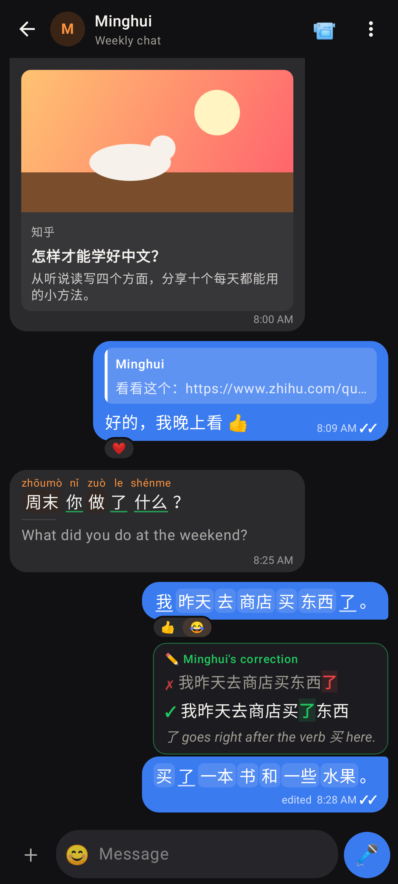
Folded, dark

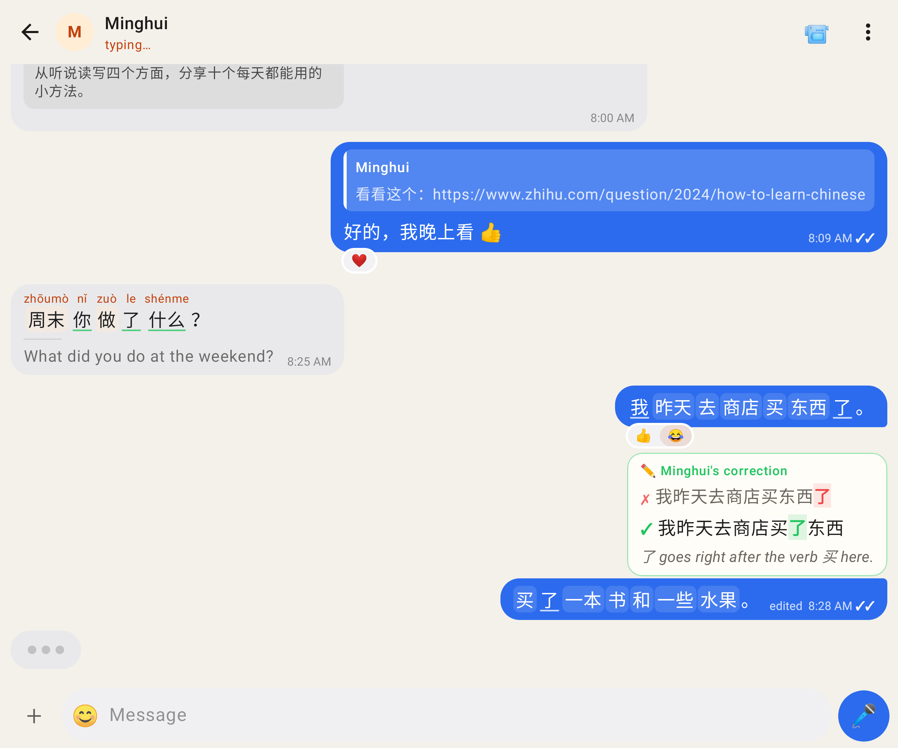
Unfolded (841 dp), typing

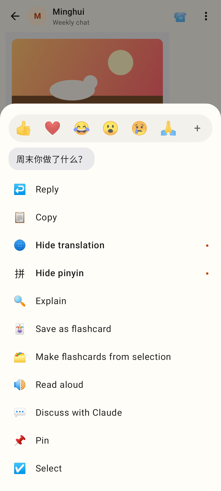
Long-press menu: reaction bar + every action

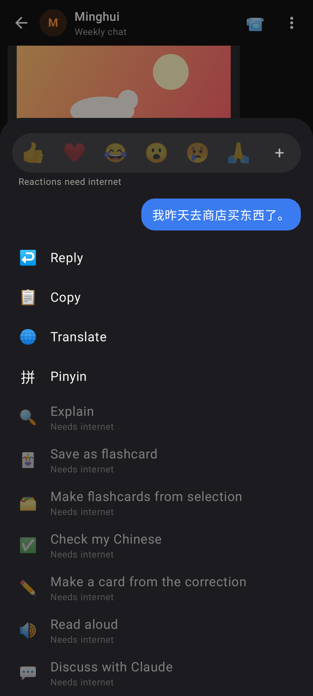
My message offline: network actions disabled (dark)

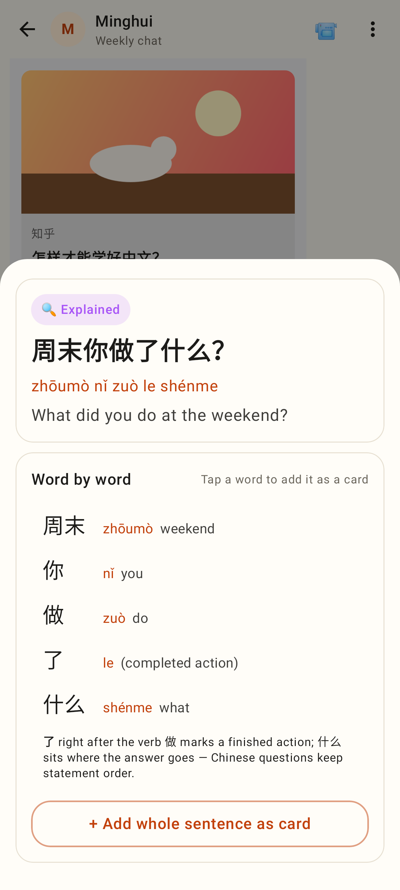
Explain: breakdown, words → cards, whole sentence as card

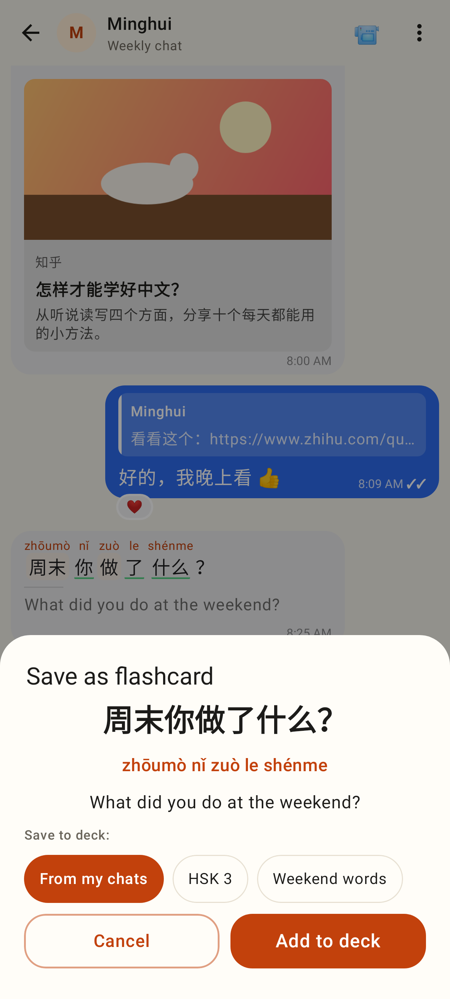
Save as flashcard: one sentence card in the add-card sheet

Composer with text: ✓ check and ➤ send (replying)

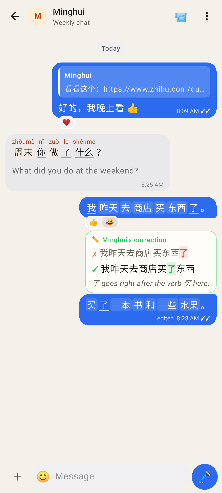
Composer empty: + · 😊 · 🎤

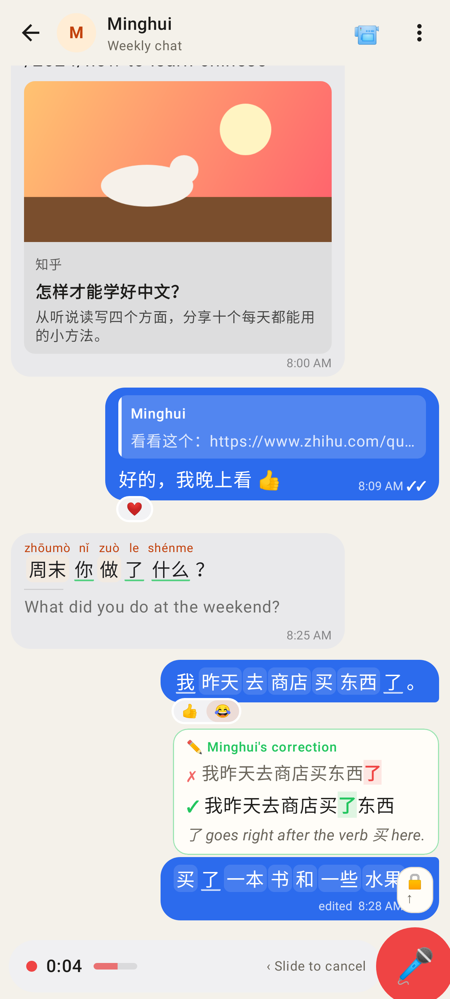
Holding the mic: slide to cancel, lock above

Locked: 🗑 · timer · ■ stop · ➤ send

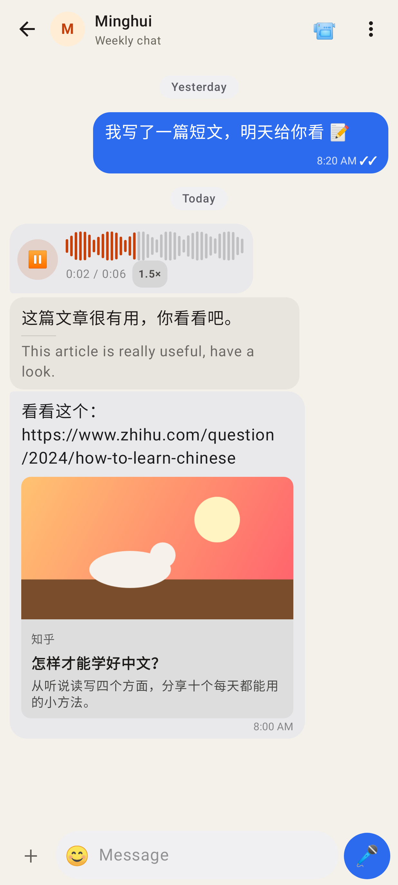
Voice bubble: real waveform playing, 1.5× speed chip

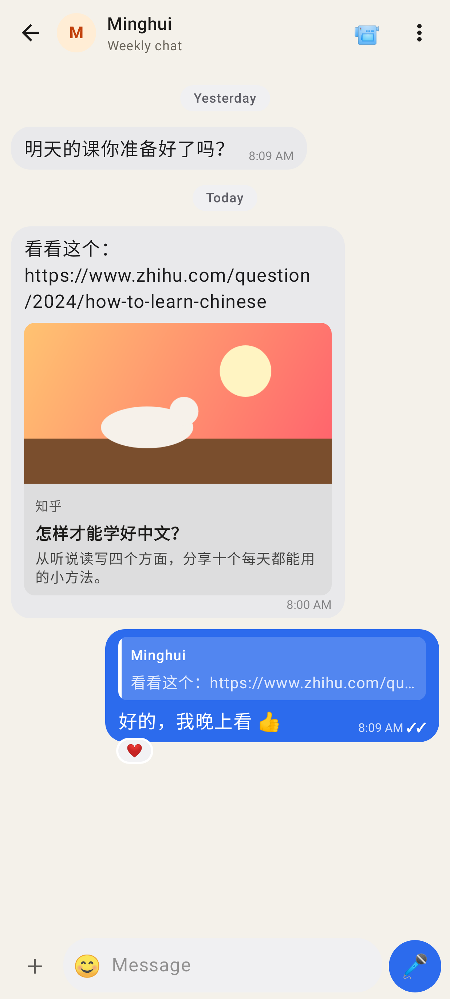
Link preview card

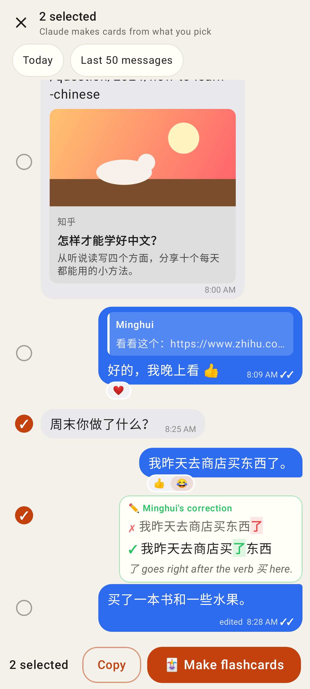
Selection mode: N selected · Copy · Make flashcards
