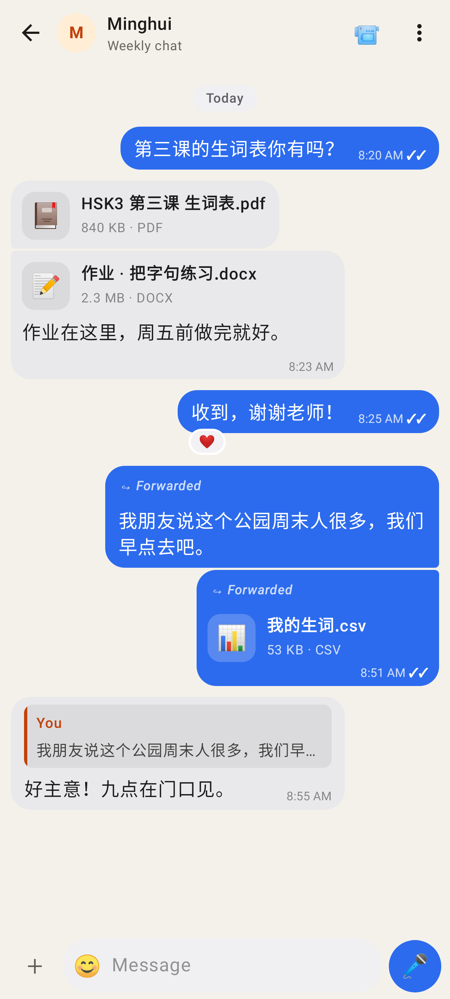
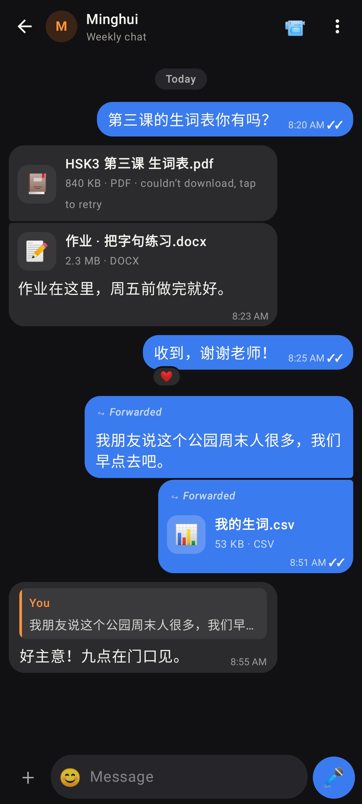
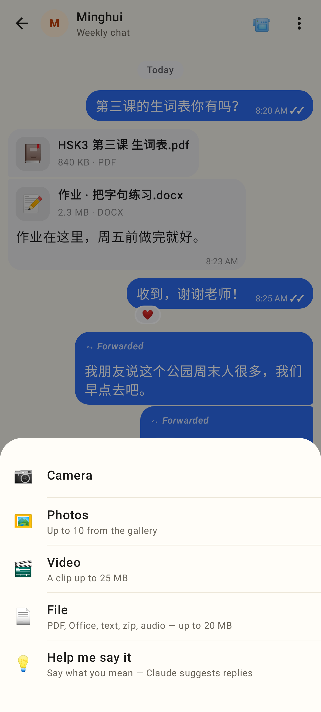
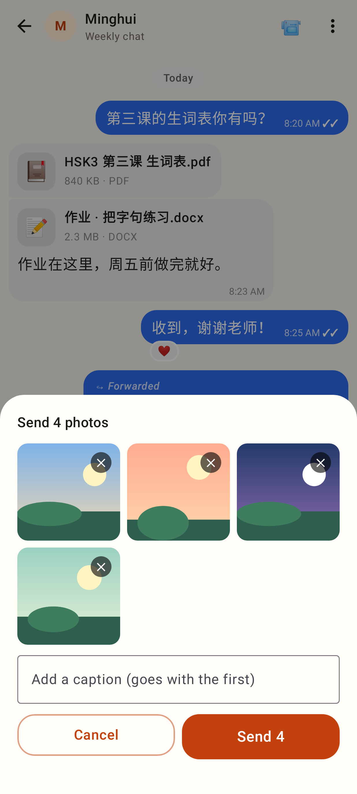
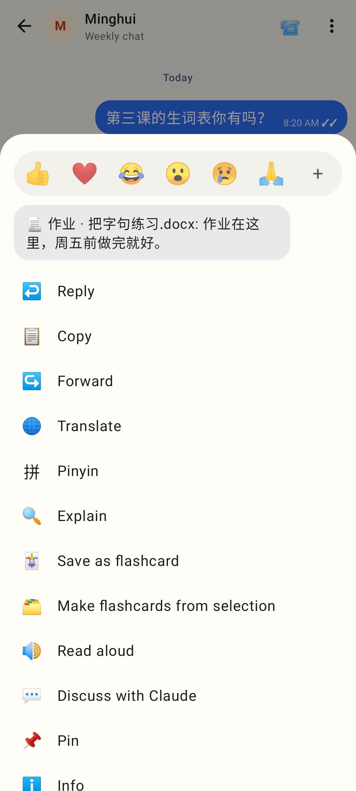
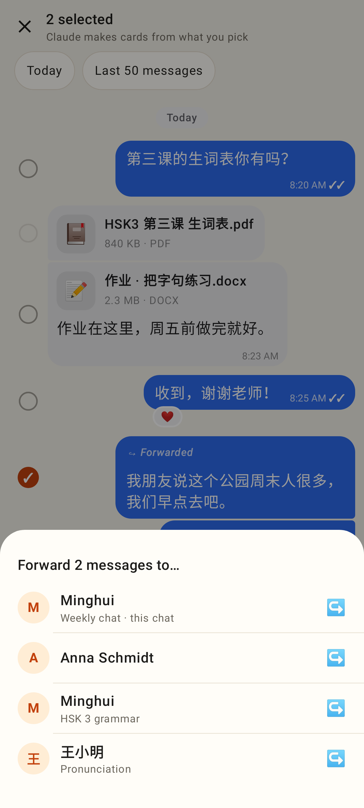
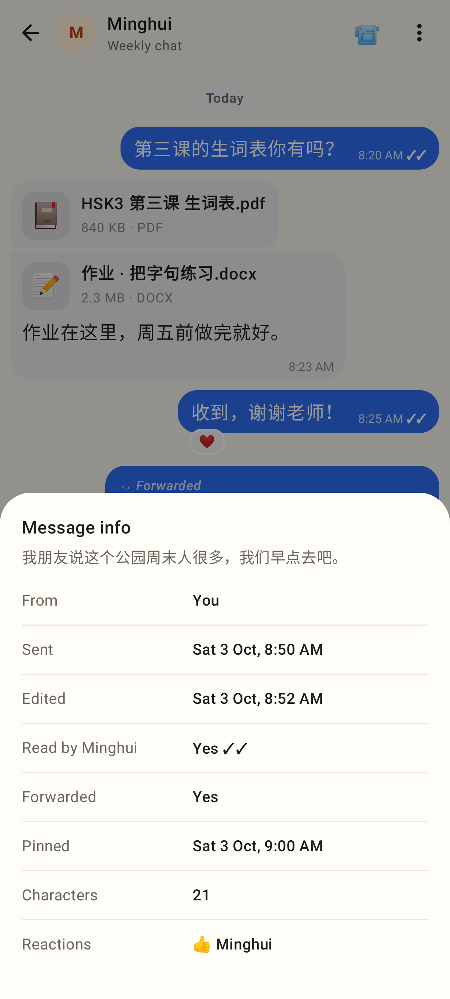
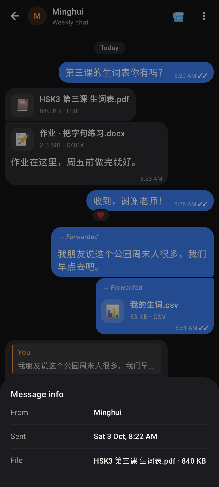
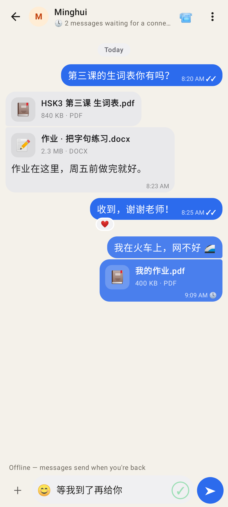
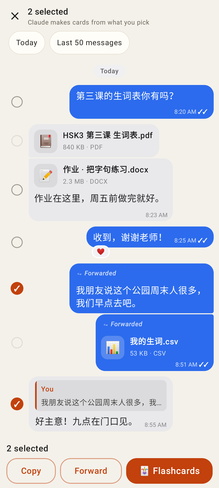

# Lab app — chat round 2, PR 3

The native Lab app's half of docs/CHAT.md "Round 2 — PR 3" (phone, 412 dp).

A PDF and a Word file from the tutor, "↪ Forwarded" on a text and on a file, a reply quoting the forward.

Dark theme; a file whose download failed says "couldn't download, tap to retry".

A landscape clip with a caption and a portrait reply, each sized by its shape with the first frame, ▶ and its length.

+ → Camera · Photos (up to 10) · Video · File · Help me say it.

Four photos in the compose sheet: a grid with ✕ on each, the caption goes with the first, "Send 4".

The long-press menu now has Forward (after Copy) and Info (after Pin); the lifted preview says "📄 name: caption".

"Forward 2 messages to…" — every conversation with a person, newest first, "· this chat" marked.

Message info for my forwarded, edited, pinned message: sent, edited, read by Minghui ✓✓, forwarded, pinned, characters, reactions.

Message info for a file: the name and its size.

Offline: the header says "🕓 2 messages waiting for a connection", each pending bubble keeps its 🕓, the kept draft is in the box.

Selection mode: Copy · Forward · 🃏 Flashcards.
