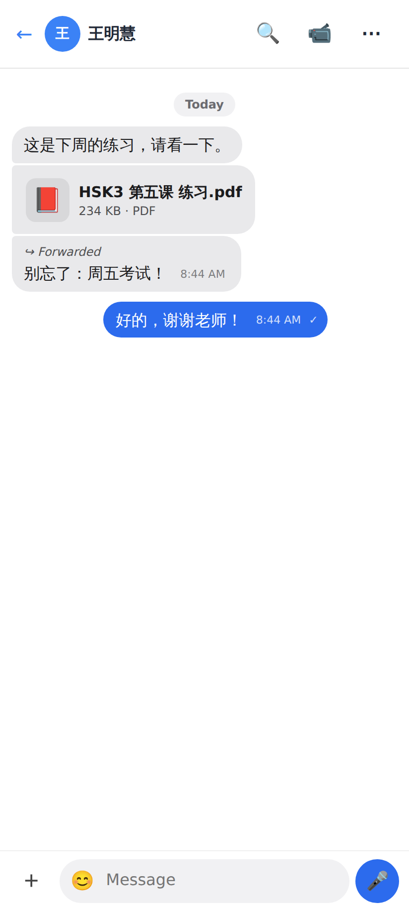
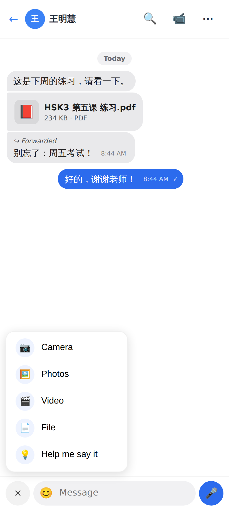
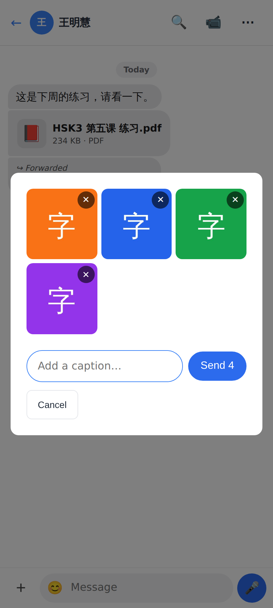
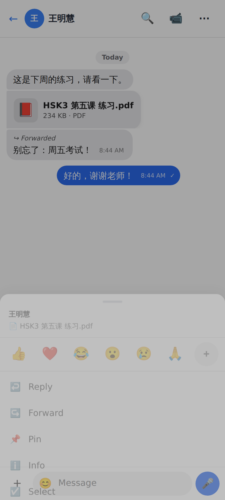
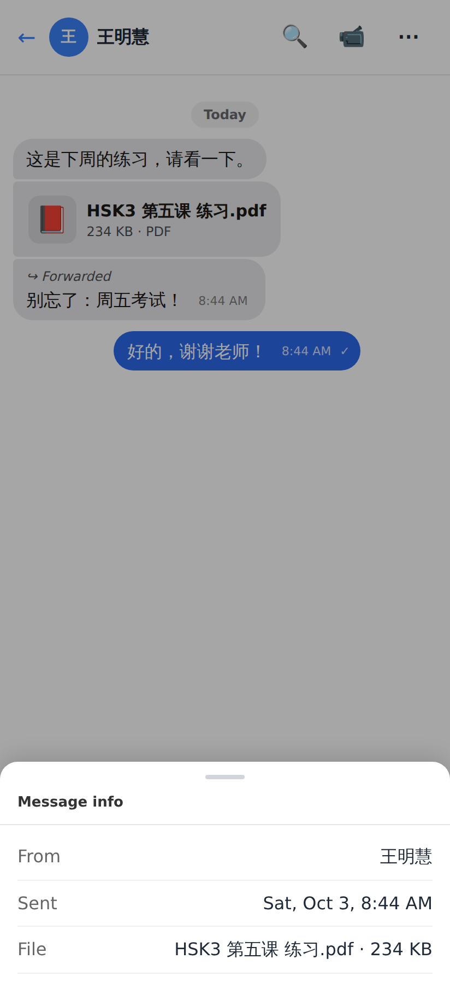
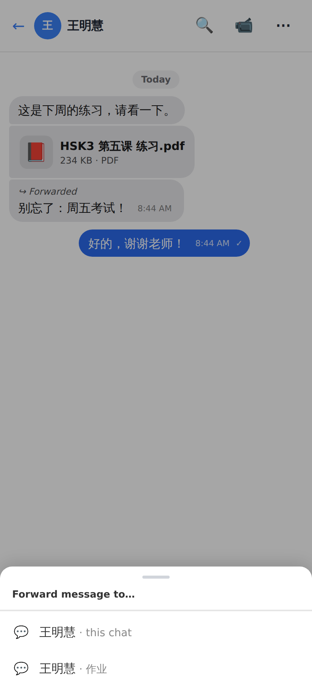
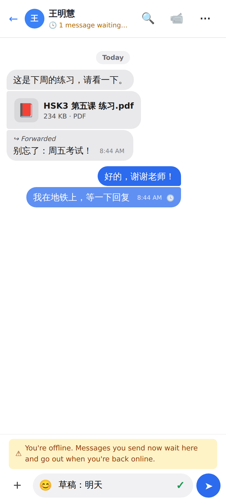

# Chat round 2 — PR 3 (web, phone 412 px)

A PDF from the tutor (icon, name, size · type — a tap opens it) and a forwarded message ("↪ Forwarded").

+ now has Camera · Photos · Video · File · Help me say it.

Four photos picked at once: a grid with ✕ on each, one caption, "Send 4" (one message each).

The message menu gains Forward and Info.

Message info: from, sent, the file, read by (on my own messages).

Forward to…: every conversation with a person, "· this chat" marked.

Offline: the header says "🕓 1 message waiting for a connection", the bubble keeps its 🕓, and the draft stays in the box.

The Lab app's screenshots are in [`../../chat-r3-lab/README.md`](../../chat-r3-lab/README.md).
