# Chat round 2 — web (phone 412 px unless noted)

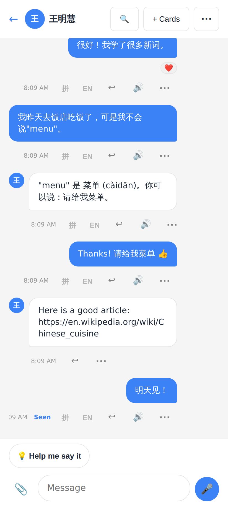
Before: every bubble carried 拼 / EN / ↩ / 🔊 / ⋯ buttons.

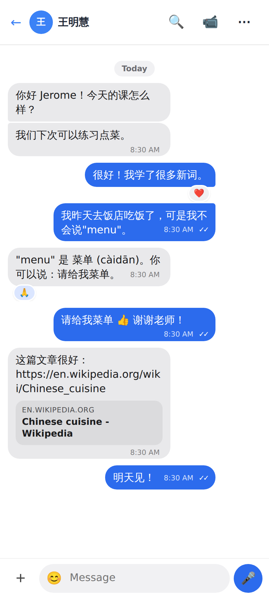
After: Signal-like bubbles: groups, time and ✓✓ inside the bubble, a day pill, a reactions pill, a link preview, and a one-row composer.

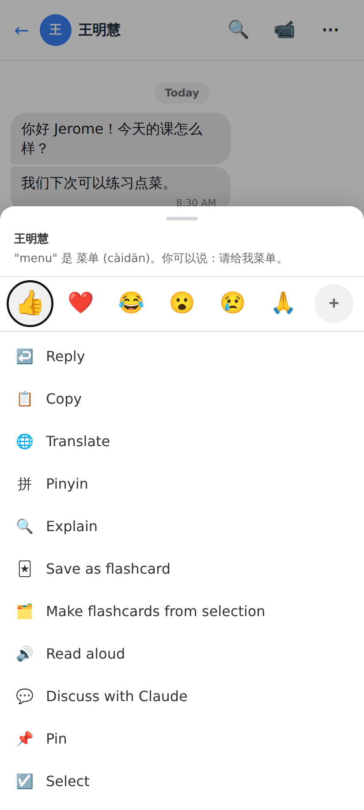
Long-press: the reaction bar, then Reply · Copy · Translate · Pinyin · Explain · Save as flashcard · Make flashcards from selection · Read aloud · Discuss · Pin · Select.

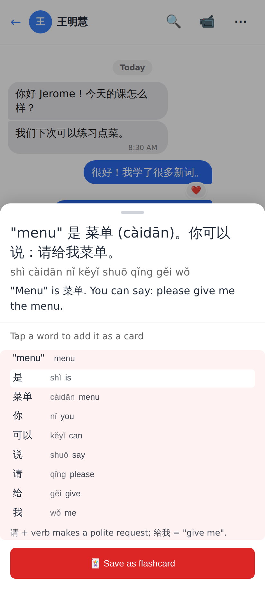
Explain: the translation, word by word (tap a word → card), and 🃏 Save as flashcard (the whole message as one card).

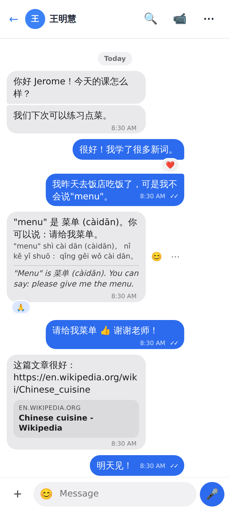
Pinyin and Translate, switched on from the menu, show inside the bubble.

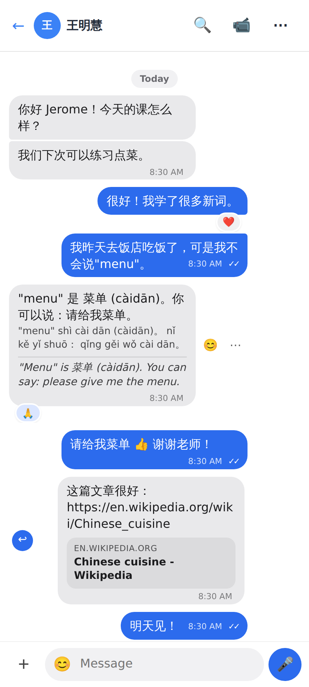
Swiping right on a bubble starts a reply (↩ appears).

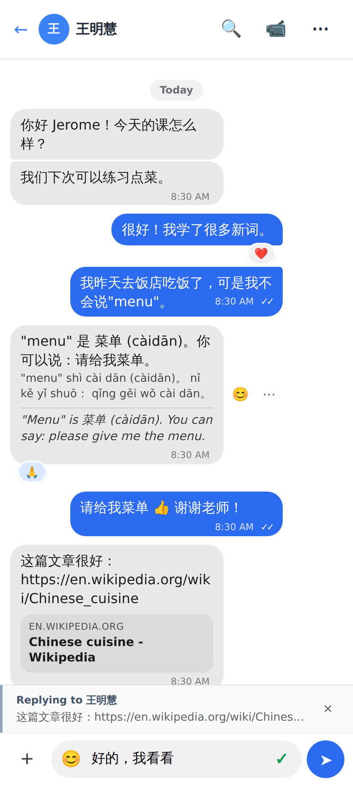
Replying: the mic becomes ➤ as soon as there is text.

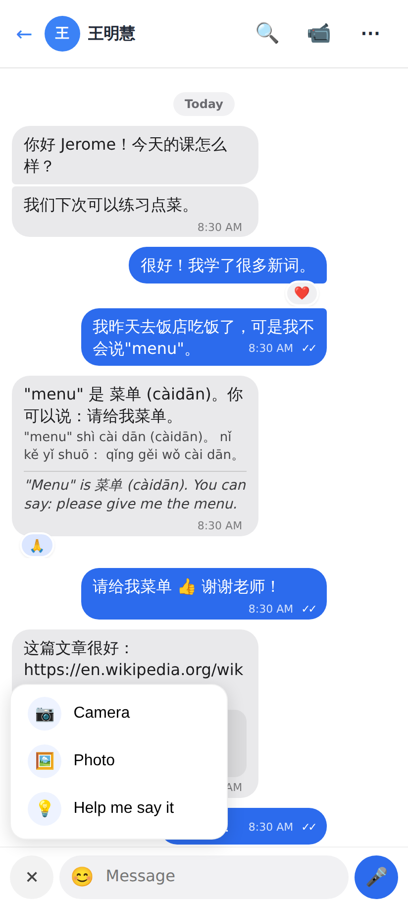
The + menu: Camera · Photo · 💡 Help me say it.

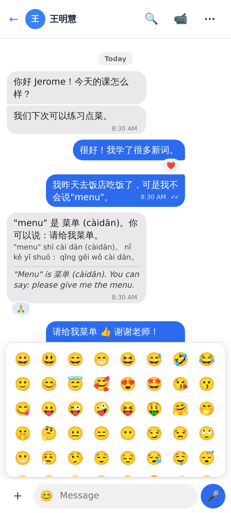
The 😊 panel inserts emoji at the caret.

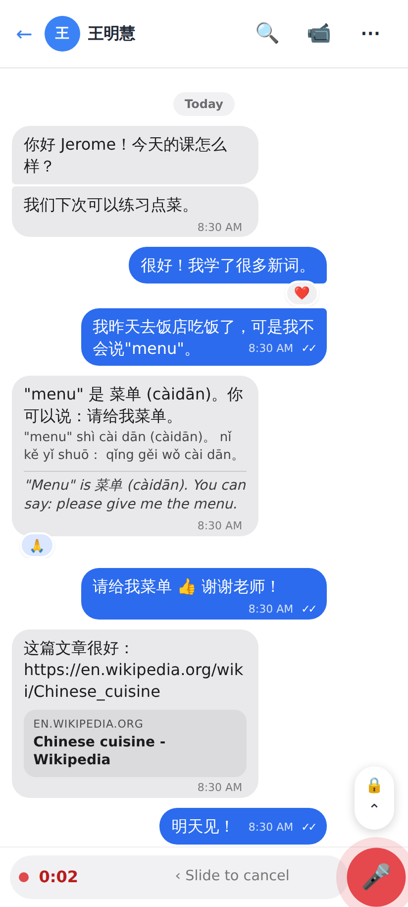
Holding the mic: timer, "‹ Slide to cancel", and 🔒 above for slide-up-to-lock.

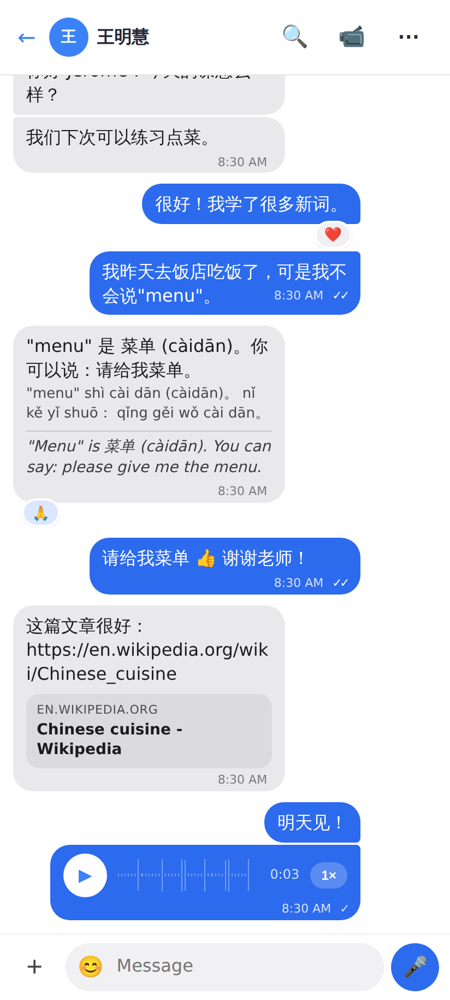
A voice message: waveform of the real clip and the 1× / 1.5× / 2× speed chip.

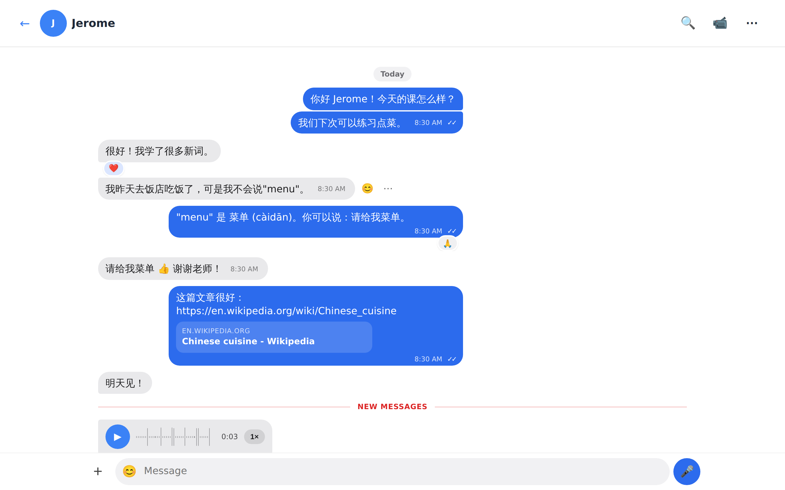
Desktop (1280 px, the tutor): hovering a bubble shows 😊 and ⋯.

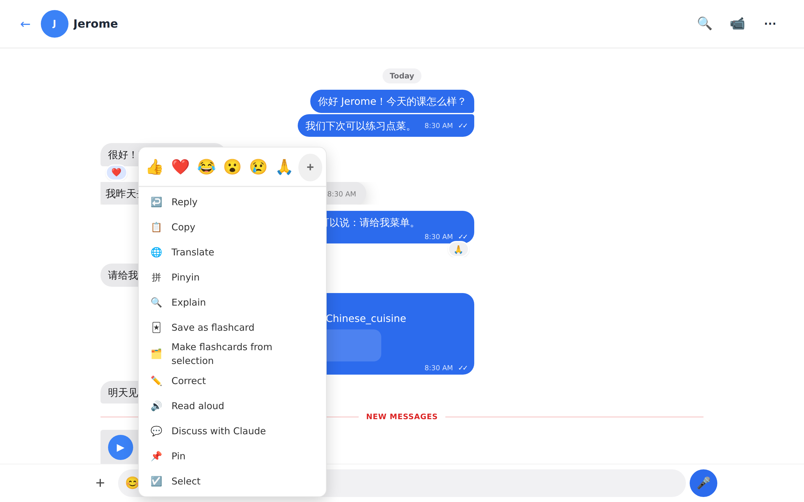
Desktop right-click: the menu as a popover at the pointer, including Correct for the tutor.

The Lab app's screenshots (folded light / dark, unfolded, menu, Explain, Save, composer, recording, voice, link preview, selection) are in [`../../chat-r2-lab/README.md`](../../chat-r2-lab/README.md).
