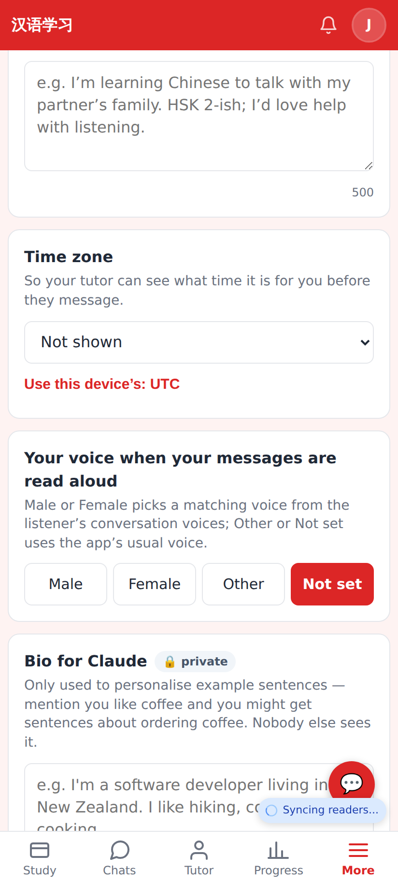
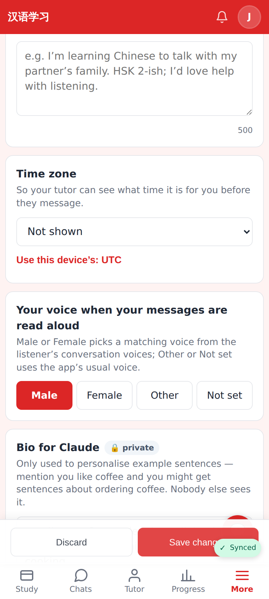
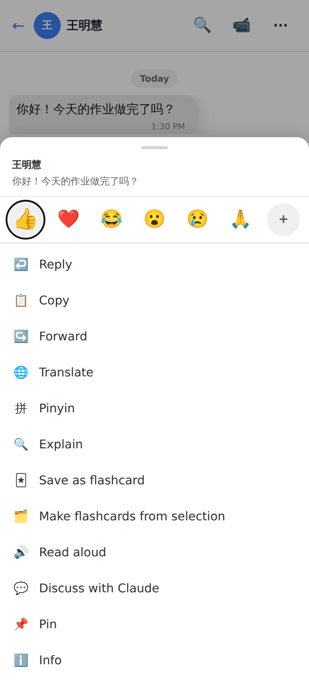
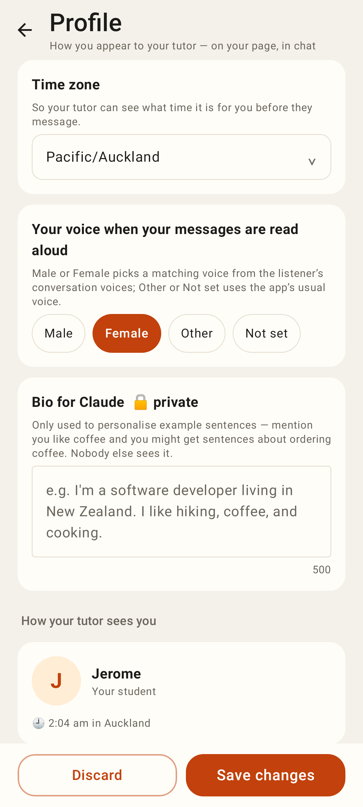

# Chat read-aloud voice + voice gender

Web Profile: the new "Your voice when your messages are read aloud" row (Not set).

Web Profile: Male chosen (saved with the rest of the profile).

Web chat: the message menu's Read aloud now plays the sender's matching voice from the listener's conversation voices (e2e asserts `Male_Announcer` for a male sender, never `female-yujie`).

Lab app Profile: the same row.
