# Chats tab — Lab app (Roborazzi, Pixel Fold folded 412×915dp)

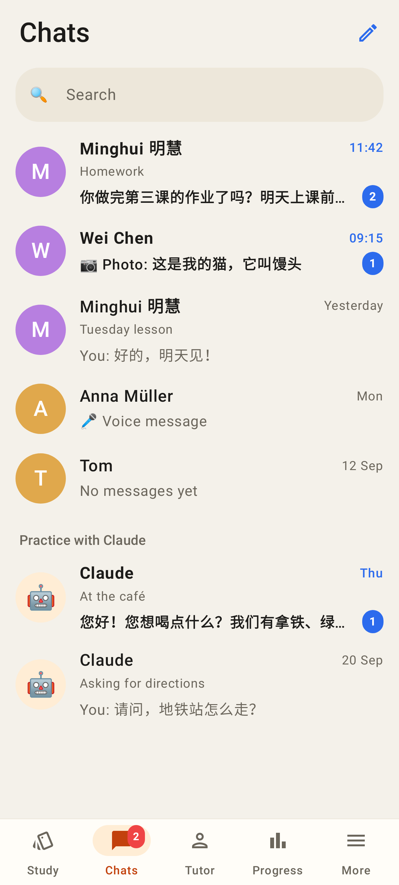 — student tab bar (Study · Chats · Tutor · Progress · More), unread pills, Practice with Claude section
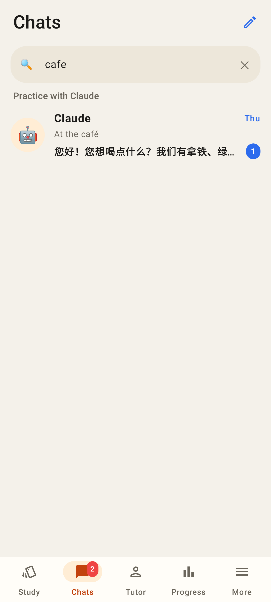 — "cafe" (no accent) finds Claude's "At the café"
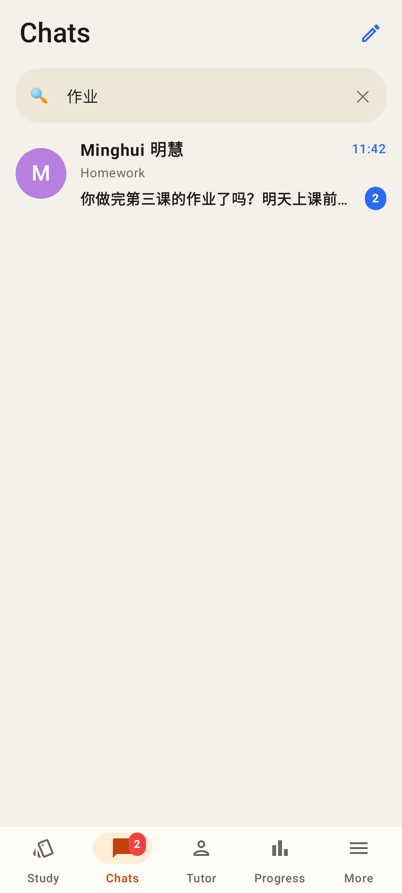 — "作业" matches the last message
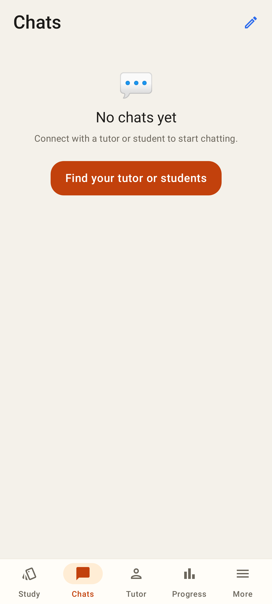 — no chats yet → Find your tutor or students
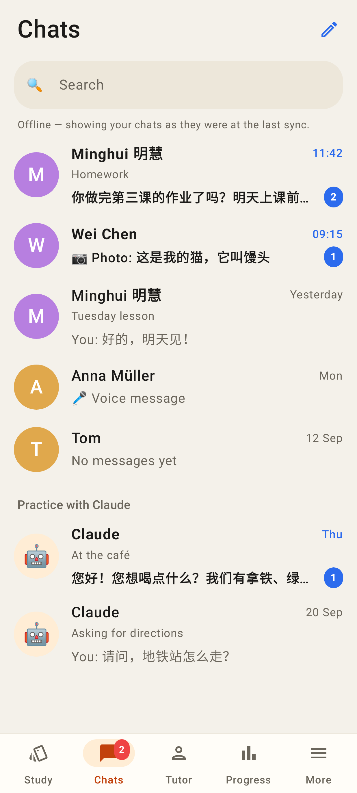 — rendered from the cache
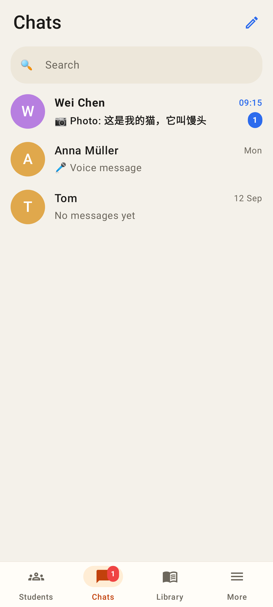 — Students · Chats · Library · More
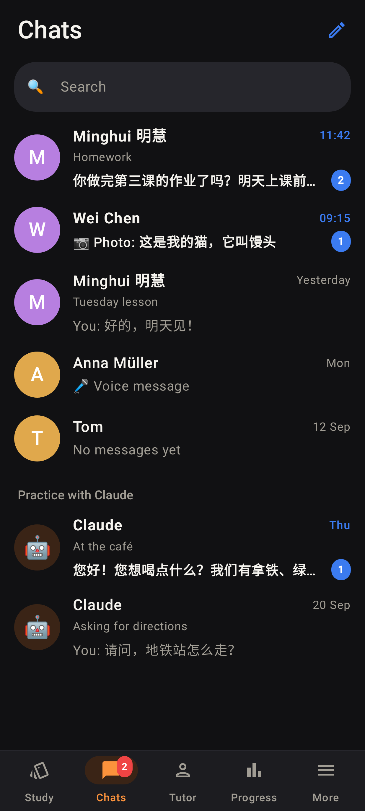 — dark theme
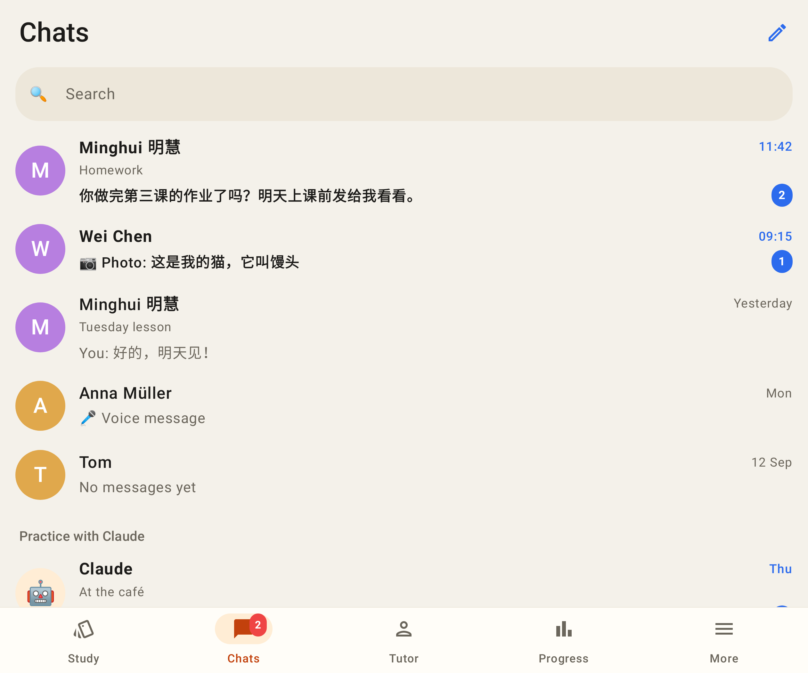 — inner screen
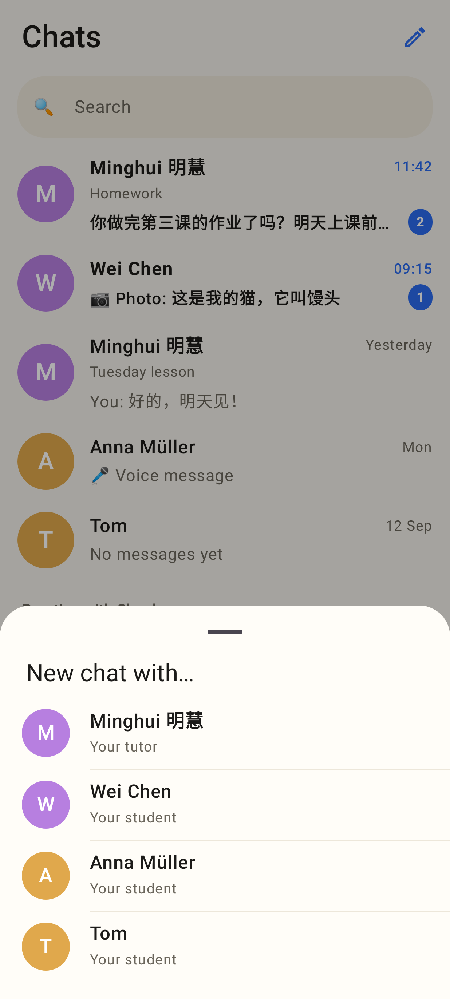 — ✏️ with several people
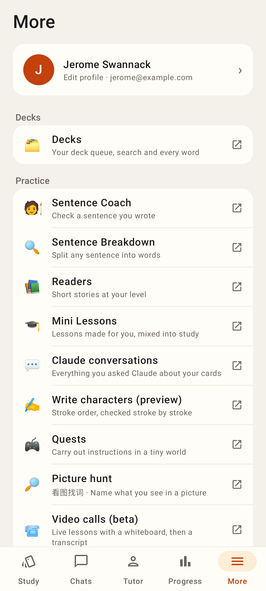 — Decks is the first row of More (student)
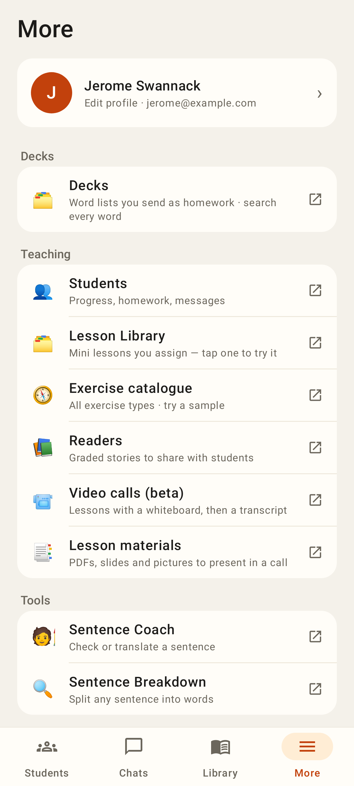 — tutor account
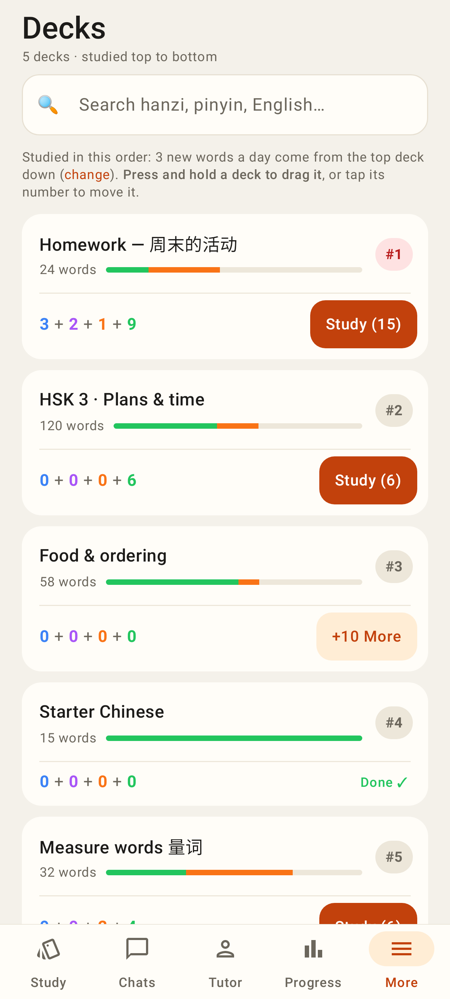 — /decks lights up More
