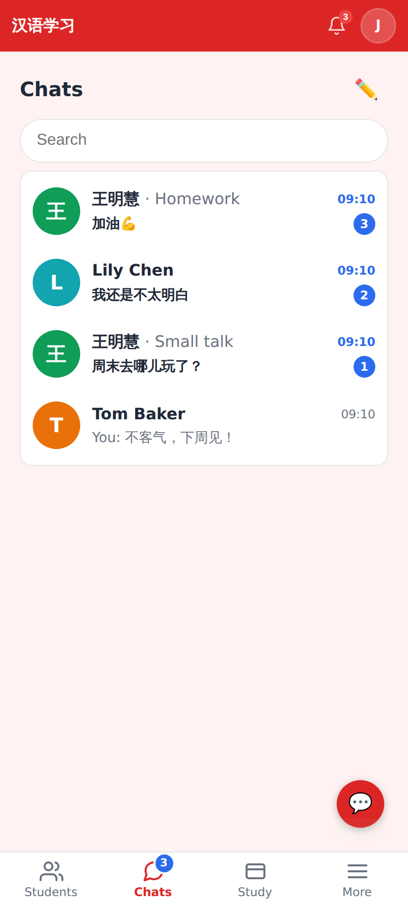
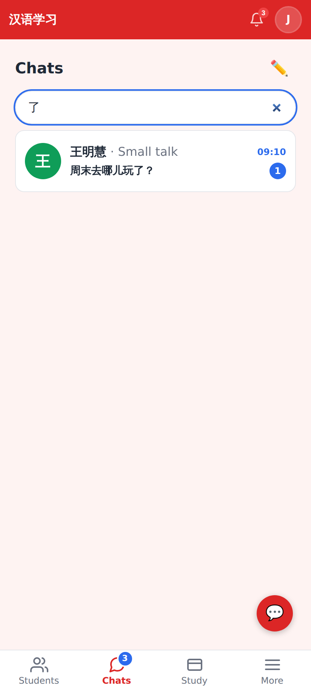
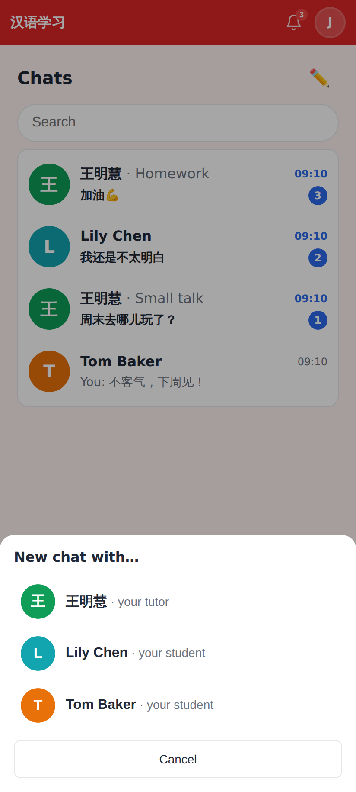
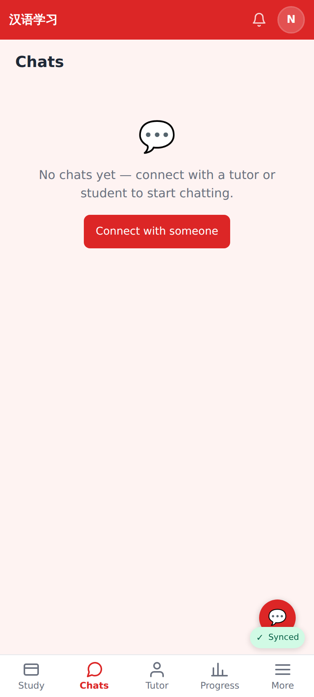
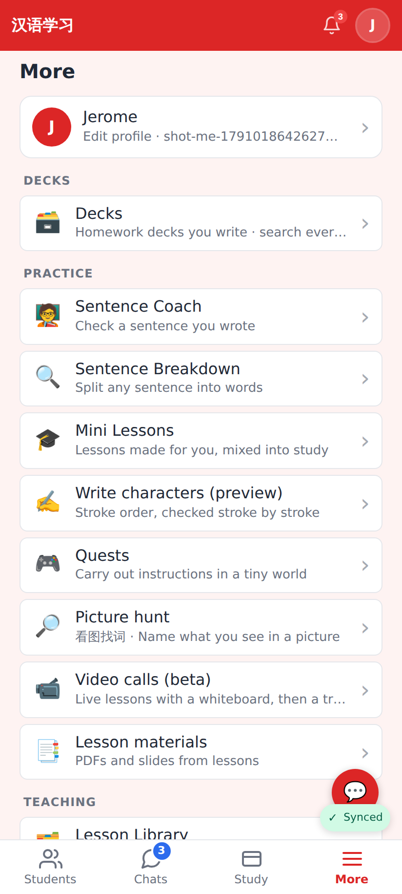
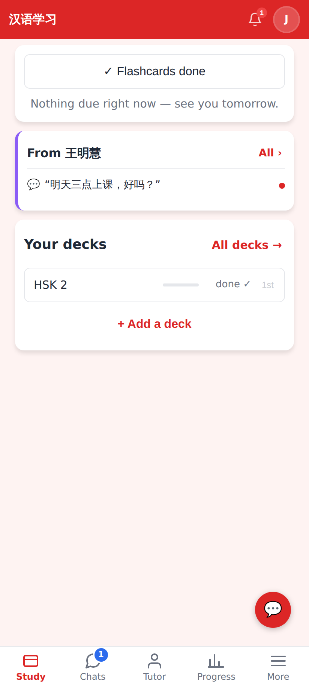
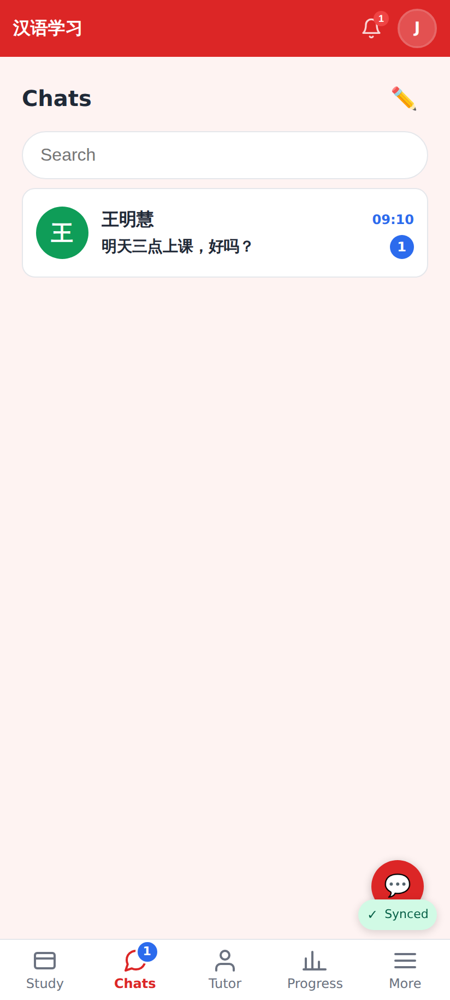

# Chats tab — web (412×915 @2×)

The Chats tab: every conversation, newest first; the title shows only when there are several chats with one person; unread counts + the tab badge (3 conversations unread).

Search filters by person, title and last message (here: 了).

✏️ with more than one person → pick who to start a chat with.

No connections yet.

Decks moved from the tab bar to the first row of More (a deck page lights More up).

Student account: Study · Chats · Tutor · Progress · More, with the unread badge; Home's "All decks →" still opens the deck list.

A student's inbox with one tutor.
