# ⚡ Study it today — screenshots (412×915, 2×)

## Web app

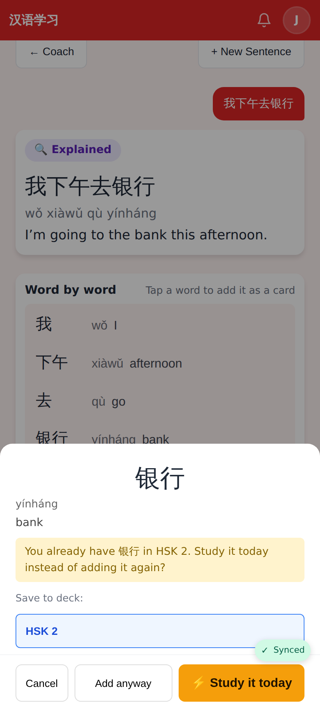
Coach → Explain → tap 银行, which is already in HSK 2: the sheet says so and **⚡ Study it today** is the primary action (Add anyway second). Before this PR the sheet only said "This word is already in the selected deck." with "Add anyway".

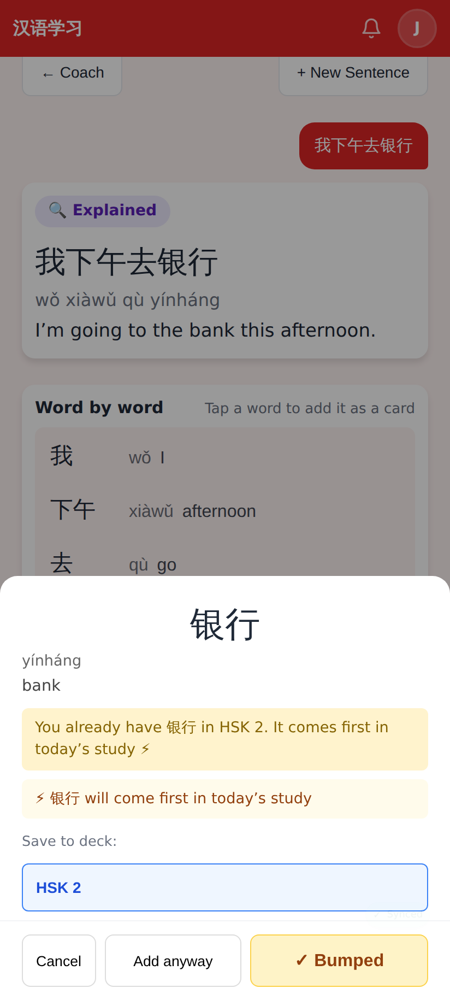
After the tap: "⚡ 银行 will come first in today's study".

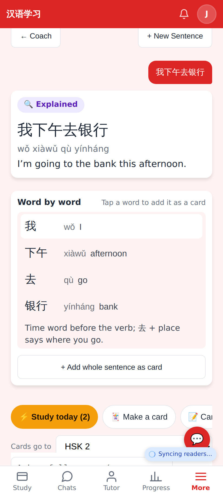
The quick-action row gets "⚡ Study today (2)" when words of the sentence are already cards (下午, 银行).

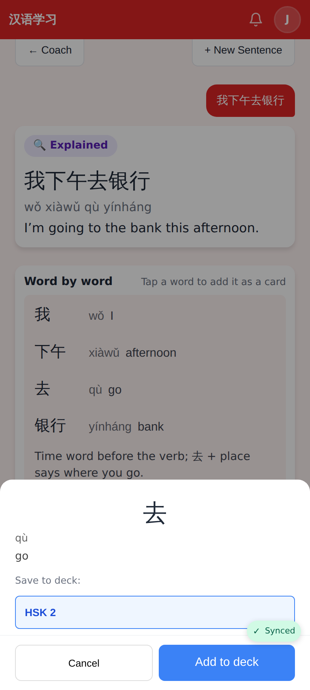
A word I don't have yet: the sheet is unchanged (Add to deck).

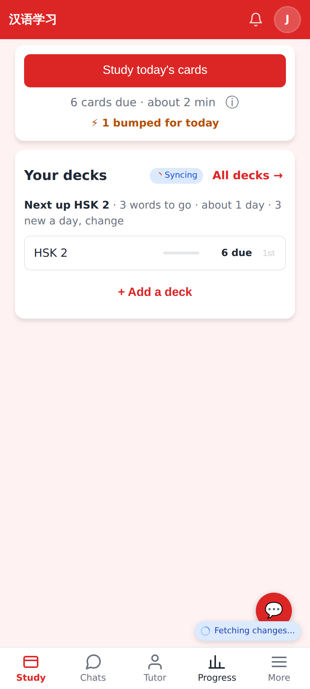
Home: "⚡ 1 bumped for today" under the Study button.

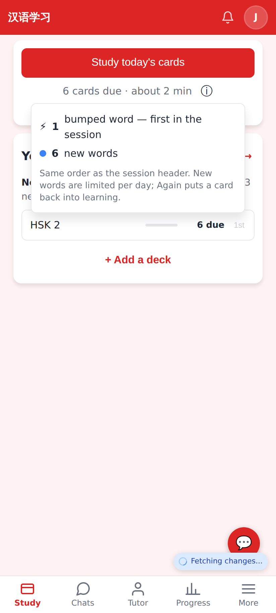
The ⓘ breakdown lists the bumped words first.

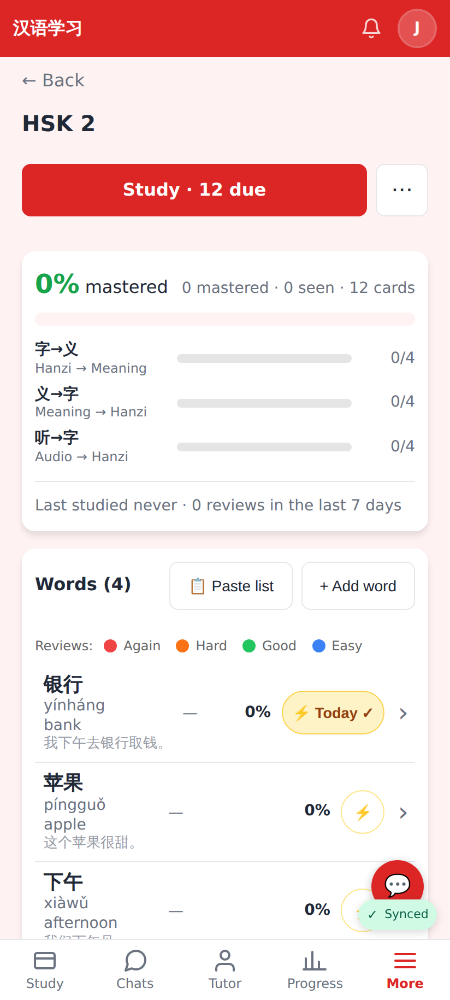
Deck page: a quiet ⚡ per word; "⚡ Today ✓" once bumped (tap again to take it out).

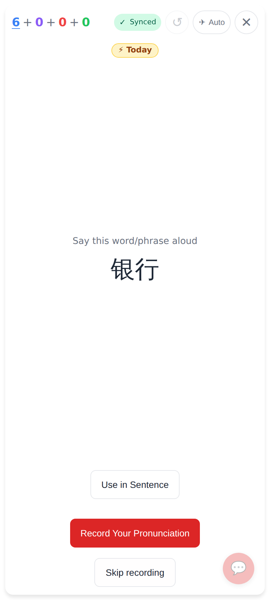
The session starts with the bumped word (first in the queue, before the budget's new words), with the "⚡ Today" badge. The e2e test checks the same with a budget of 0.

## Lab app (android-lab)

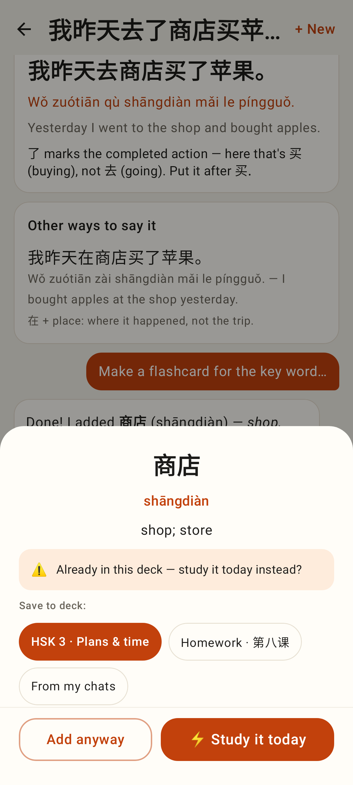
The Coach's add-card sheet when 商店 is already a card: "⚡ Study it today" primary, "Add anyway" secondary.

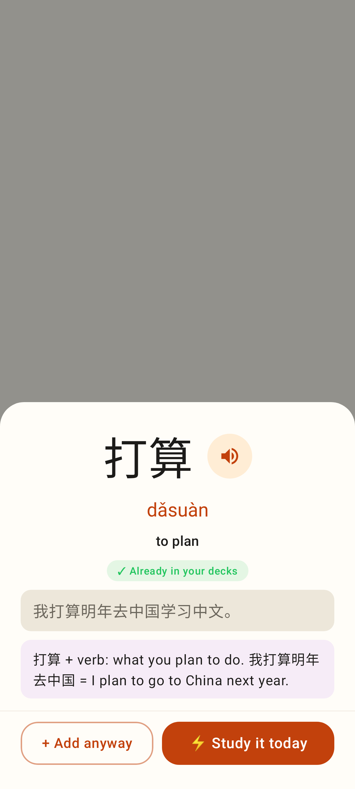
A reader word already in the decks: "⚡ Study it today" first.

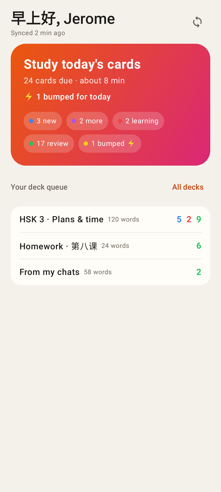
Home: "⚡ 1 bumped for today" under the due line, plus the chip.

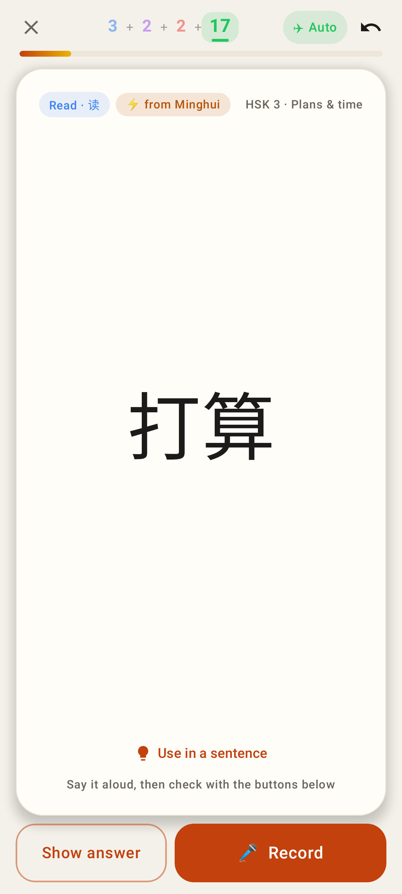
A card from the pocket, bumped by the tutor: "⚡ from Minghui".

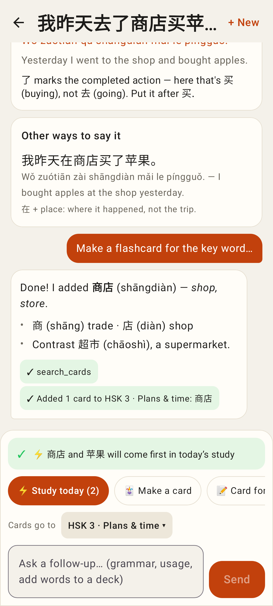
The Coach's "⚡ Study today (2)" chip after tapping it.
