# Coach: "⚡ Study … today" applies to the sentence, or to the words you pick

Before (one tap bumped every matched word): [../claude-bump-to-today/02-coach-chip.png](../claude-bump-to-today/02-coach-chip.png)

## Web (412×915, 2×)

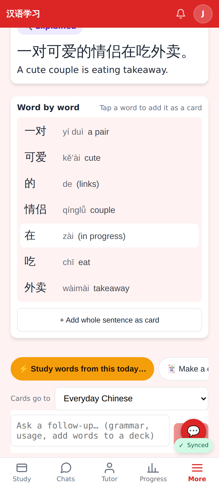
Some of the sentence's words are cards: "⚡ Study words from this today…" (no bare count).

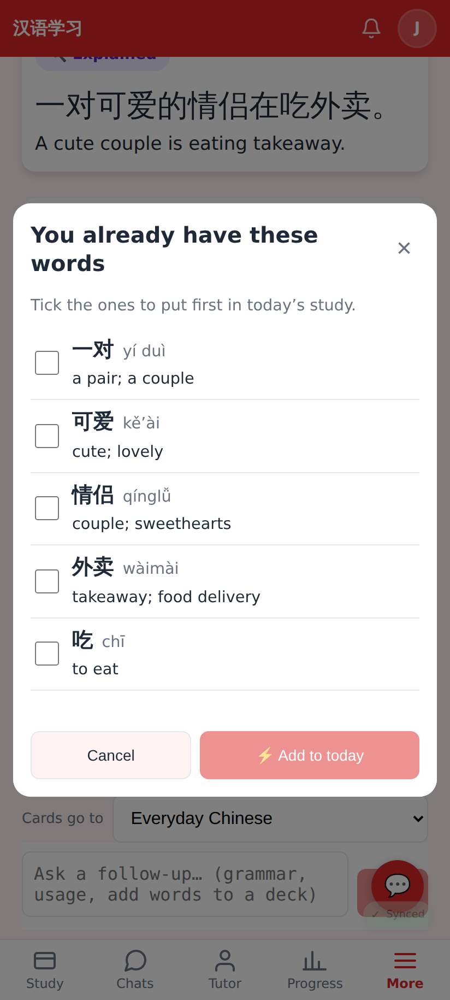
"You already have these words": longest first, 吃 last, nothing ticked, the pinned button waits.

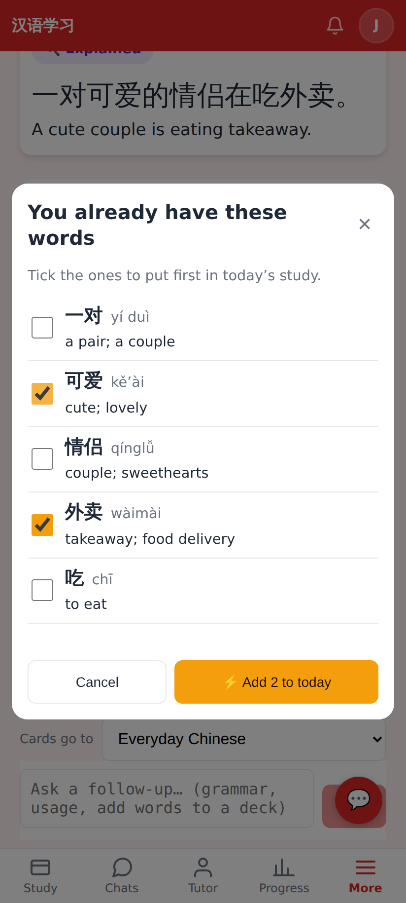
Ticking 可爱 and 外卖 → "⚡ Add 2 to today".

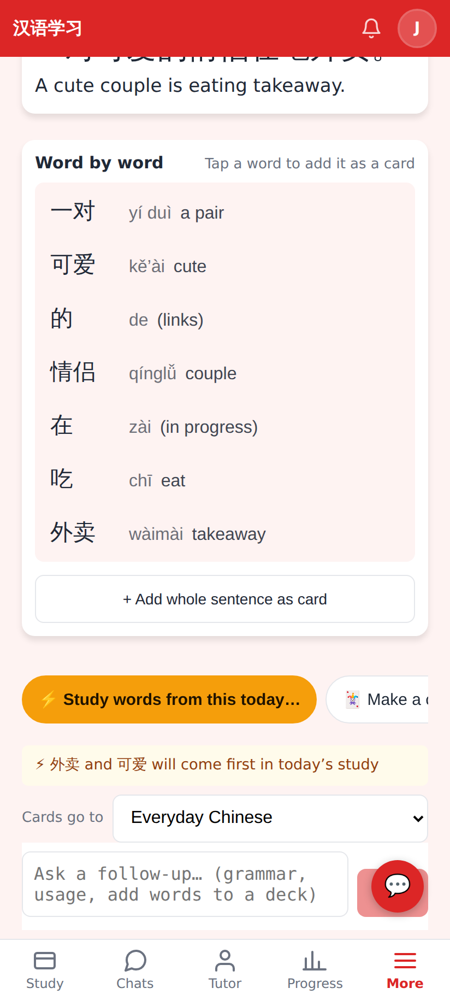
Only those two go first in today's study.

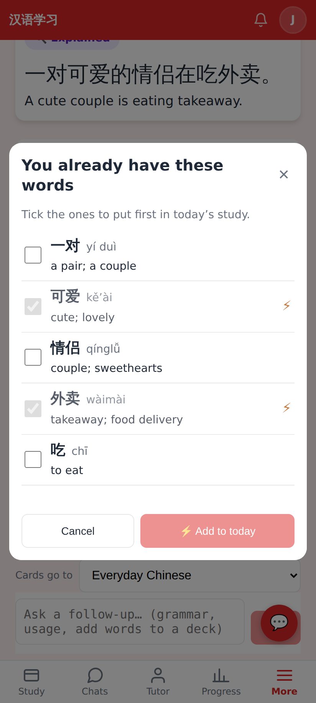
Opened again: bumped rows show ⚡ and can't be ticked.

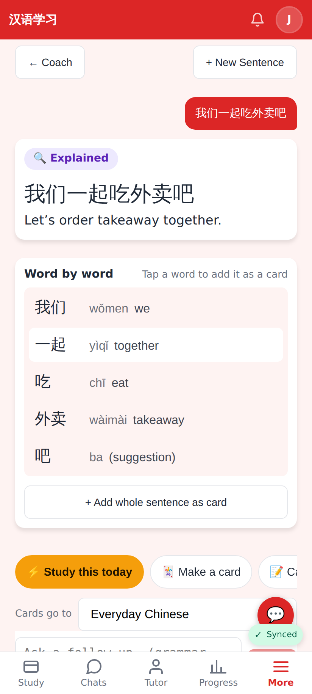
The sentence is itself one of his cards: "⚡ Study this today" bumps only it.

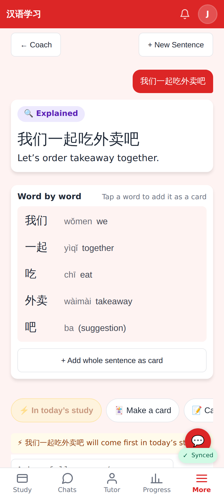
After the tap: "⚡ In today’s study".

## Lab app

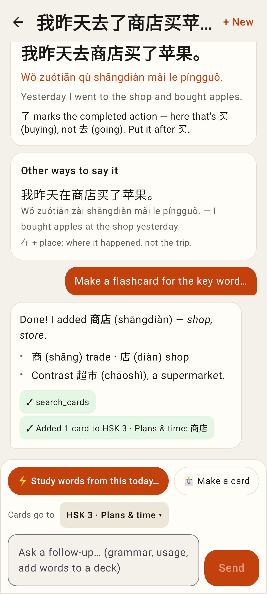
The chip in the native Coach.

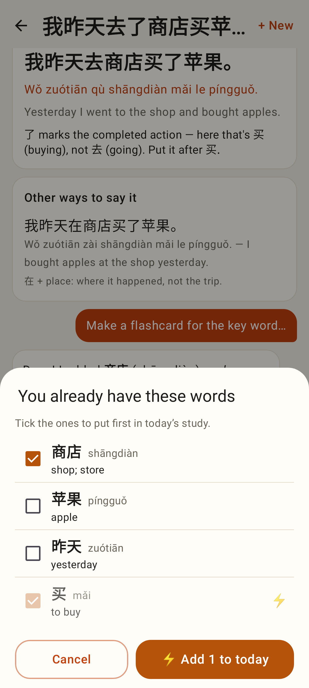
The picker (SheetScaffold, pinned Cancel / "⚡ Add 1 to today"); 买 already bumped.

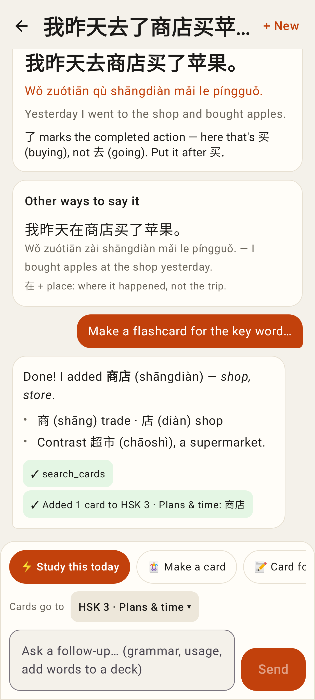
"⚡ Study this today".

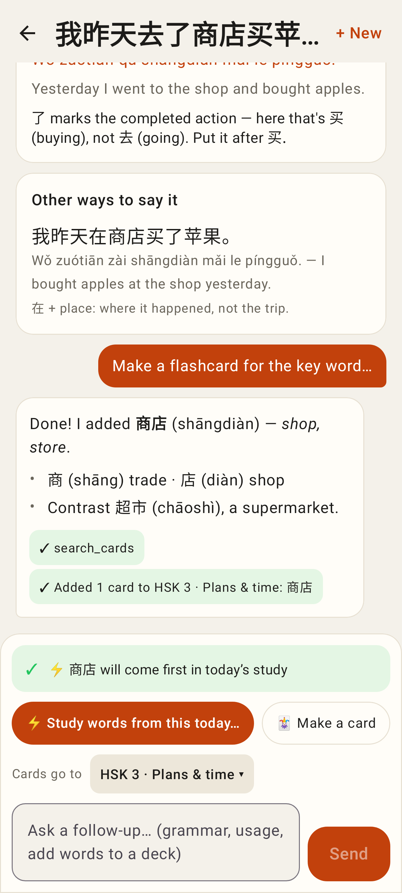
After adding.
