# Lab app (pure-native Android) — v1 screenshots

Rendered from the real Compose screens by `android-lab/app/src/test/…/ScreenshotTest.kt`
(Roborazzi + Robolectric) at the Pixel Fold's folded size (412×915dp) and unfolded (841dp wide).
Motion, haptics and sounds (flip spring, spark burst on a right answer, streak pops,
milestone chimes, confetti + fanfare at the end) don't show in stills.

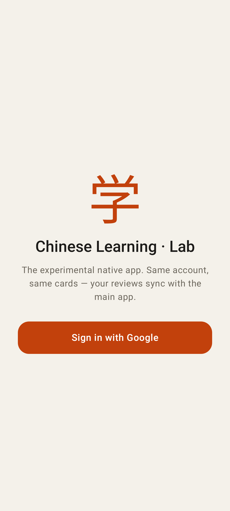
Sign in — Google in a Custom Tab, back into the app on `chineselearning-lab://auth`.

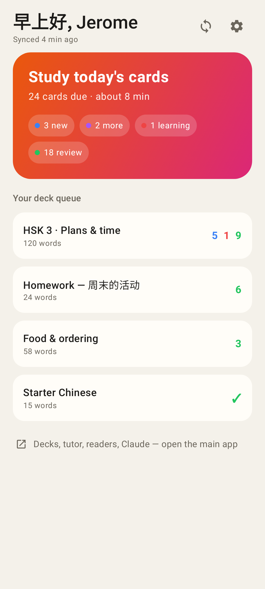
Home — today's cards with the web's four-colour breakdown, the deck queue with per-deck due counts.

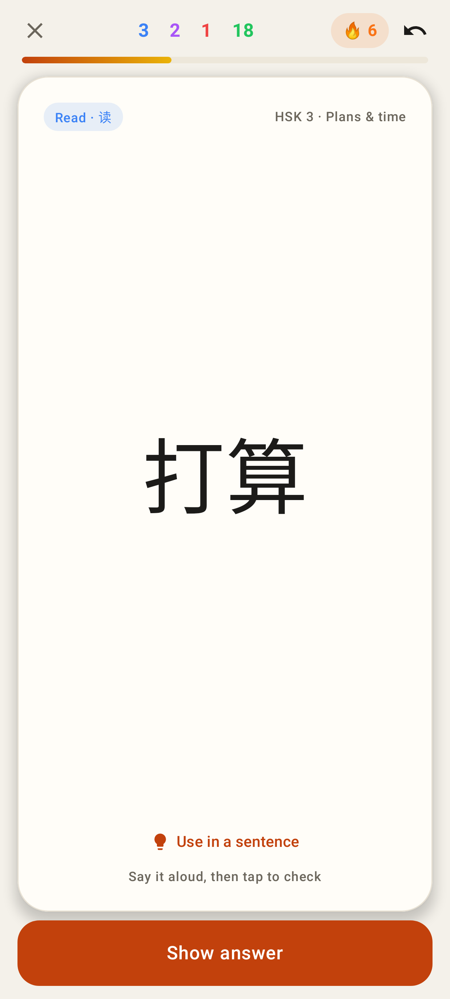
Read (hanzi → meaning) front: type chip, deck, "Use in a sentence", streak and queue counts on top.

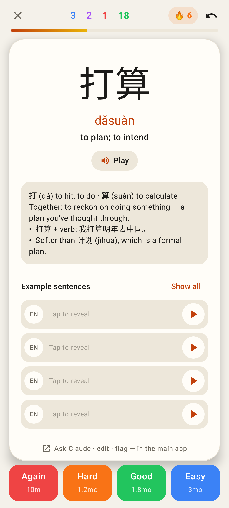
Back: pinyin, meaning, explanation, example sentences (tap to reveal, EN mode), ratings with FSRS intervals.

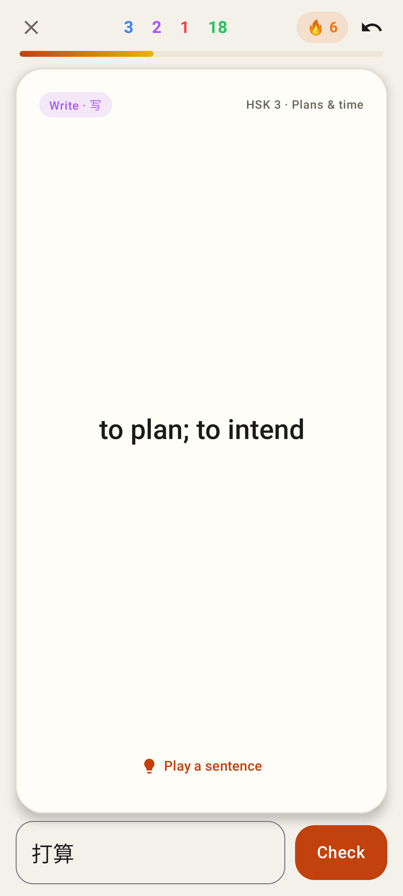
Write (meaning → hanzi): typing into the answer box.

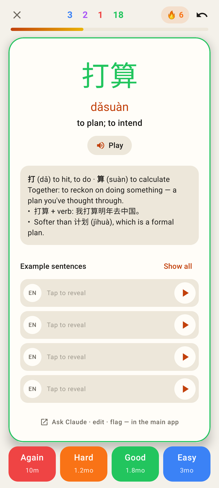
A right typed answer: green glow + spark burst + chime + haptic.

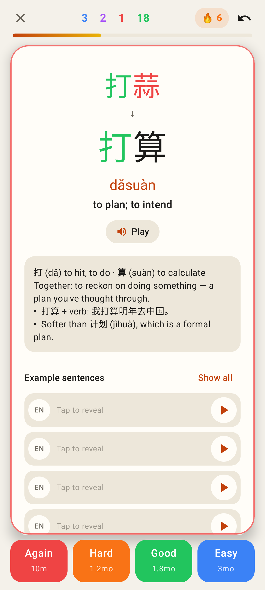
A wrong answer: character diff (the web's AnswerDiff), shake + soft thud.

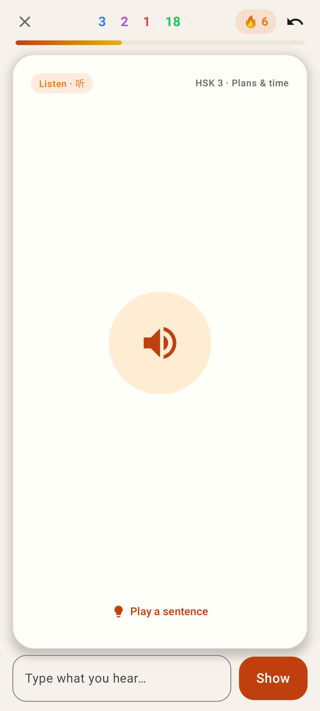
Listen (audio → hanzi): big play button, the clip auto-plays.

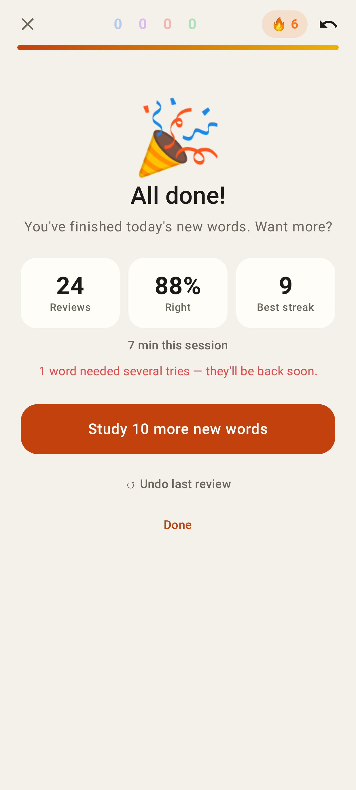
All done: confetti, count-up stats, "Study 10 more new words", undo.

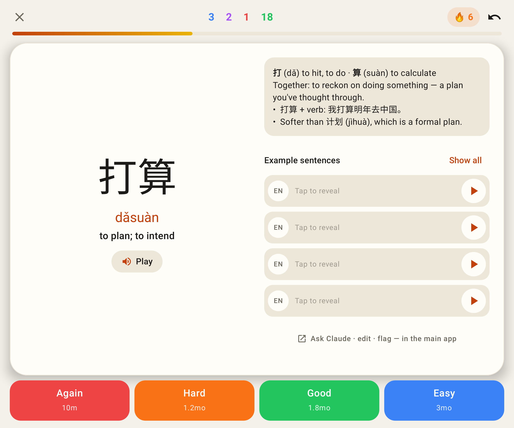
Unfolded: two panes — answer on the left, explanation and sentences on the right.

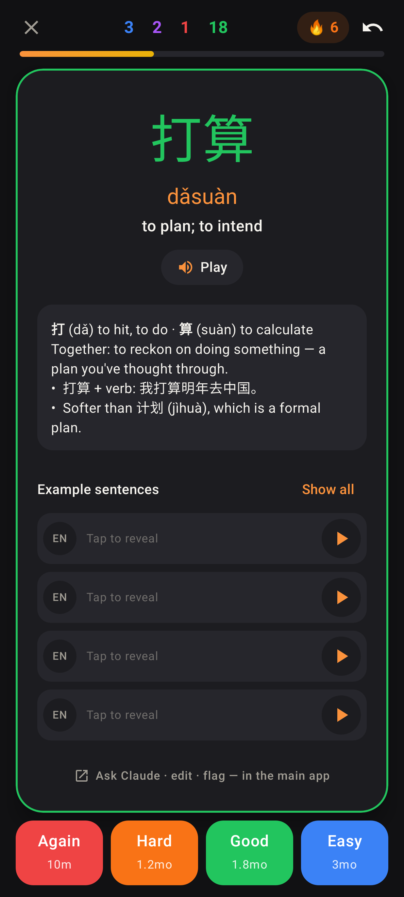
Dark theme.
