# "From the card" badge: a tab on the row's edge, not a line of its own

Row 1 of the example sentences (the note's own sentence) had its badge on its own line, so the
collapsed row was taller and its "Tap to reveal" / blank bar sat below the centre. The badge is now
a small tab straddling the row's top edge, left of ▶: row 1 is the same height as the others, and
when revealed it covers none of the hanzi / pinyin / English lines nor ▶.

Phone viewport (Pixel Fold folded, 412 dp / 412×915 @2×).

## Lab app — collapsed

| Before | After |
|---|---|
| 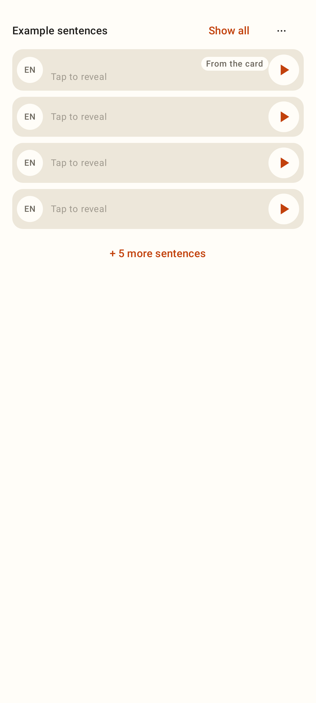 | 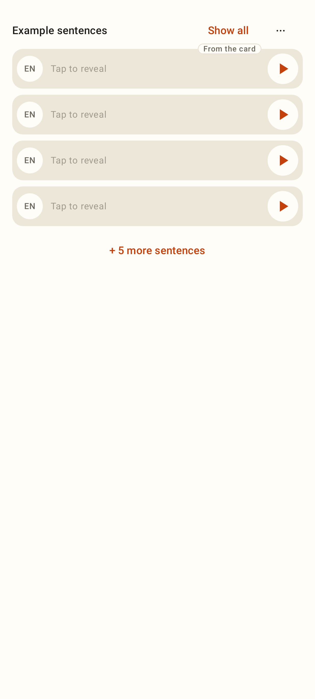 |
| 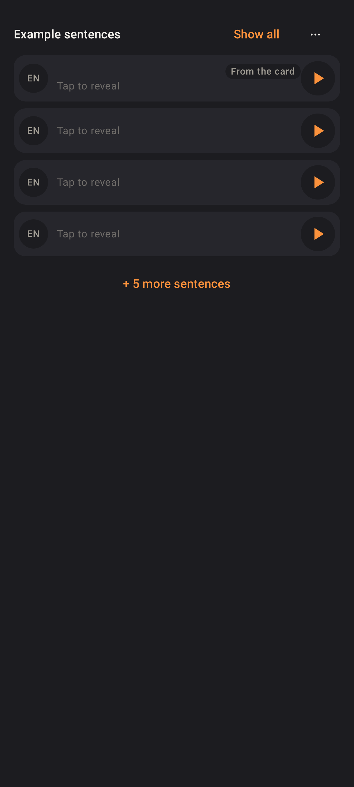 | 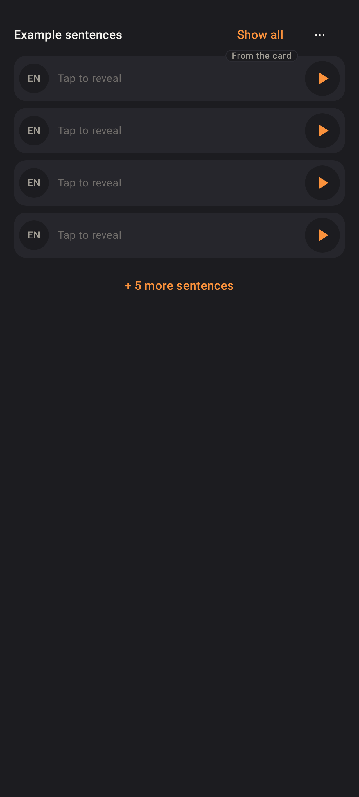 |

## Lab app — fully revealed (Show all)

| Before | After |
|---|---|
| 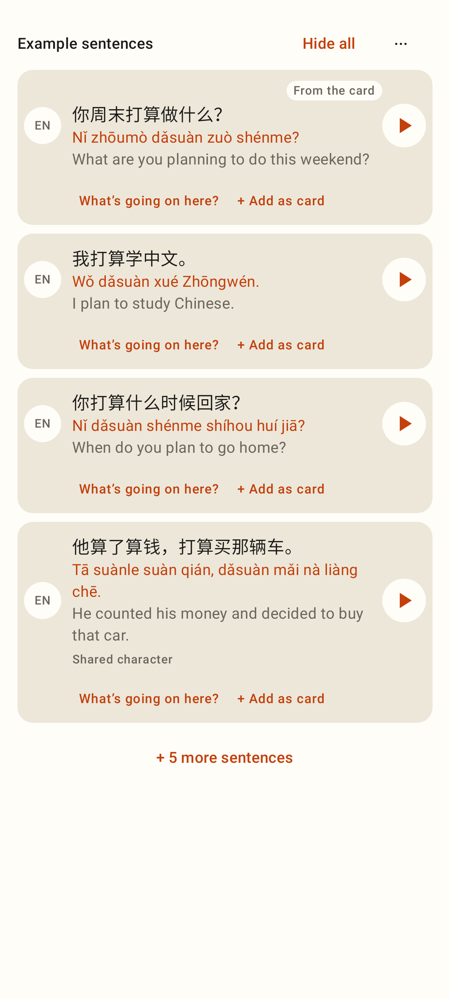 | 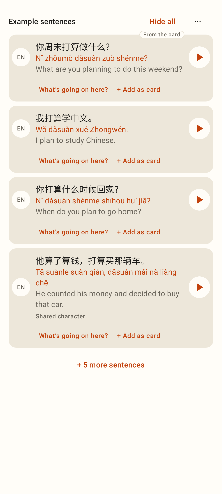 |
| 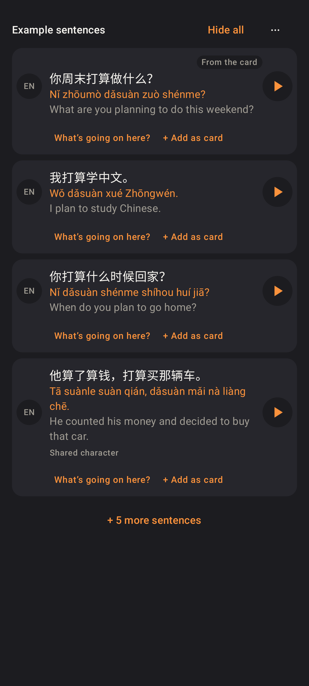 | 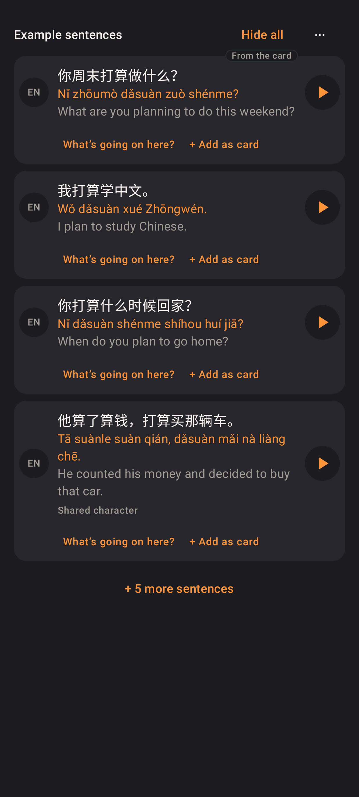 |

## Lab app — other places the row appears (after)

Card back at font scale 1.3 (dark): the tab still clears the first line.

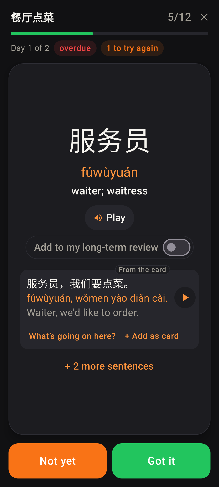
Homework pass: the card's sentence opened, tab on its top edge.

## Web — study card back

| Before | After |
|---|---|
| 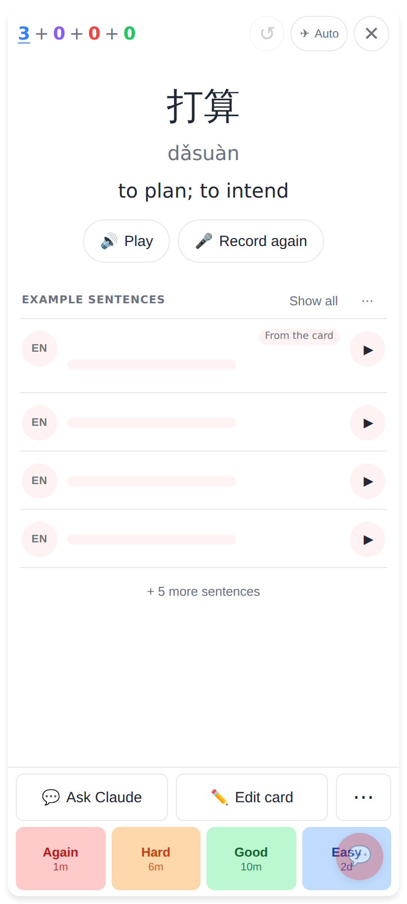 |  |
| 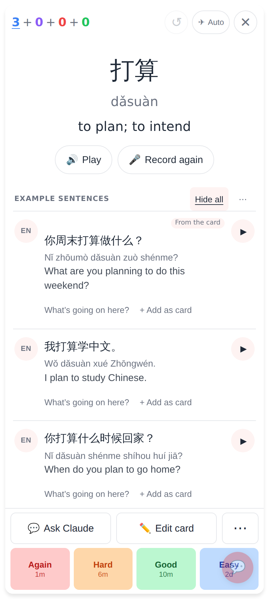 | 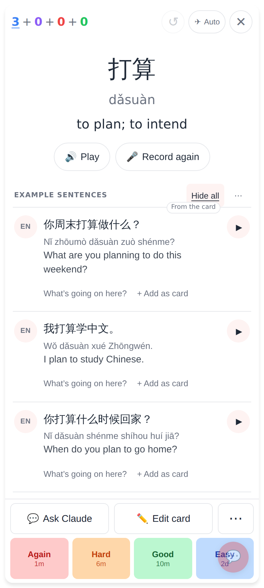 |

Measured on the web: collapsed row 1 was 74.6 px tall vs 59 px for row 2 (blank bar 40.6 px vs 25 px
from the top); after, both are 59 px with the bar at 25 px.
