# Sentence Coach: Check my sentence / Explain

Web (412×915 @2x) and the native Lab app (Roborazzi, Pixel Fold folded).

## Web

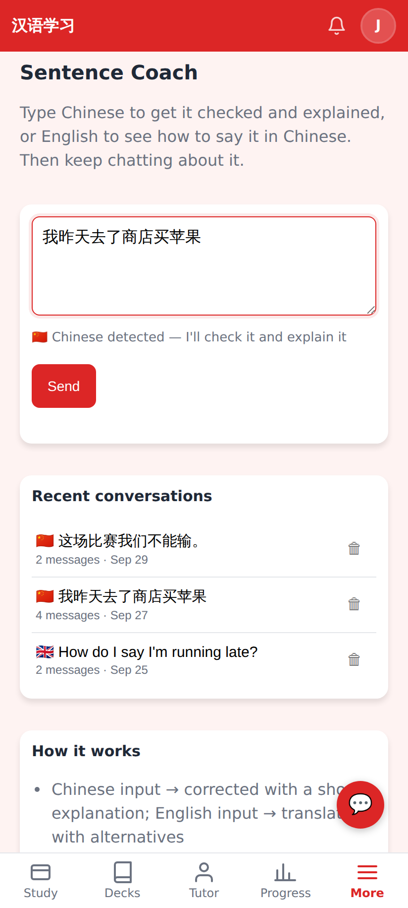
Before: one "Send" button, Chinese always went to the coach's correction.

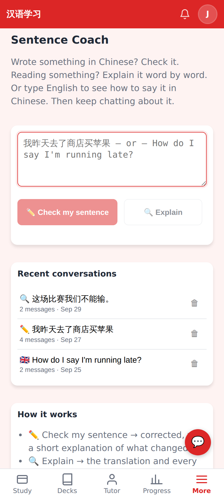
The widget's ✏️ (`?focus=1`): an empty box on the two buttons, disabled, nothing sent.

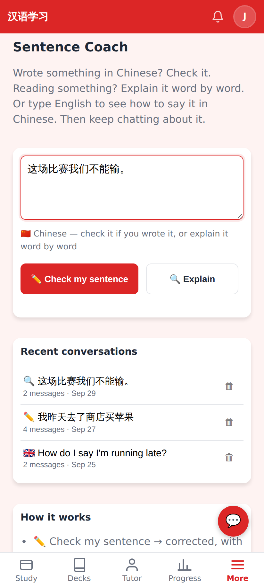
Chinese: ✏️ Check my sentence + 🔍 Explain. Recent conversations show which button started them.

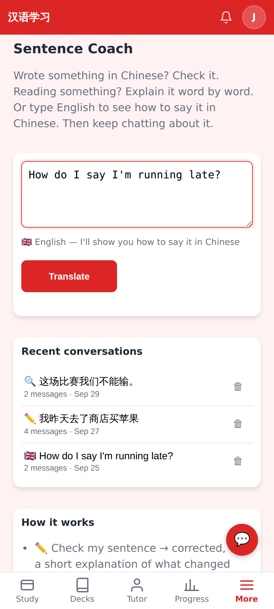
English: the single Translate button.

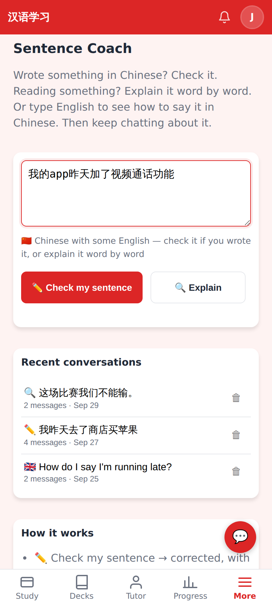
Chinese with some English: both Chinese buttons.

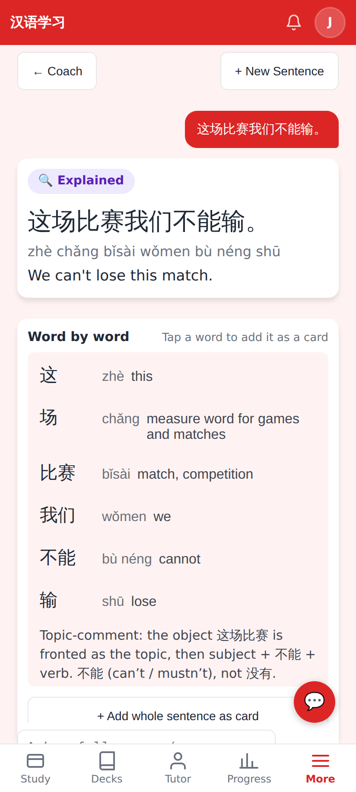
Explain: the translation, then the same one-word-per-row breakdown as "What's going on here?", then the construction.

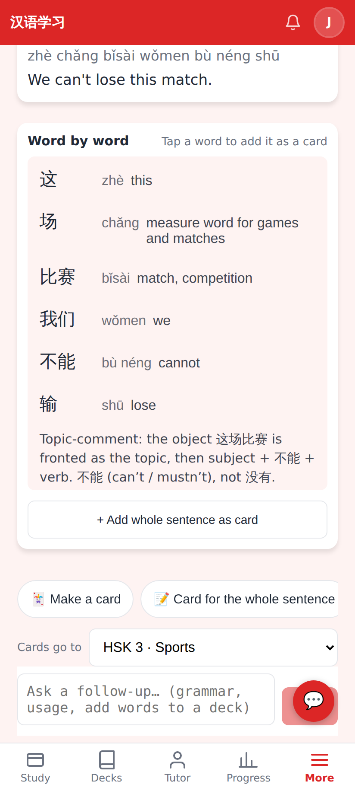
"+ Add whole sentence as card" and the usual quick-action chips + follow-up chat.

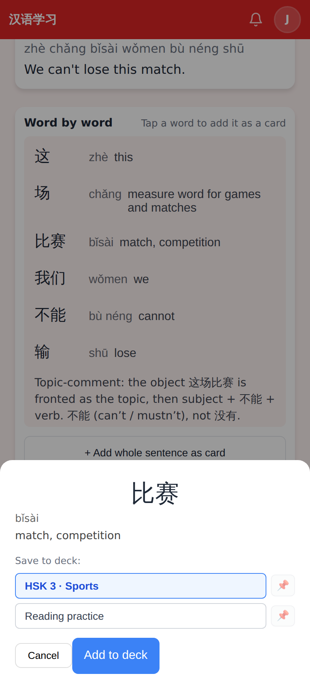
Tapping a word row opens the same Add-as-card sheet (now above the tab bar).

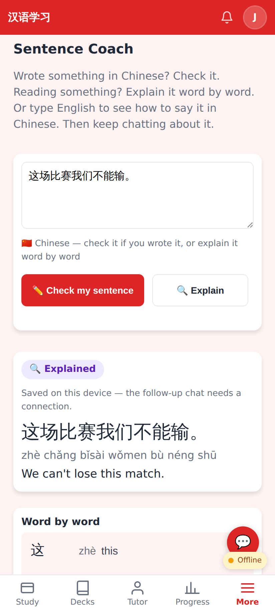
Offline: a sentence explained before comes from the device.

## Lab app

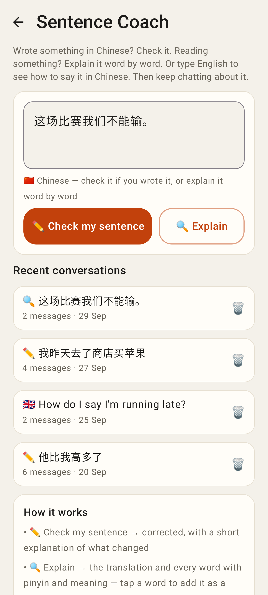
Chinese: Check my sentence + Explain.

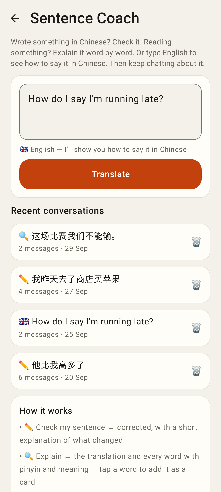
English: Translate.

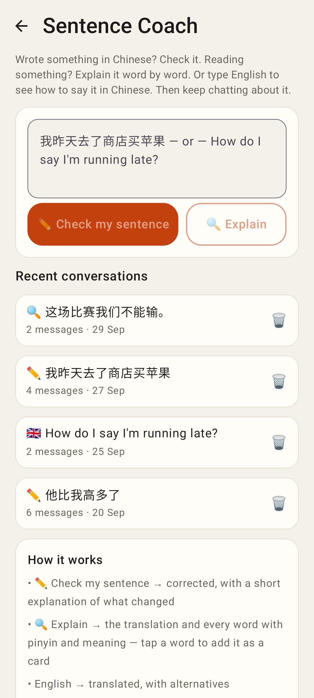
Empty box (widget ✏️): both buttons disabled.

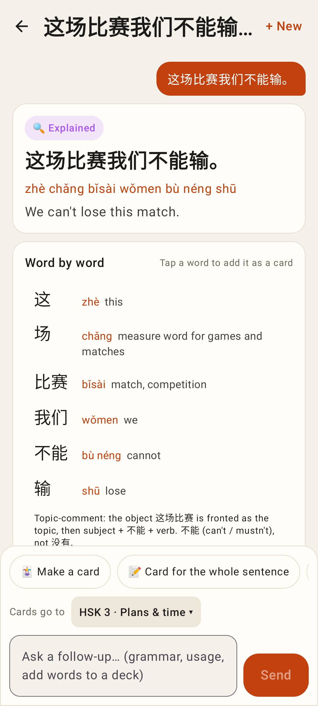
Explain result with the PR #450 breakdown rows (each adds the word as a card).

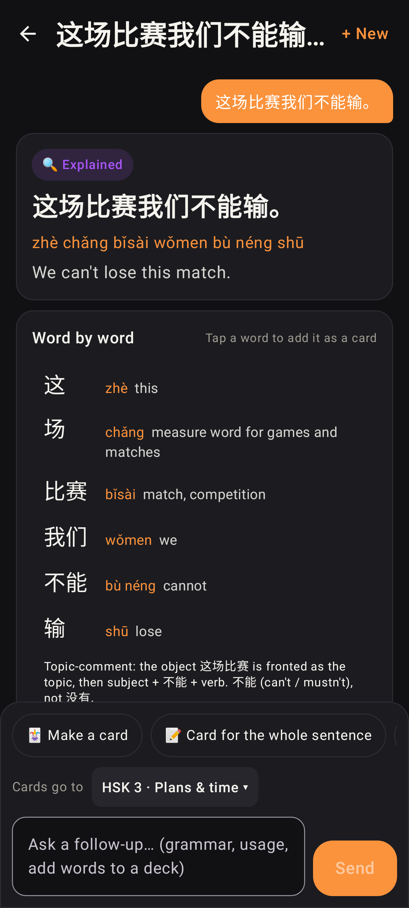
Same, dark theme.

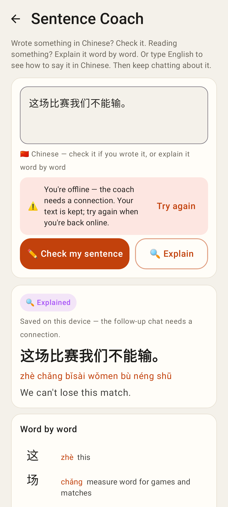
Offline: the saved breakdown.
