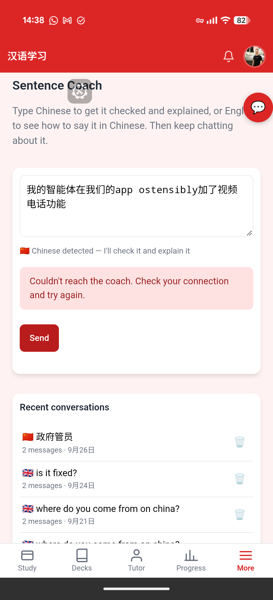
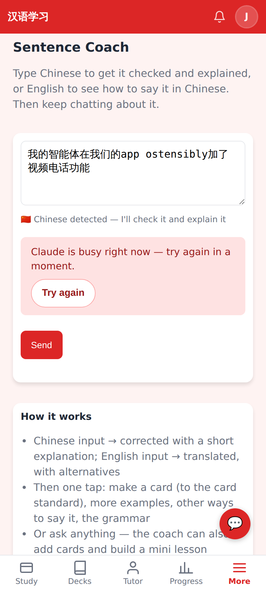
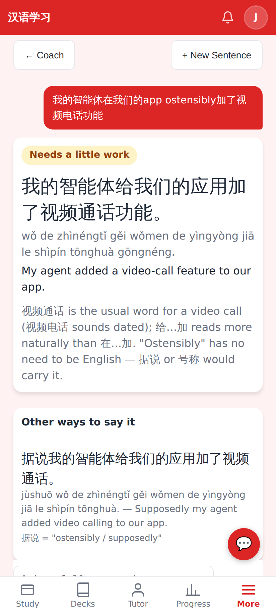

# Sentence Coach reliability — screenshots

Phone, 412×915 @2×. The coach's AI reply is stubbed at the network level for 02/03.

Before (Jerome's screenshot): every failure read "Couldn't reach the coach", and the cause was a truncated reply, not the connection.

After: when a failure outlasts the server's retries and the app's automatic retry, the real reason plus **Try again**; the typed sentence is kept.

Try again → the answer.
