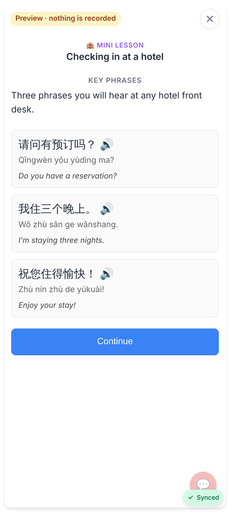
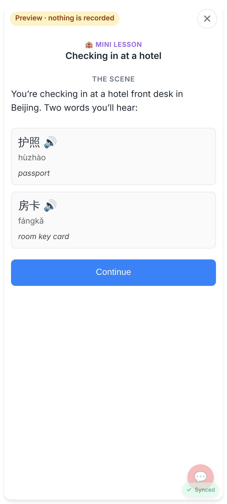
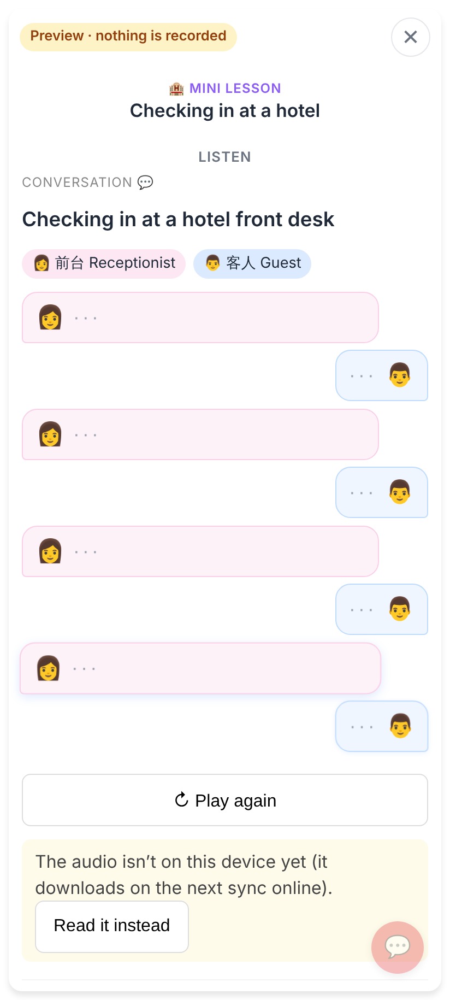
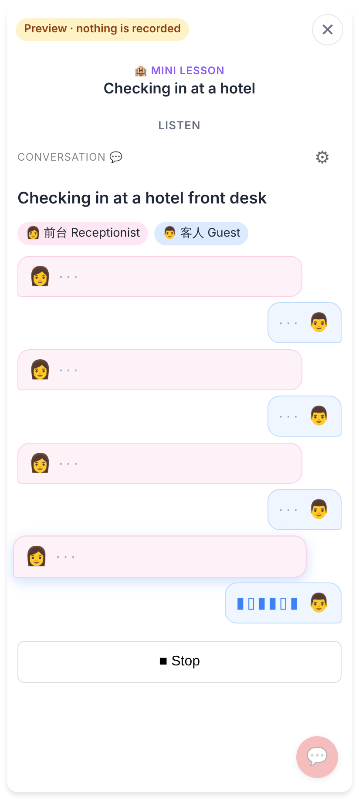
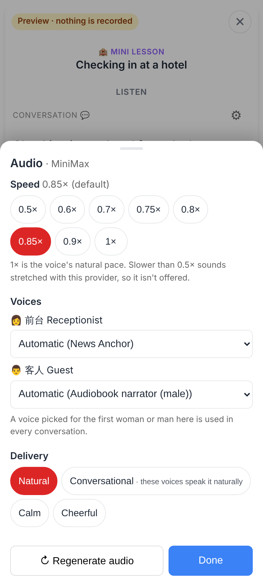
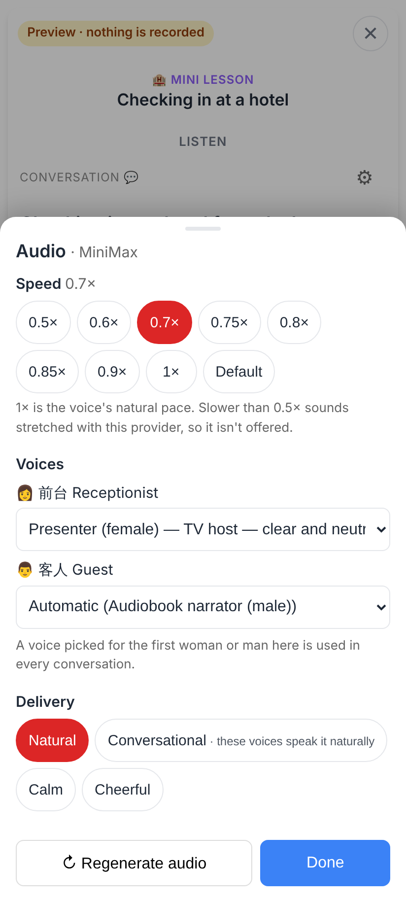
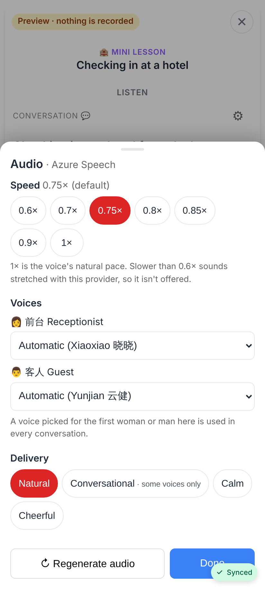
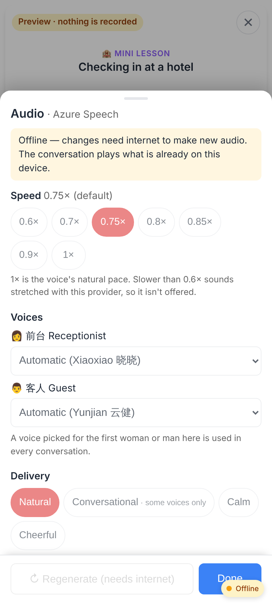
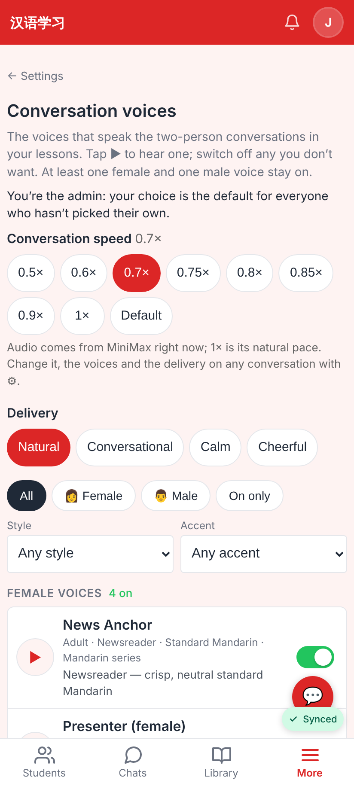
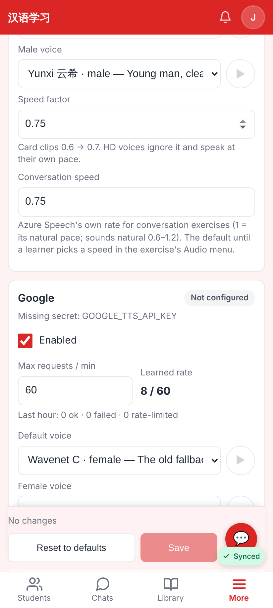

# Conversation audio controls + spoiler-free intros

Web app at 412×915 (2×). Lab app shots are in `lab/`.

## Spoiler-free intro (catalogue sample)

| Before | After |
|---|---|
|  |  |

Before: the intro quoted 我住三个晚上 — the answer to "How many nights?". After: one scene-setting sentence and two nouns (护照, 房卡); the phrases come in a note after the conversation.

## The ⚙︎ Audio menu

| Before | After |
|---|---|
|  |  |

Audio menu while MiniMax speaks: speed 0.5–1×, a voice per speaker, delivery, Regenerate.

0.7× picked and a voice chosen for the receptionist (carries to every conversation's first woman).

With Azure active (Jerome's case now; the server answer stubbed locally because this container has no Azure key): default 0.75×, Azure's own voices, steps from 0.6×.

Offline: controls off, "Regenerate (needs internet)"; playback uses what is cached.

## Settings and admin

Default conversation speed + delivery on Settings → Conversation voices.

`/admin/audio`: "Conversation speed" per provider (Azure 0.75), separate from the card speed factor.
