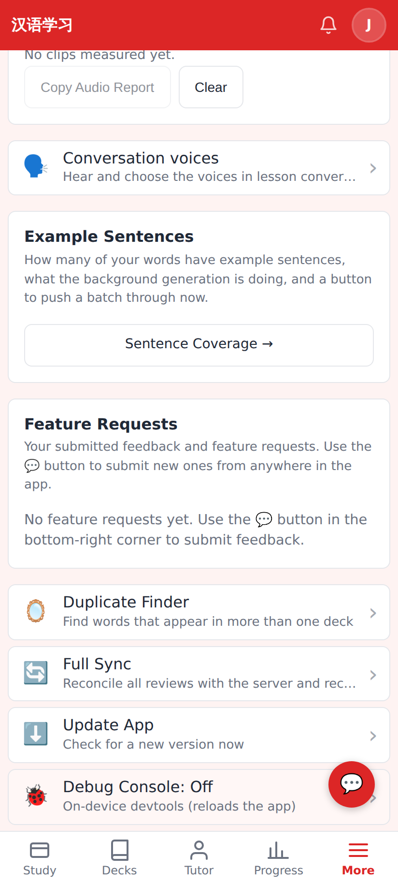
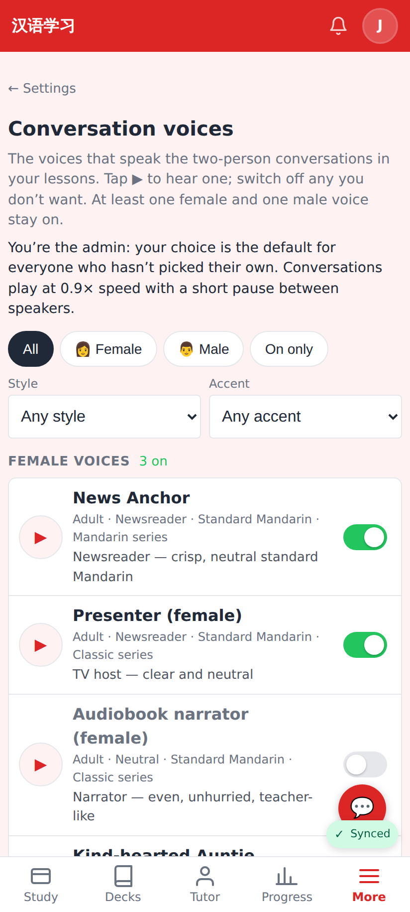
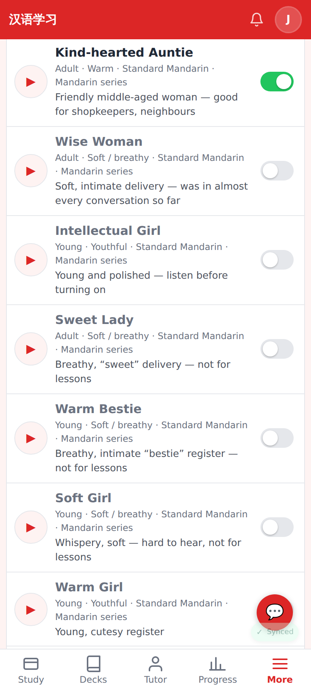
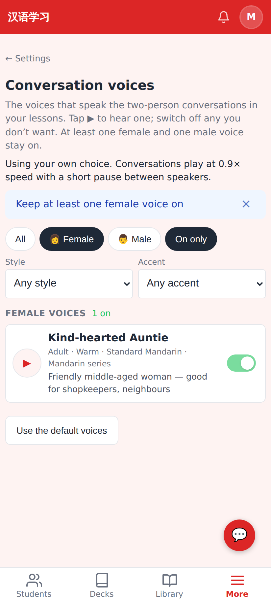
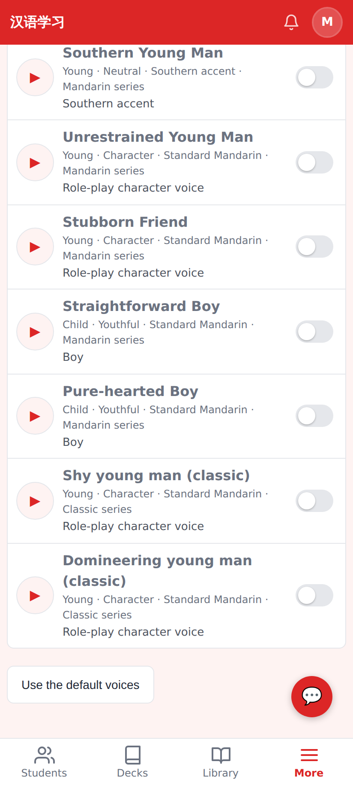
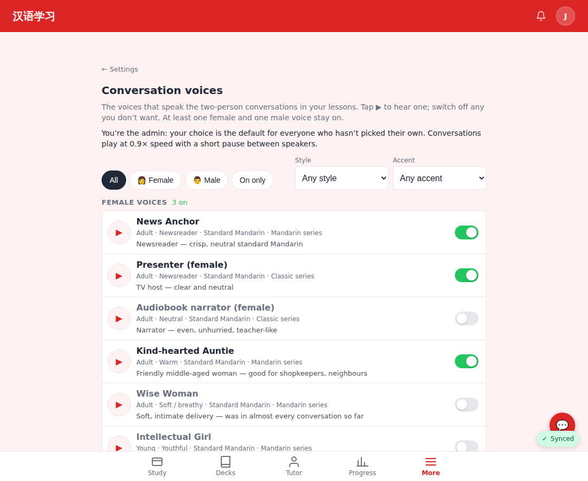
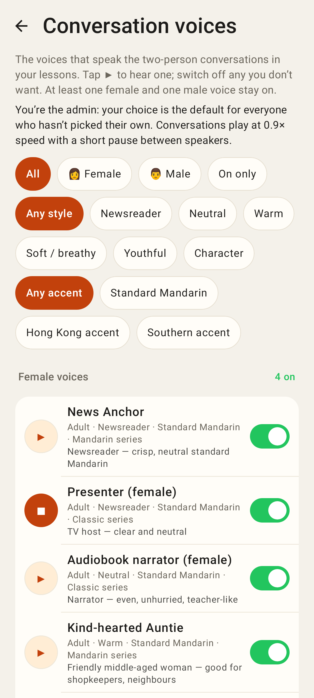
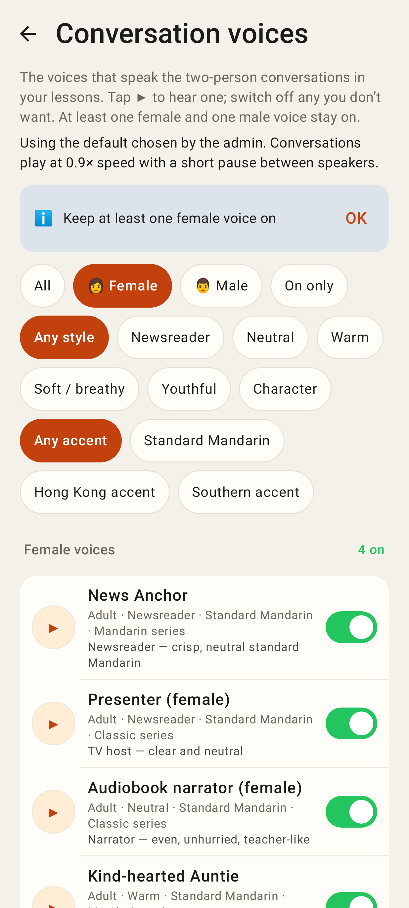
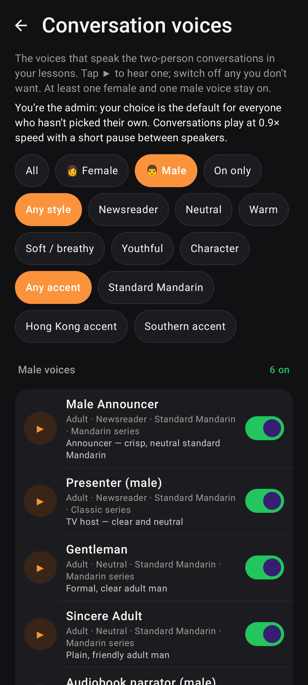

# Conversation voices + faster conversations

Web (412×915 @2×, plus one wide shot) and the Lab app (Roborazzi).

Settings → Advanced → **Conversation voices**.

The page for the admin: whose choice applies, the 0.9× pace, filters (gender, on only, style, accent), ▶ sample + switch per voice.

The breathy / “sweet” / role-play voices ship off, with the reason under each name.

Turning off the last female voice is refused with a notice.

A non-admin account with its own choice can go back to the default (the admin's selection).

Unfolded / desktop width.

Lab app: same page (`/settings/voices`), a sample playing.

Lab app: female filter, the last-voice notice, a sample loading.

Lab app, dark theme, male voices.
