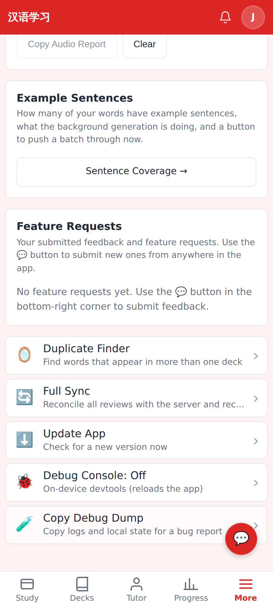
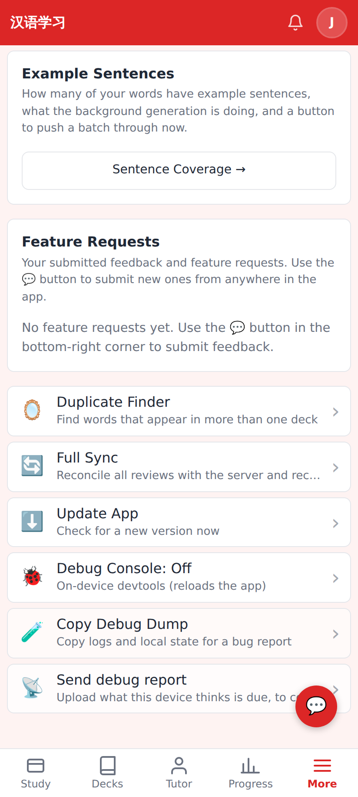
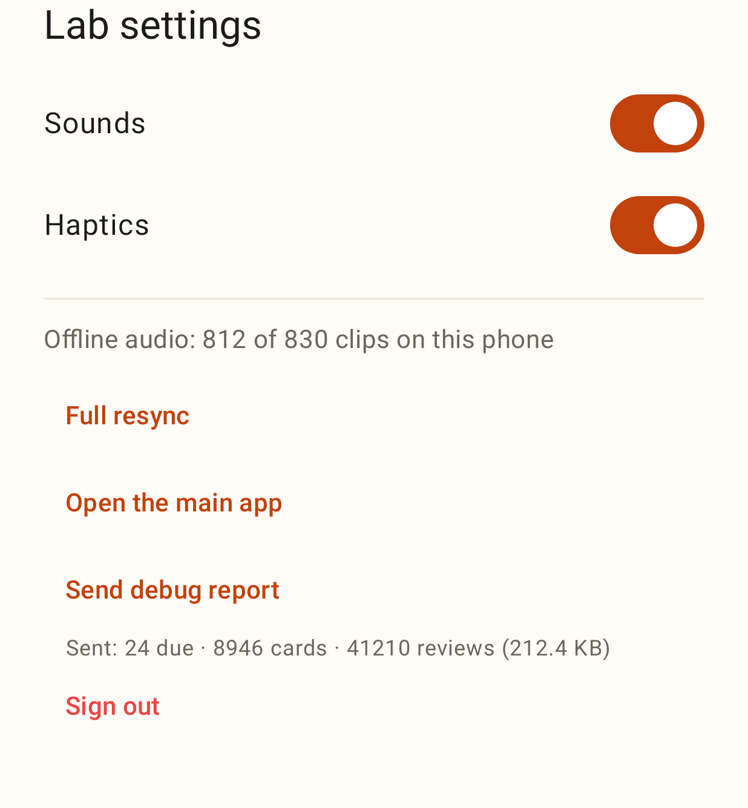

# Debug reports — screenshots

Web app, phone viewport (412×915 @2×), Settings → Advanced:

Before — the Advanced list as it is on main.

After — a new **Send debug report** row under Copy Debug Dump.

After tapping it: the row says what was uploaded (cards due, cards, reviews, size).

Lab app (Roborazzi render of the home ⚙ settings sheet):

**Send debug report** under "Open the main app", with the last result underneath.
