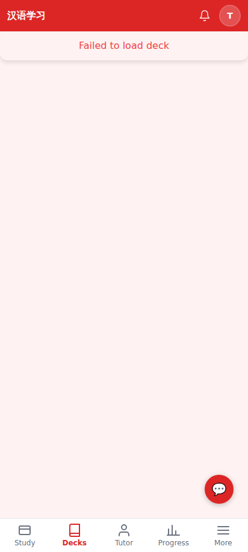
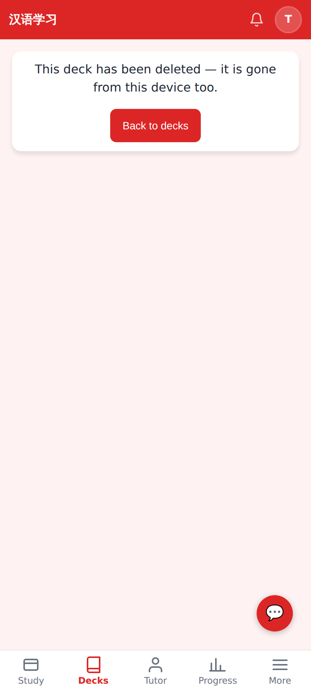
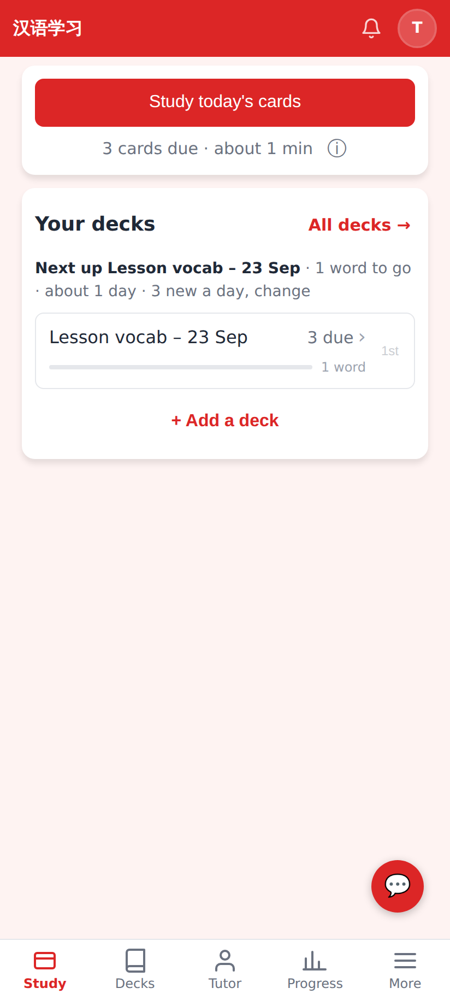

# Deleted decks that came back — screenshots

Phone viewport (412×915).

Before: a deck deleted while a full sync was running came back. Its page could only say "Failed to load deck", with no way to delete it.

After: opening a deck the server no longer has removes it from the device and says so.

After: home once the one-time catch-up sync has run. Only the deck that still exists is left.
