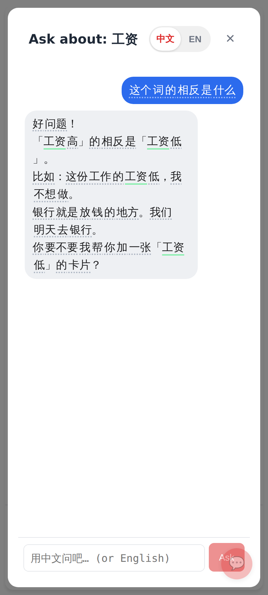
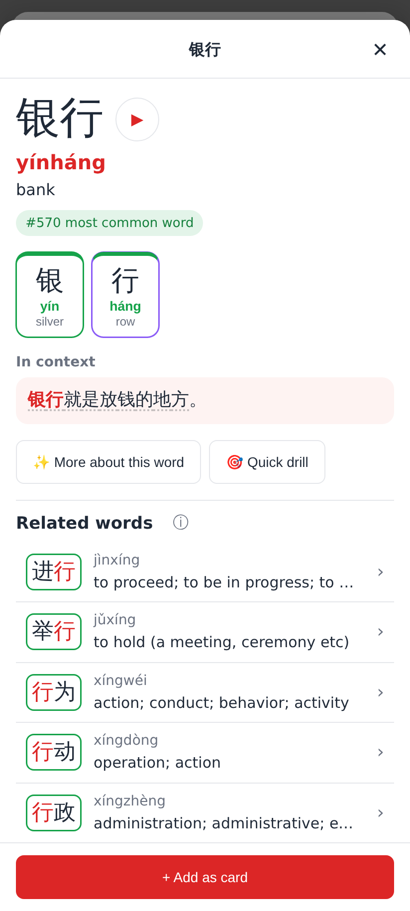
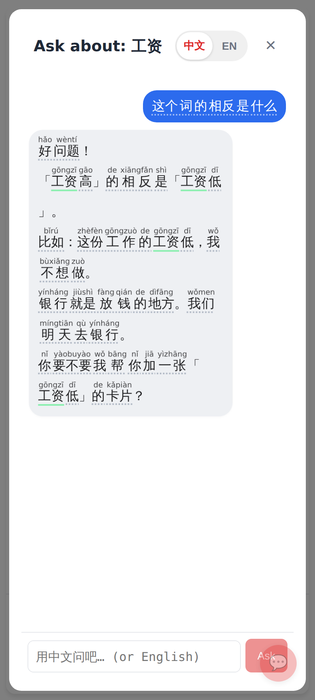
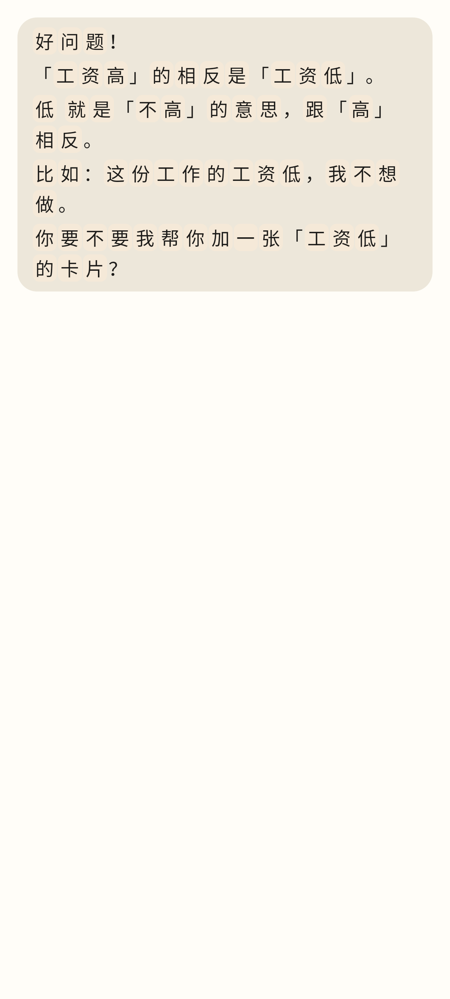
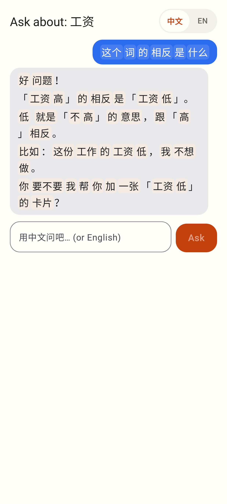
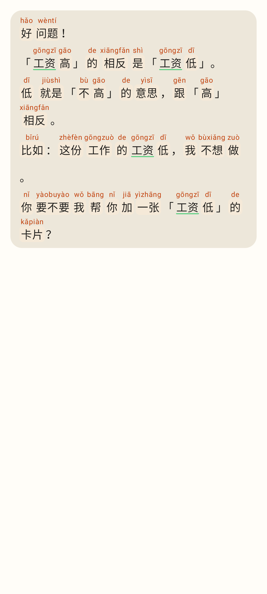

# Word chips without an LLM — screenshots

Ask Claude's Chinese reply at the phone viewport (412 × 915). Before: Claude's word splitter hadn't
answered (it took 2–31 s, and sometimes failed), so every character was its own chip. After: the
device's deterministic segmenter makes word chips the moment the answer arrives.

## Web

Before: every character tappable on its own; the dotted underline runs on, so you can't see the words.

After: 工资 · 相反 · 这份 · 工作 · 银行 · 地方 · 要不要 · 卡片 are each one chip, immediately and offline.

Tapping 银行 opens the language explorer on the whole word (meaning from the dictionary).

Pinyin on: each word carries its own pinyin (auto-pinyin with the 一 / 不 tone changes: yìzhāng, yàobuyào).

## Lab app

Before: the old per-character fallback.

After: the same reply in the Ask Claude sheet, word chips made on the phone (my question too).

With pinyin: one pinyin per word; 工资 is underlined green (already in a deck).
