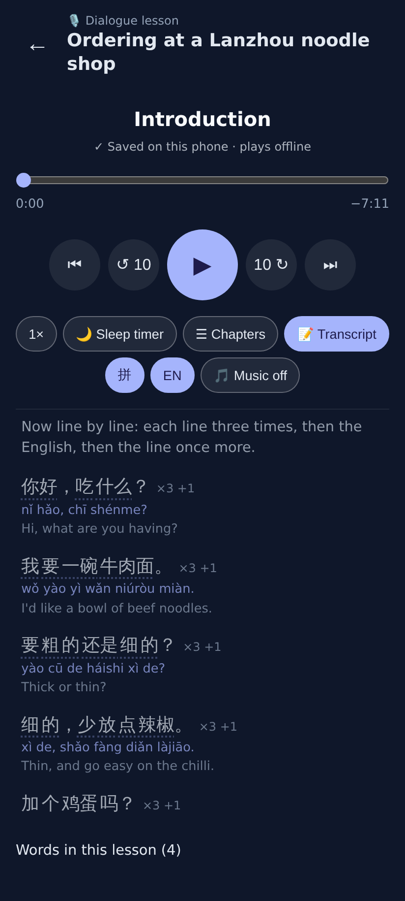

# Dialogue lessons: line by line ×3 + the English + once more

The player's transcript (412×915, 2×) on a dialogue lesson made with the fake model: each line of the
"Line by line" chapter is ONE row with "×3 +1" — said three times, the English, then once more — with its
pinyin and English under it. Before, the row showed the line once with no chip.
