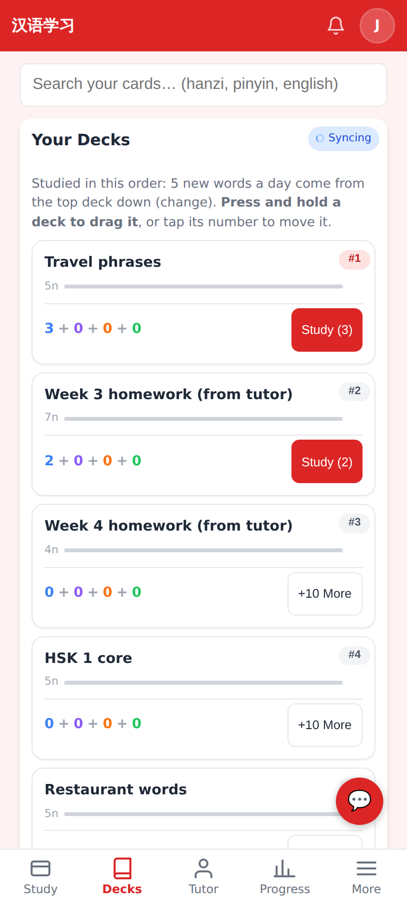
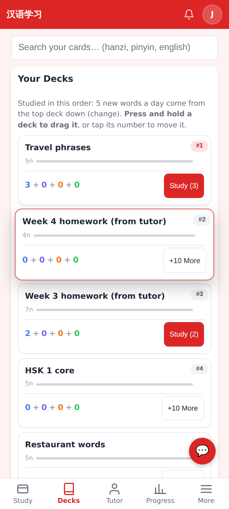
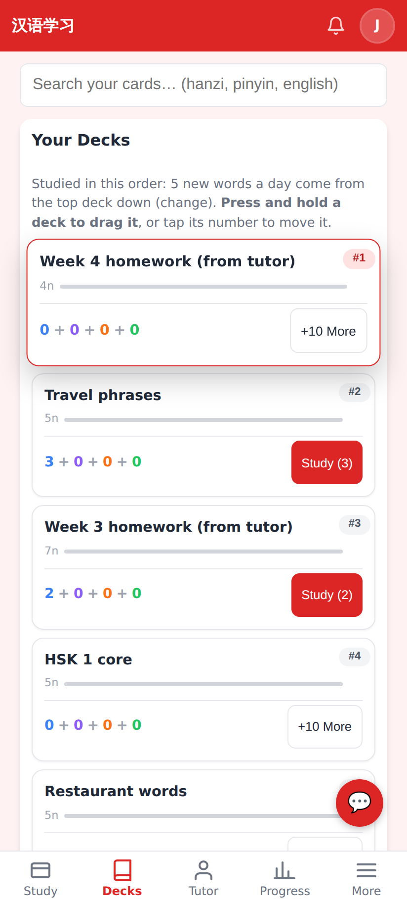
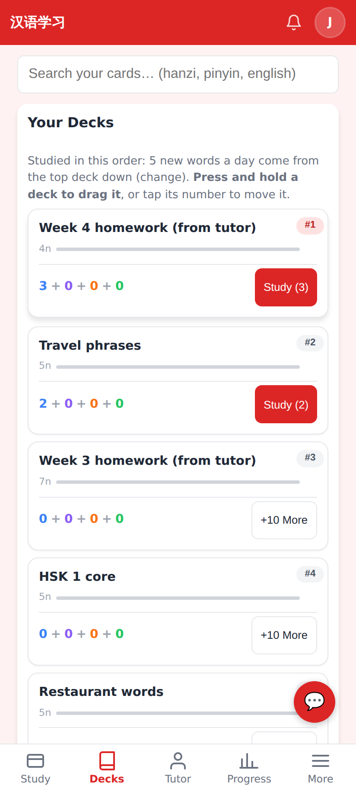

# Press-and-hold to drag decks — PR screenshots

Captured at 412×915 @2× from this branch running locally in E2E test mode as student **Jerome** (five decks). The drag was driven with the pointer: press, hold 600 ms, move, release.

**The hint** now says it: "Press and hold a deck to drag it, or tap its number to move it."

**Held and lifting.** After the hold the card lifts (scale, shadow, red outline) and the list re-sorts under the pointer as it moves.

**At the top.** The dragged deck is now shown in first place while still held.

**Dropped.** The order is written locally at once and to the server; the #N badges update, and today's new-card allocation follows the new order (the new top deck now takes the 3 it is allowed, the next deck the remaining 2 of the 5-a-day budget). The order survives a reload.

