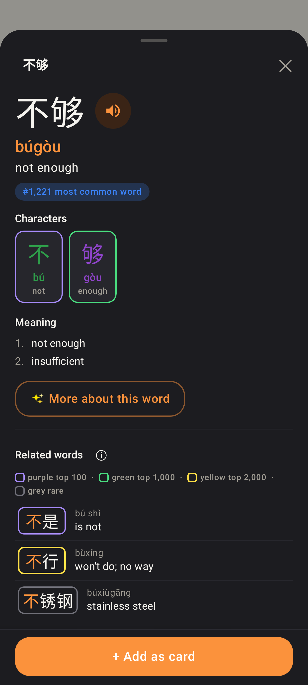
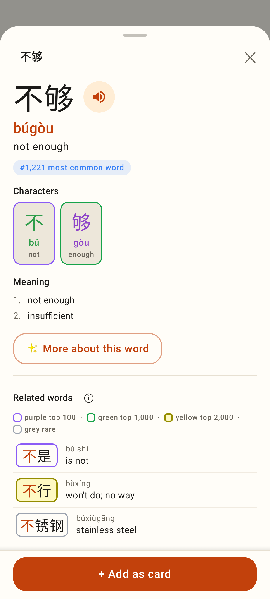
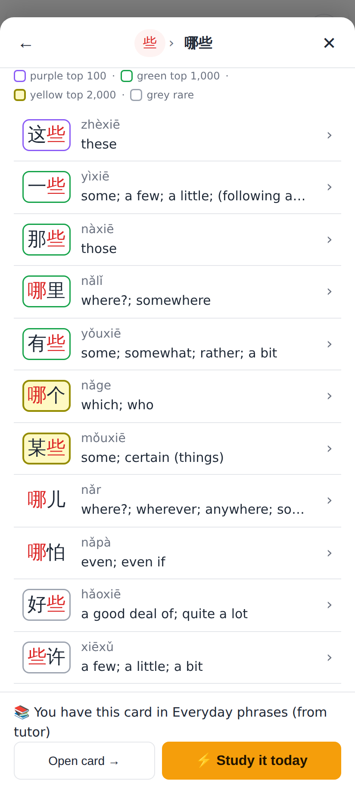

# Explorer: a lighter, lemon yellow for the top-2,000 decal

On the Lab's dark card the yellow tier (`#facc15`) still read as orange / gold. It is now lemon yellow:

| | Before | After |
|---|---|---|
| Dark (Lab card `#1c1c20`) | `#facc15` 2px, no fill (11.1:1) | `#fde047` (yellow-300) 2px, no fill (12.9:1) |
| Light (white / Lab card `#fffdf8`) | `#a89000` 2px on a `#fef08a` fill (3.2:1) | `#948c00` lemon-olive 2px on a `#fef9c3` fill (3.5:1 on white, 3.4:1 on the Lab card, 3.25:1 on the fill) |

No fill on dark: a 10–14 % yellow tint over `#1c1c20` comes out khaki and pulls it back towards gold. Tiers,
legend text ("yellow top 2,000"), purple / green / grey are unchanged. Real ranks from the shipped word-freq list;
Lab 412×915dp (Roborazzi `ExplorerDecalScreenshots`), web 412×915 @2×.

## Lab app, dark

Before: 不行 (#1,821) in `#facc15`, reads orange next to the green and purple.

After: 不行 in `#fde047`, clearly lemon yellow; the key's swatch matches.

## Lab app, light

Before: `#a89000` on `#fef08a`.

After: `#948c00` on a paler `#fef9c3`.

## Web

Before: 哪些's related words with the key open; 哪个 (#1,428) / 某些 (#1,638) on the old yellow.

After: the same list in the lighter lemon yellow.
