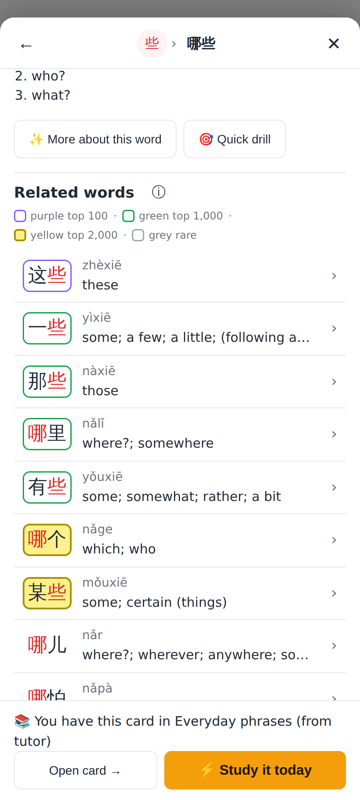
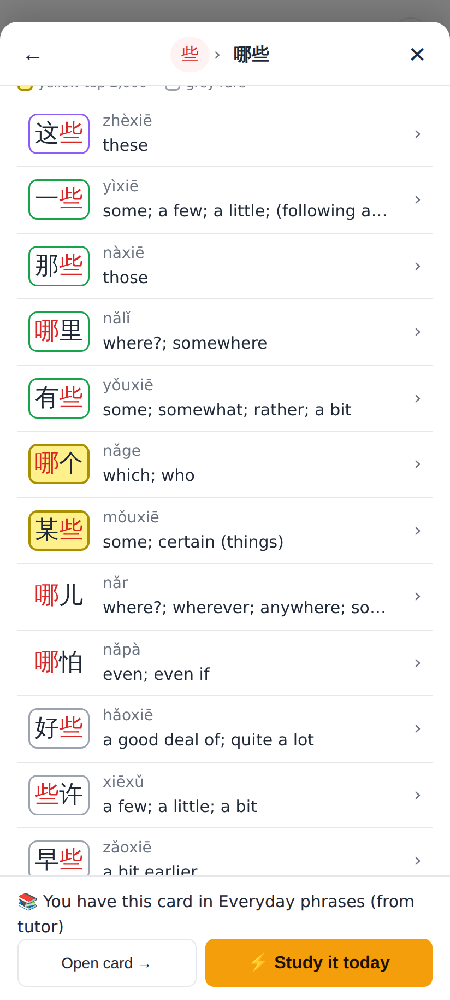
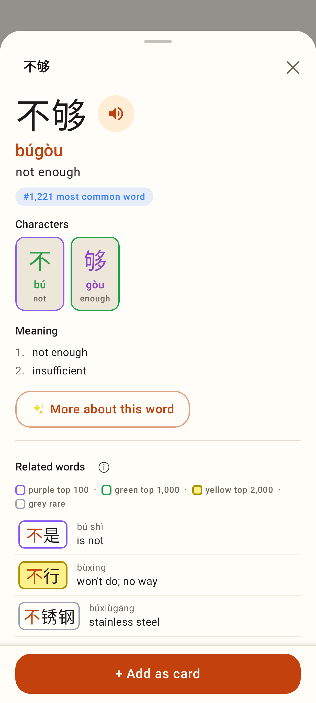
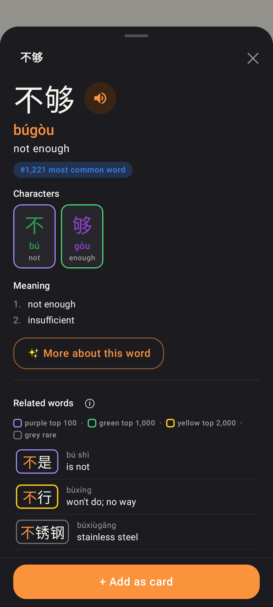

# Explorer: the top-2,000 decal is yellow

The 1,001–2,000 tier was orange (`#ea580c`), which read as gold / "rare". It is now **yellow** (yellow = common):
purple top 100 · green top 1,000 · **yellow top 2,000** · grey rare.

A pure yellow line can't reach 3:1 on white, and darkening it until it does turns it gold. So on the light sheet the
yellow tier is a 2px dark-yellow outline (`#a89000`, 3.2:1 on white) around a yellow fill (`#fef08a`): the fill is
what reads yellow. On the Lab's dark card it is `#facc15` (11:1), 2dp, no fill. Real ranks from the shipped word-freq
list; phone viewport (web 412×915 @2×, Lab 412×915dp).

## Web

哪些: "Related words" with the ⓘ key open — "yellow top 2,000" with its swatch; 哪个 (#1,428) and 某些 (#1,638) are yellow.

The same list further down: 这些 purple, 一些 / 那些 / 哪里 / 有些 green, 哪个 / 某些 yellow, 哪儿 / 哪怕 unmarked, 好些 / 些许 / 早些 grey.

Under a dark system setting: the web app is light-only, so the sheet stays white with the light set (same as before).

## Lab app

不够: chips 不 purple and 够 green; related words 不是 purple, 不行 yellow, 不锈钢 grey; the key open.

Dark theme: 不行 in `#facc15`, no fill.
