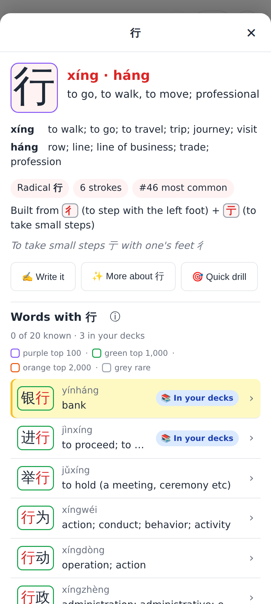
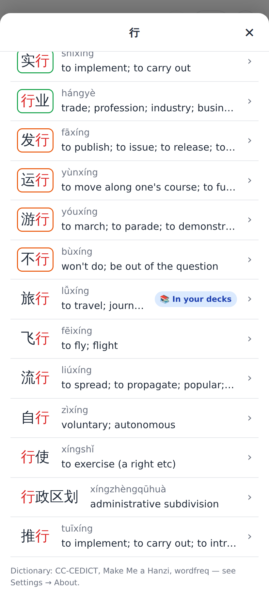
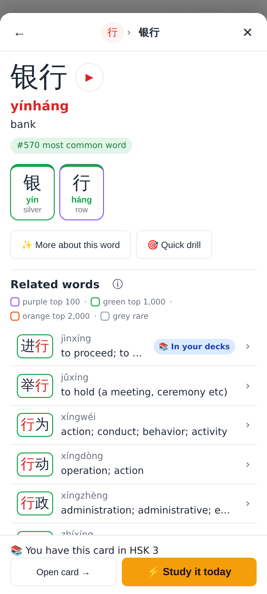
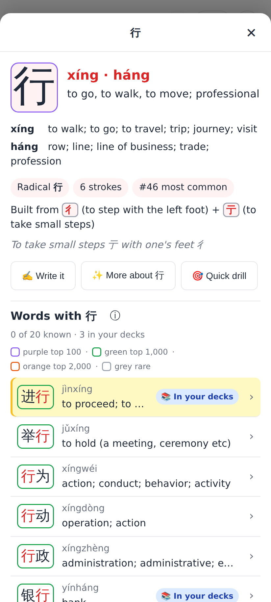
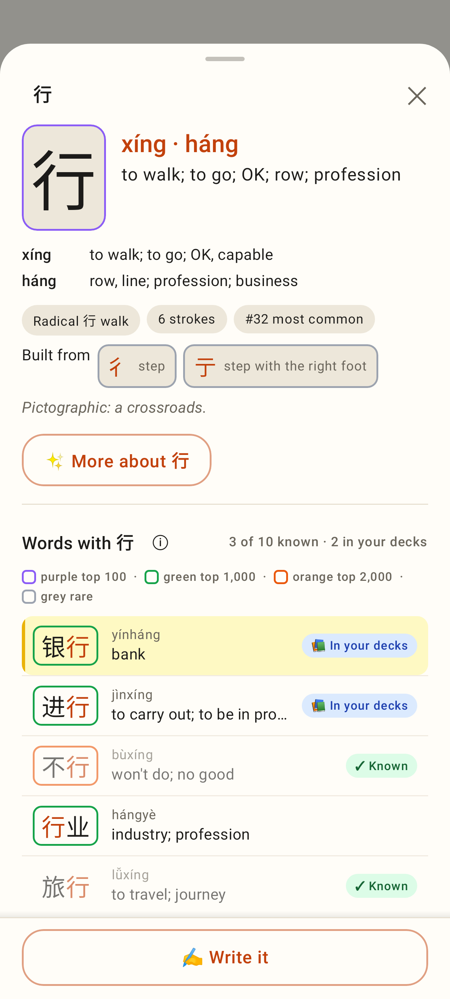
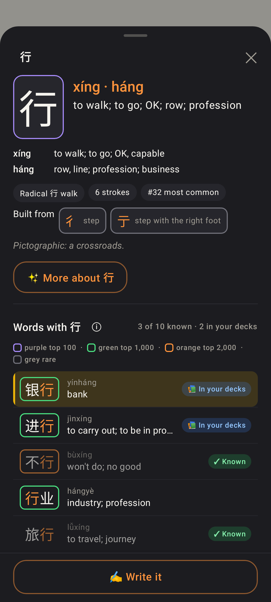
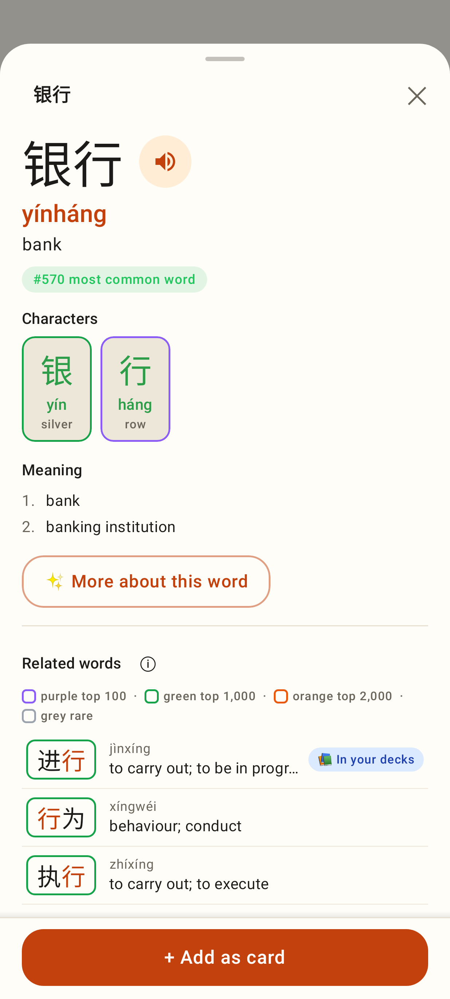
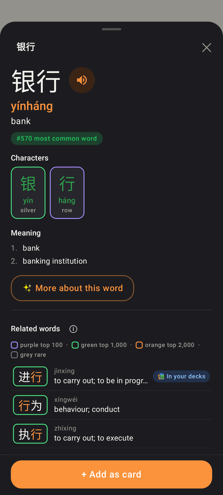

# Explorer frequency decals

Outline around each word / character tile: purple top 100 · green top 1,000 · orange top 2,000 ·
grey rare (words beyond 10,000 / characters beyond 3,500, or not in the list) · none in between.
Phone viewport (412×915, 2×). Real ranks from the shipped word-freq list.

## Web

行: the glyph tile is purple (top 100), components 彳 / 亍 grey, the ⓘ key open, word tiles green / none.

Further down "Words with 行": green, orange (发行, 运行, 不行 …) and unmarked tiles; badges unchanged.

银行: character chips 银 green (#713) and 行 purple (#46), keeping the tone bar on top; related words with the key open.

The web app is light-only: under a dark system setting the sheet stays white and keeps the light decal set.

## Lab app

行 in the Lab: same tiles, same key.

Dark theme: the softer dark set (≥ 3:1 on the dark card).

银行: character chips and related words.

Dark theme.
