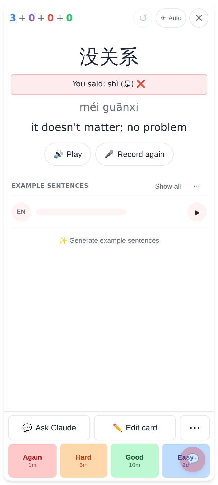
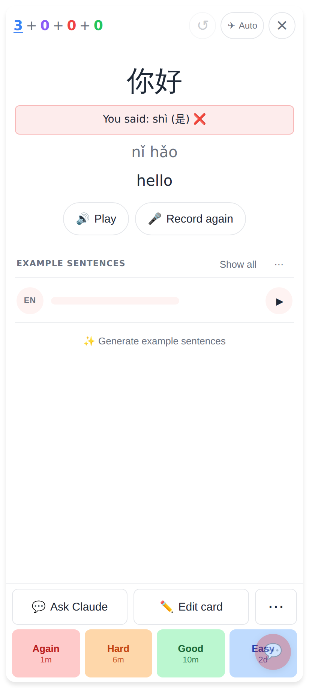

# Faster pronunciation transcription

No new UI: the same "You said: …" line, it just arrives sooner. Both shots are the web app at 412px, with Soniox faked in the page and a fake microphone.

Streamed live (Soniox stand-in): the result was on screen 161 ms after tapping Stop, with 8 × 250 ms chunks sent while recording and no upload.

Fallback (`provider: upload`): the take goes to POST /api/transcribe as before, and transcription now starts at Stop instead of at Check answer.
