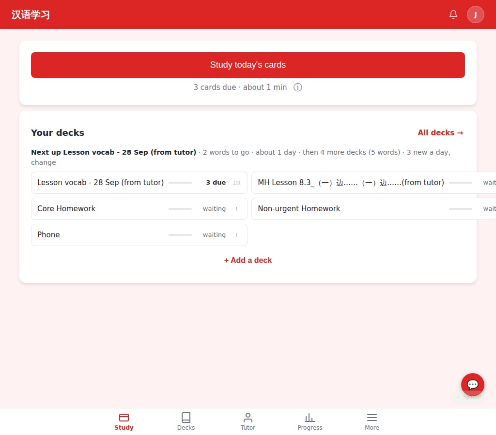
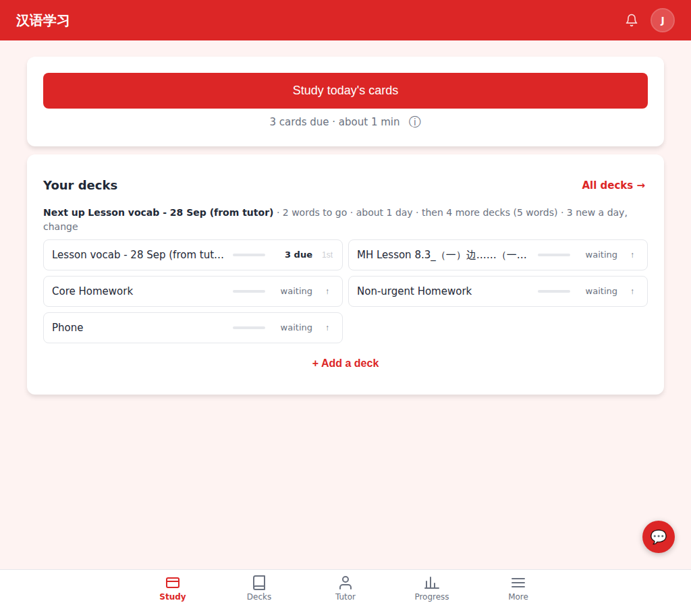
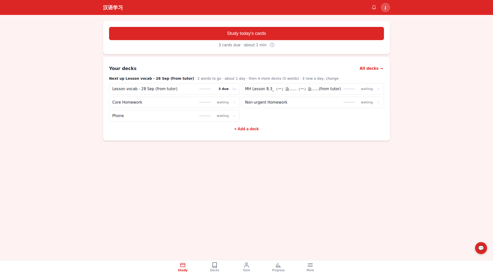
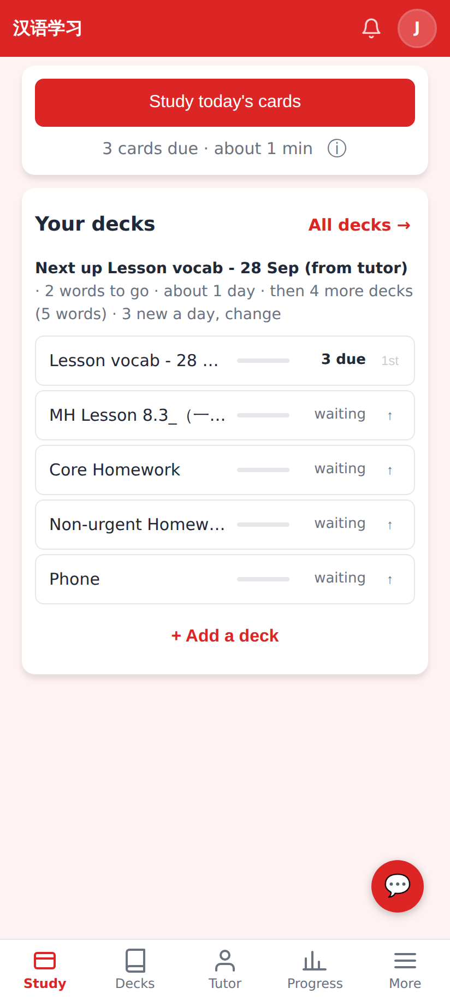

# Home: deck rows stay inside the "Your decks" card

A long deck name (`MH Lesson 8.3_（一）边……（一）边……(from tutor)`) used to widen its column of the
two-column grid past the card edge; now both columns share the card and long names are ellipsized
(full name on hover via `title`).

Before, 1024px: the right column runs off the card and the page scrolls sideways.

After, 1024px: two equal columns inside the card, names ellipsized, "n due" and ↑ in place.

Before, 1980px: columns sized by the longest name (unequal), close to the edge.

After, 1980px: two equal columns.

After, 412px (phone, 2×): one column, unchanged.
