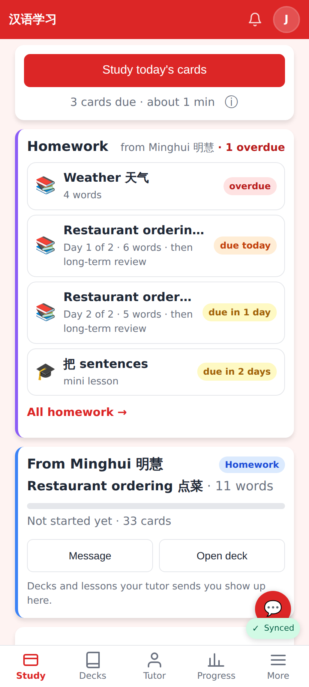
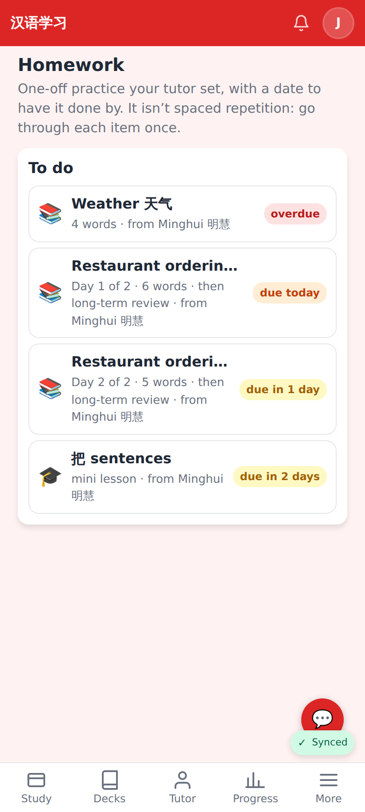
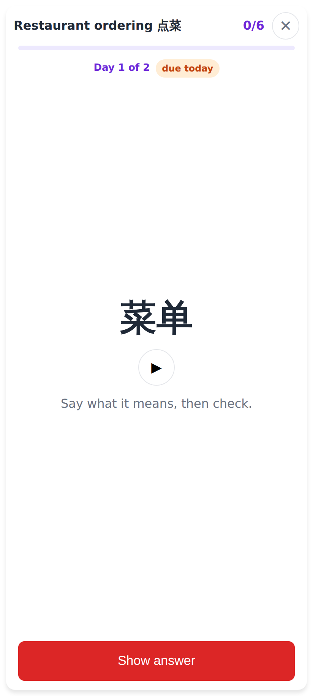
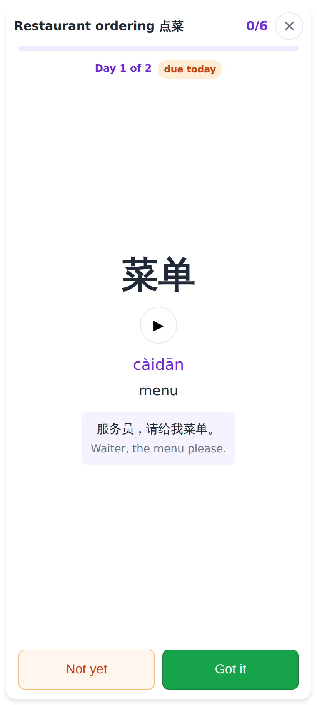
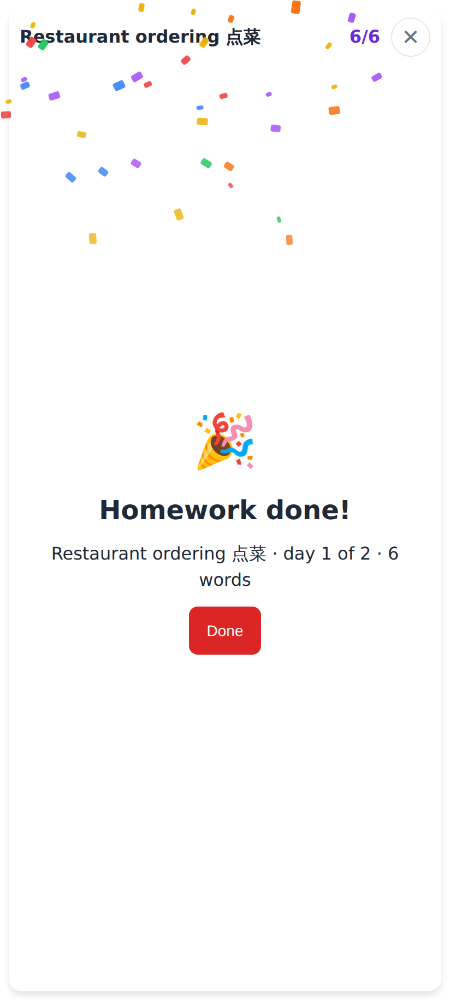
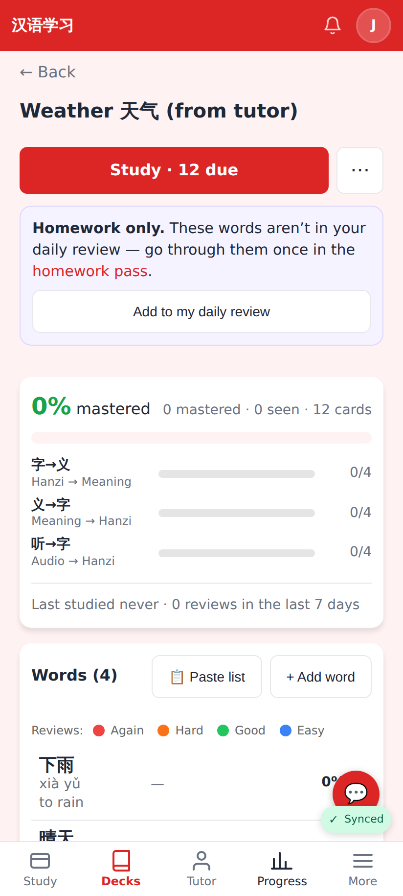
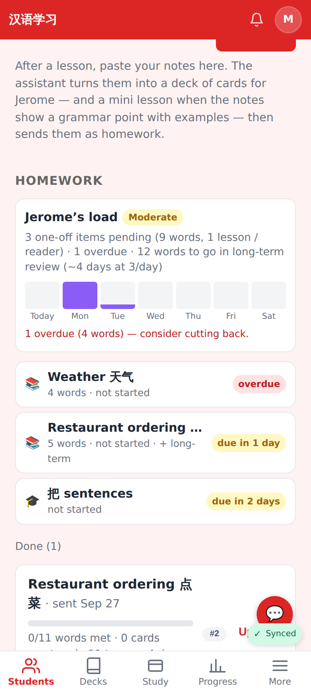
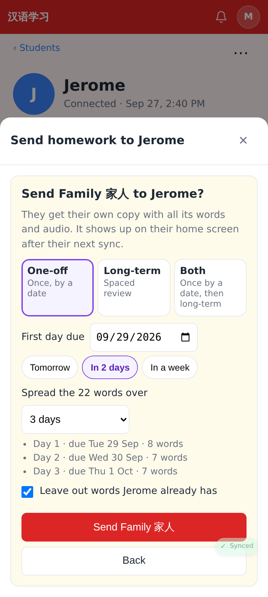

# Homework assignments — one-off passes with due dates (PR 1)

Phone viewport (412×915 @2×), seeded locally: tutor "Minghui 明慧", student "Jerome". Design: [docs/HOMEWORK.md](../../HOMEWORK.md).

Student Home: the new **Homework** card — overdue first, then by due date; a deck split over two days shows as "Day 1 of 2" / "Day 2 of 2"; "then long-term review" for mode *both*.

`/homework`: everything still to do (and what's done), with who sent it.

The one-off pass (full screen): the word, audio, "Say what it means, then check."

Revealed: pinyin, meaning, the card's sentence; **Not yet** (comes back at the end) / **Got it**.

Pass finished: confetti.

A one-off-only deck on its deck page: not in the daily review; link to the pass and **Add to my daily review**.

Tutor's student page: the **load gauge** (level, one-off pending / overdue, long-term words to go ~days, the next week) and the open one-off homework with the student's progress; tap a row to move its date or cancel it.

Send homework → a deck: **One-off / Long-term / Both**, due date with quick chips, "spread the 22 words over 3 days" with the per-day preview, "leave out words Jerome already has".
