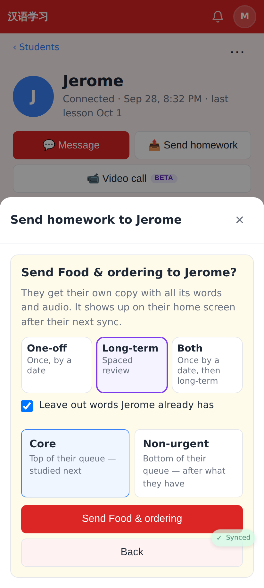
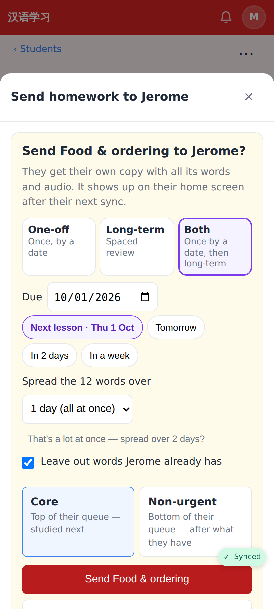
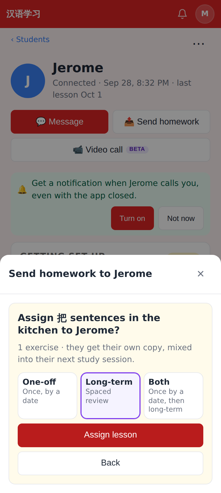
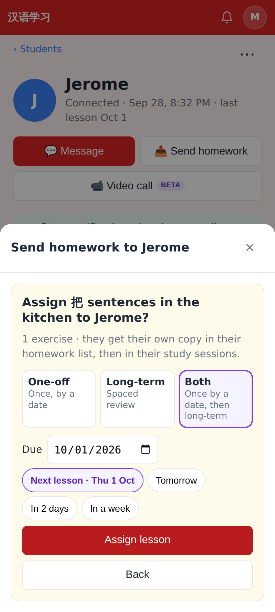
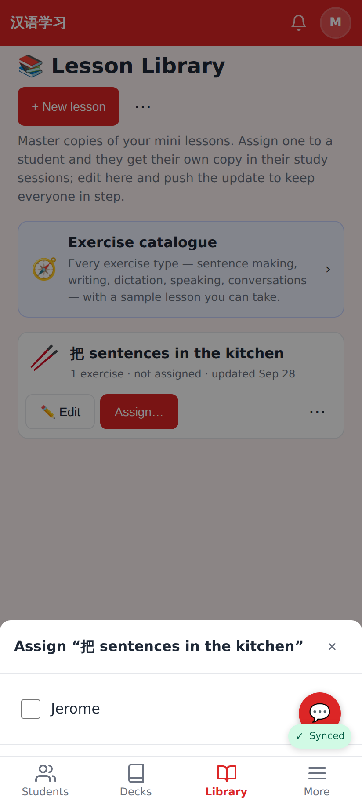
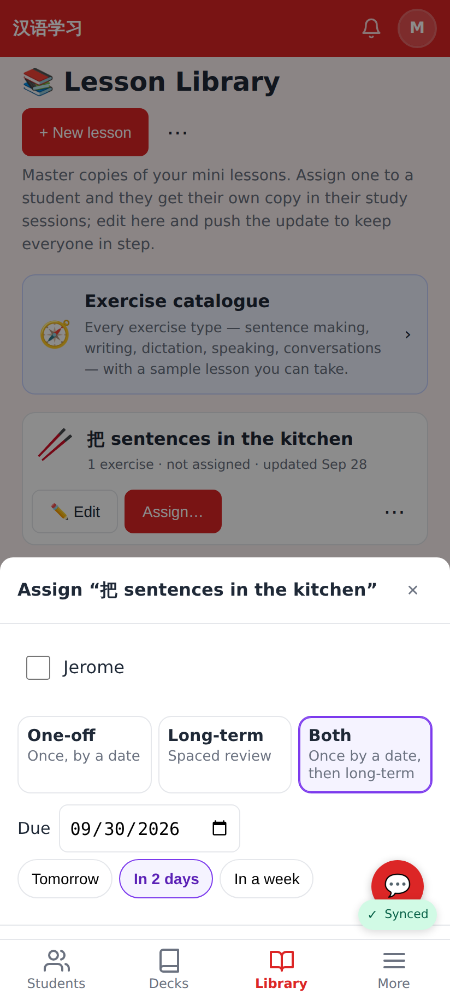
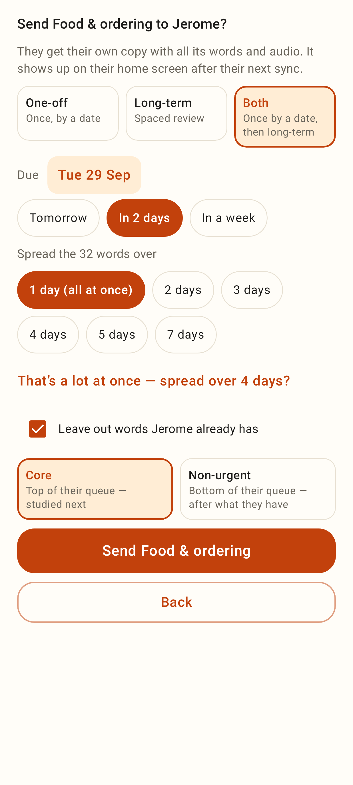
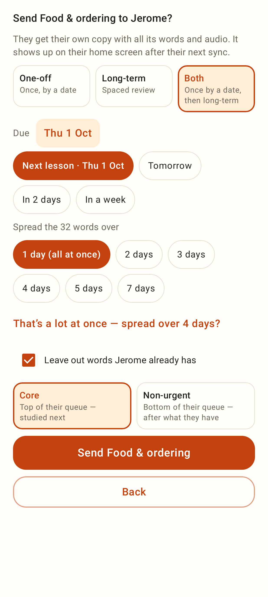
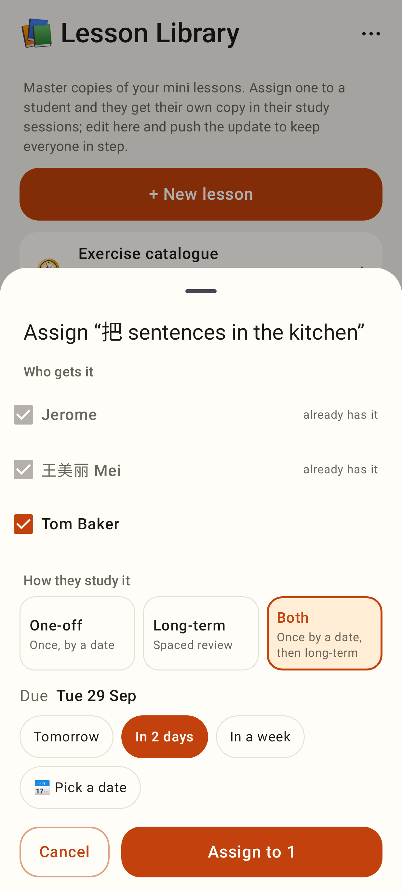

# Homework defaults to Both

Phone viewport (412×915, 2×). The student has a lesson logged for Thu 1 Oct.

## Web: Send homework, deck

Before: opens on Long-term, with no date.

After: opens on Both, due at the next logged lesson (the "Next lesson · Thu 1 Oct" chip is selected). Split over days and "leave out words" are unchanged.

## Web: Send homework, lesson

## Web: Library → Assign…

Before: no choice at all (long-term only).

After: One-off / Long-term / Both, Both by default. It is due in two days because the sheet goes to several students at once.

## Lab app

The send sheet opens on Both, due in two days when no lesson is logged:

With a lesson logged, it is due at the next lesson, and that date is the first chip:

The library Assign sheet opens on Both:

