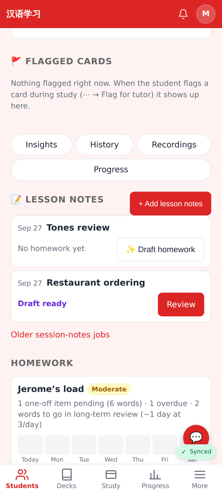
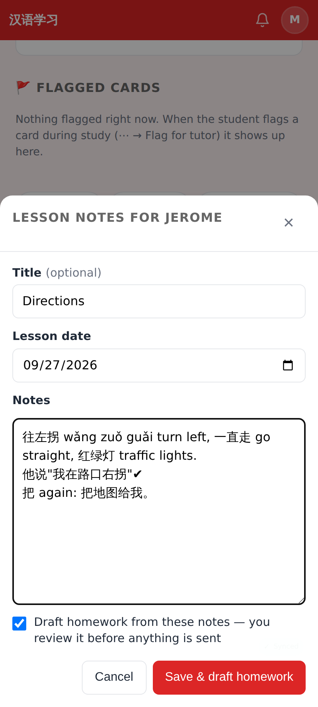
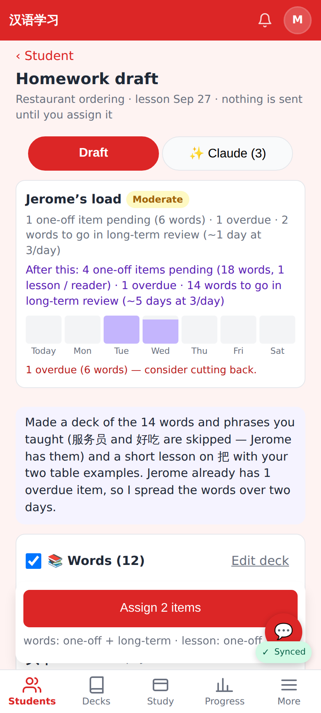
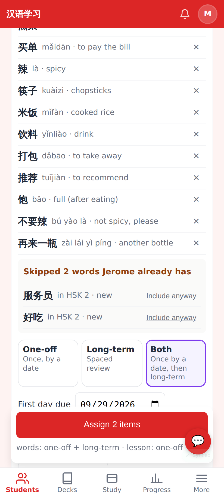
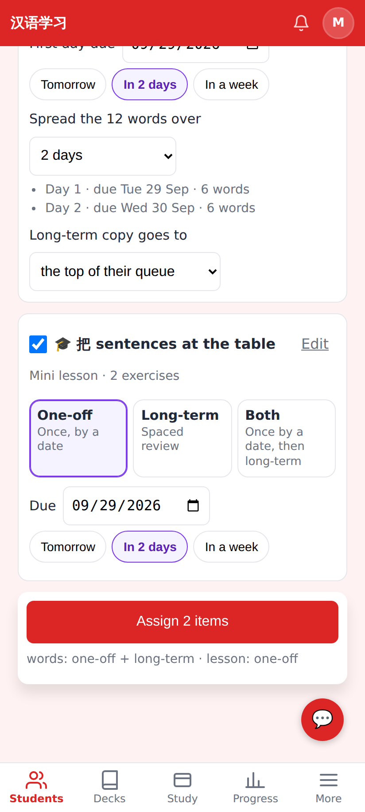
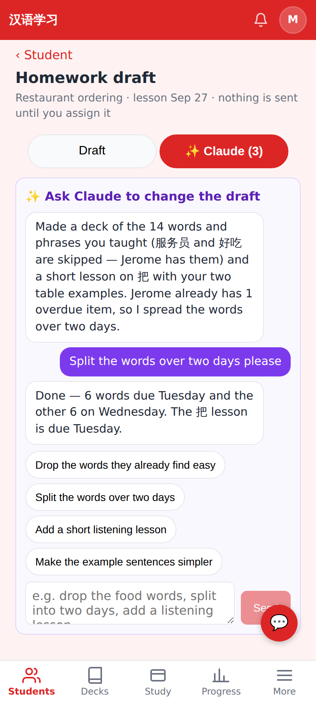
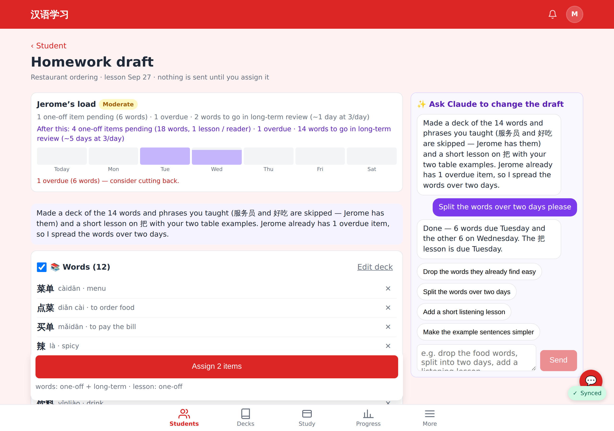
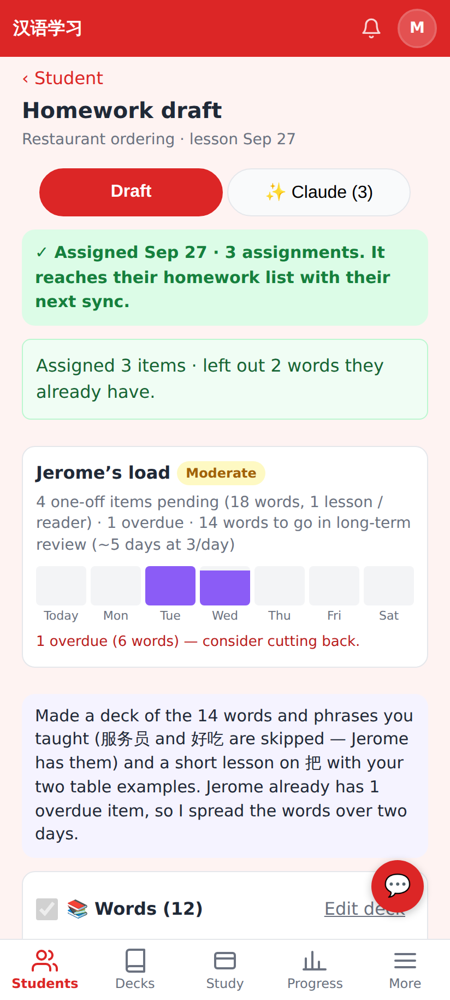
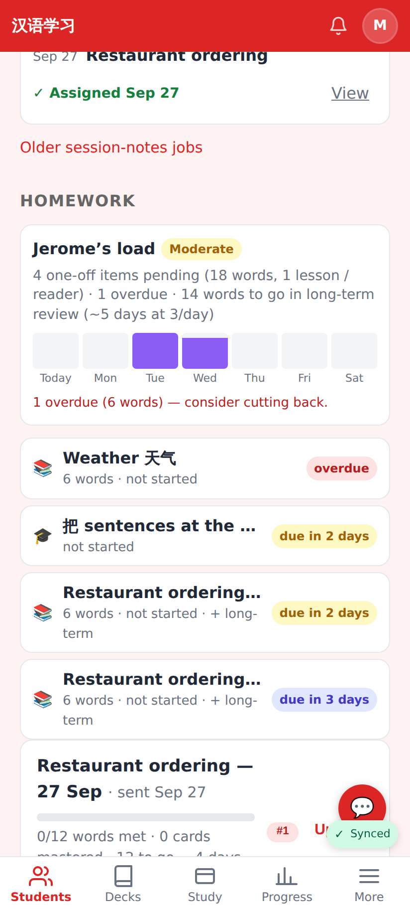

# Homework (2/2) — lesson notes → draft → review with Claude → assign

Phone viewport (412×915 @2×) unless noted; seeded locally (the draft comes from `POST /api/test/homework-draft`, the same shape the agent writes). Design: [docs/HOMEWORK.md](../../HOMEWORK.md) §4.

Student page → **Lesson notes**: one entry per lesson with its homework state — "No homework yet · ✨ Draft homework", "Draft ready · Review".

*+ Add lesson notes*: title, date, notes, and "Draft homework from these notes — you review it before anything is sent".

The draft: Jerome's load now and **after this** (week bars: the new days in light purple), the assistant's summary, sticky **Assign** bar.

Words (× to drop one), **"Skipped 2 words Jerome already has"** with where they live and *Include anyway*, One-off / Long-term / Both.

Due date, **spread the 12 words over 2 days** with the per-day preview, where the long-term copy goes, the mini lesson as one-off.

The Claude tab: the assistant's messages and the tutor's requests; suggestion chips; a message continues the same agent job.

≥1024px: draft and Claude side by side.

After **Assign**: 3 assignments (words day 1 + day 2, the lesson), 2 known words left out.

Back on the student page: the entry says "Assigned", and the homework list shows the new items with due labels.
