# "Add to my long-term review" in the homework pass

Web (412×915 @2×, real local worker + seeded tutor / student):

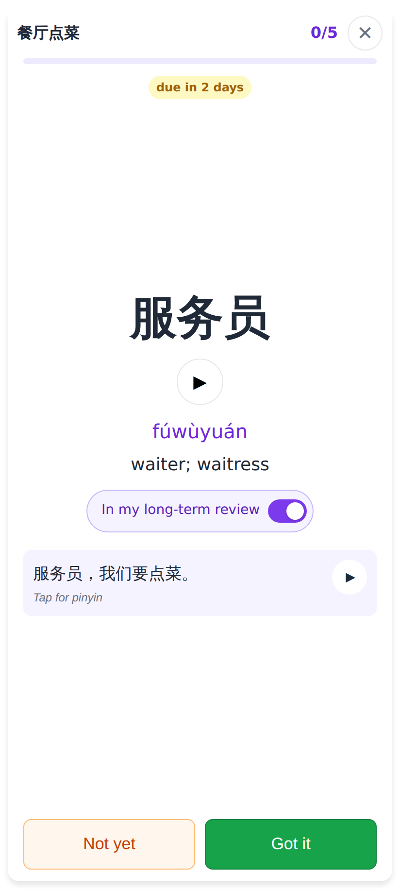
`both` pass — the answer side's switch starts **on** (the word will join daily review).

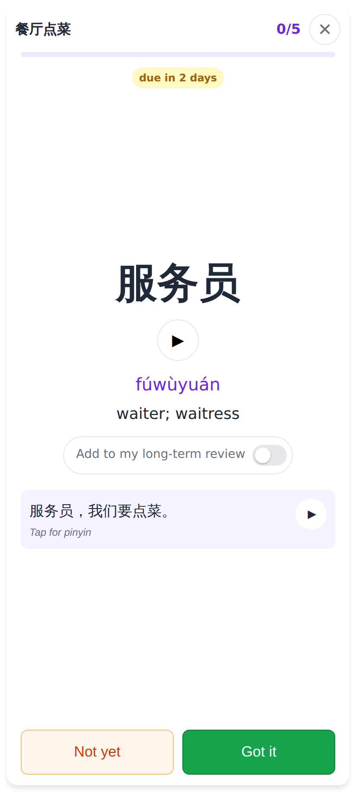
Switched off — this word never enters the FSRS queue.

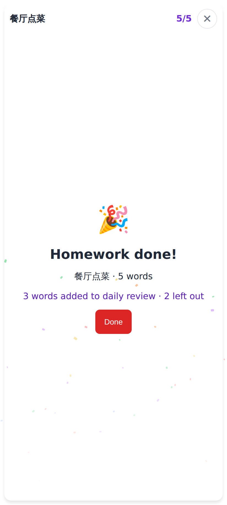
Finish line: "3 words added to daily review · 2 left out".

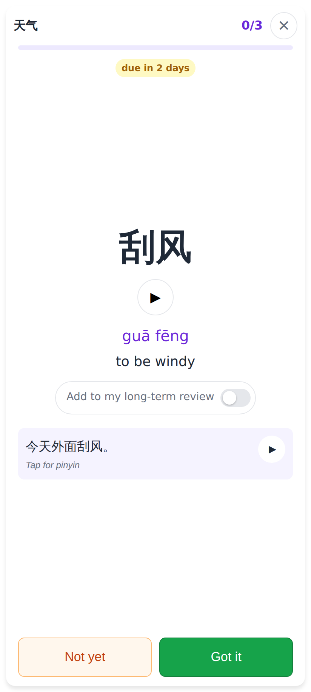
`one_off` pass — the switch starts **off**.

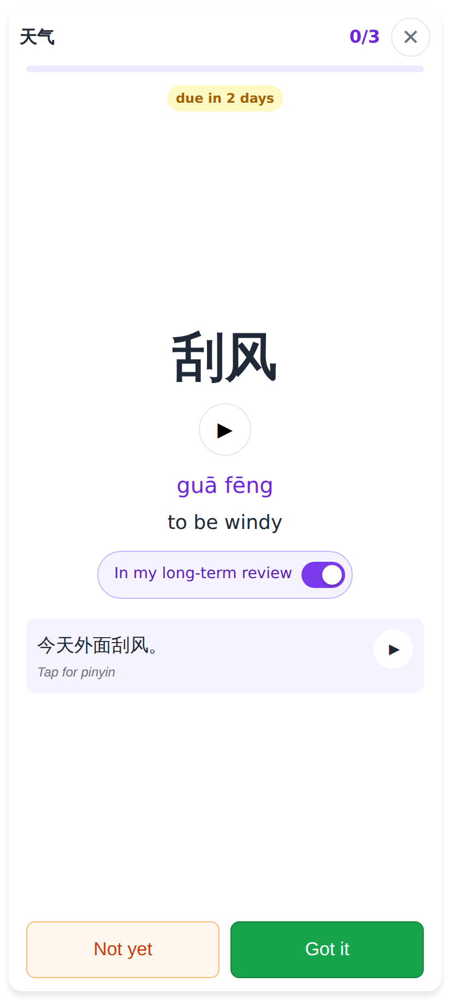
Switched on — this word joins daily review.

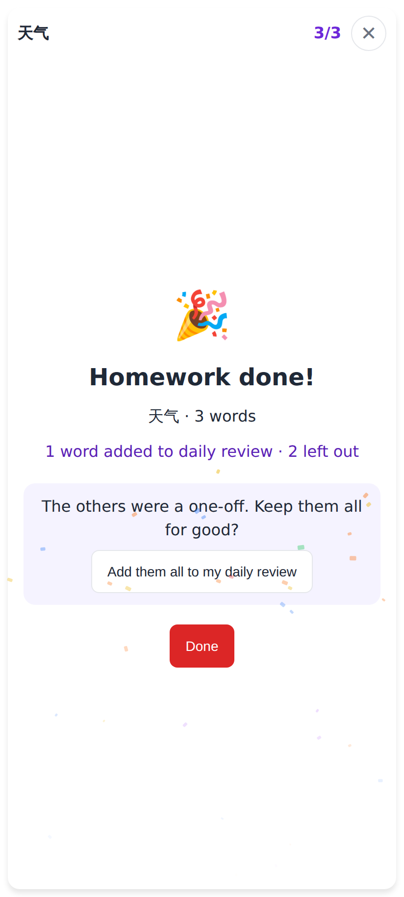
"1 word added to daily review · 2 left out" + "Add them all to my daily review".

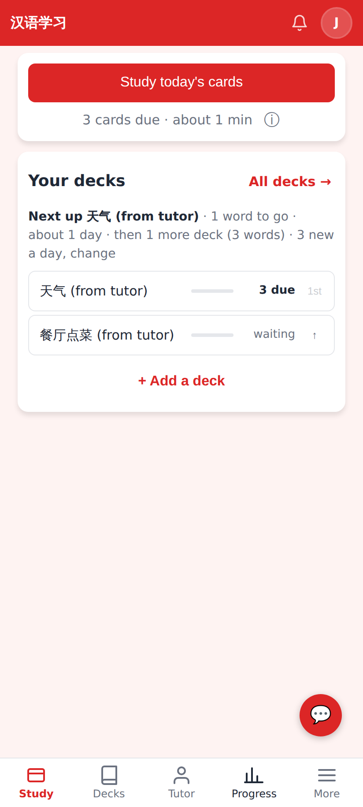
Home: the one-off deck now introduces its opted-in word; the both deck shows 3 words to go (2 left out).

Lab app (Roborazzi, 412dp):

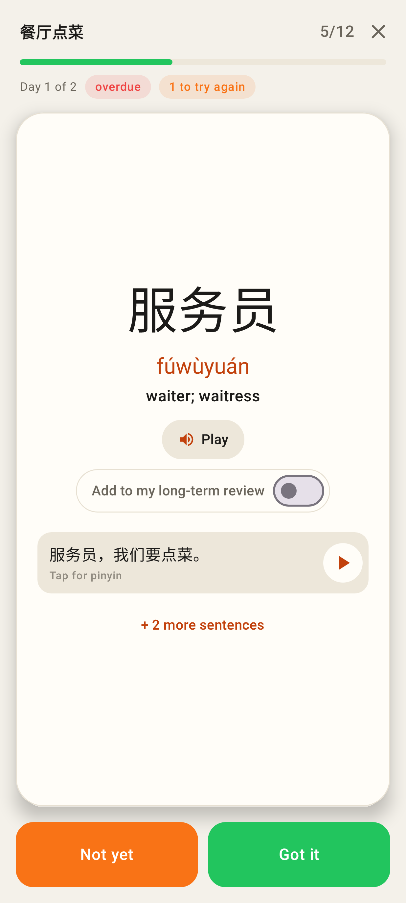
Lab — a word switched off in a `both` pass.

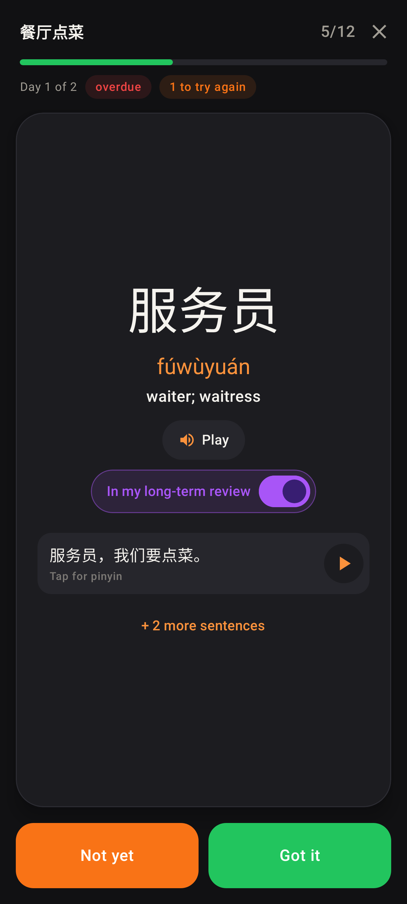
Lab — a word switched on in a one-off pass (dark).

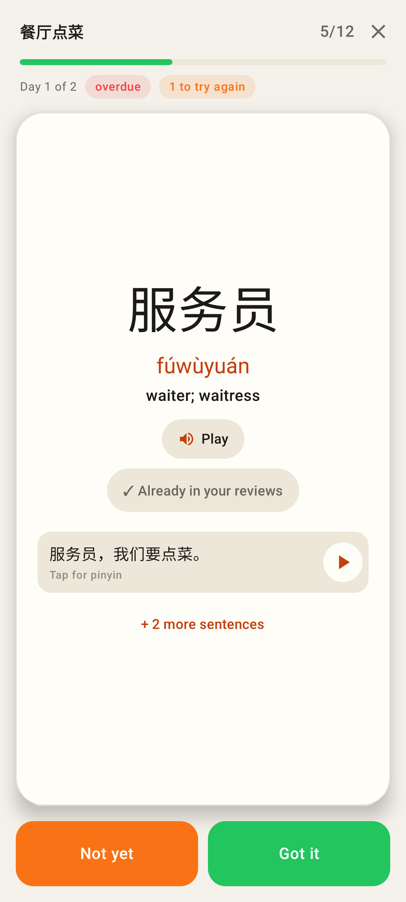
Lab — a word already reviewed: "✓ Already in your reviews" (no switch).

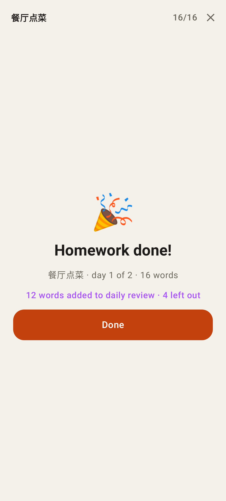
Lab — "12 words added to daily review · 4 left out".

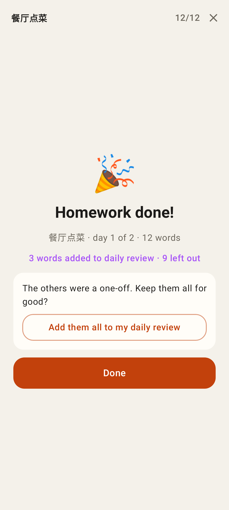
Lab — one-off pass finished with 3 switched on: "Add them all to my daily review".
