# Homework headline = one-off homework only

Phone viewport 412×915 @2×. Seed: Minghui sent Jerome a 30-word **long-term** deck (HSK 3 天气与季节, 4 words met)
and a **one-off + long-term** deck (第五课：在餐厅) whose pass he finished.

| Before | After |
|---|---|
| 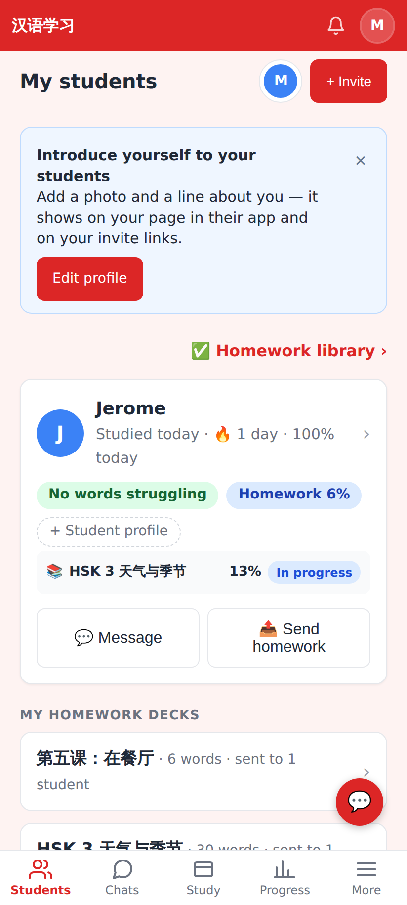 | 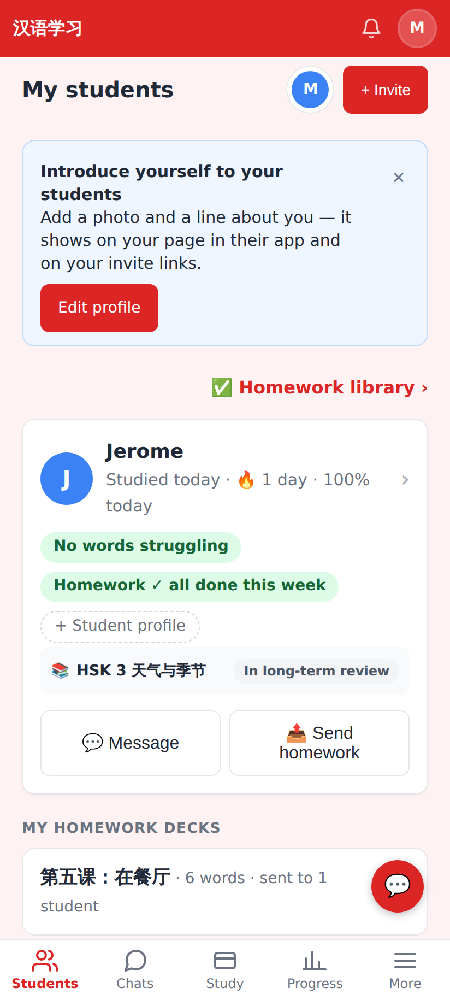 |
| Dashboard: "Homework 6%", the long-term deck "13% · In progress" | "Homework ✓ all done this week"; the long-term deck "In long-term review" (no %) |
| 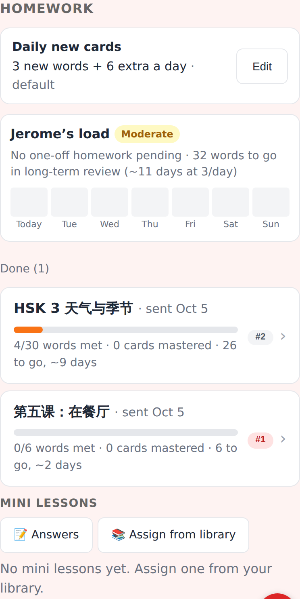 | 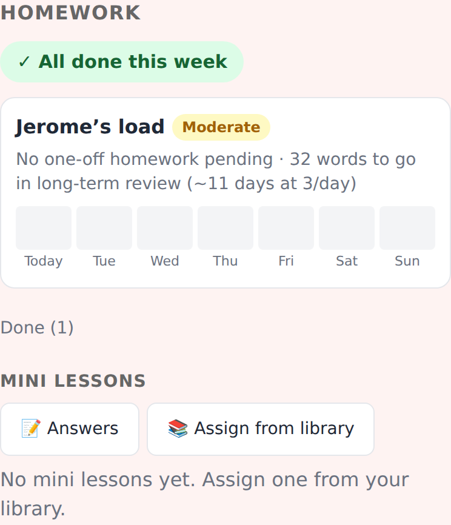 |
| Student page: decks mixed into Homework | Homework = the one-off headline + one-off items |
| — | 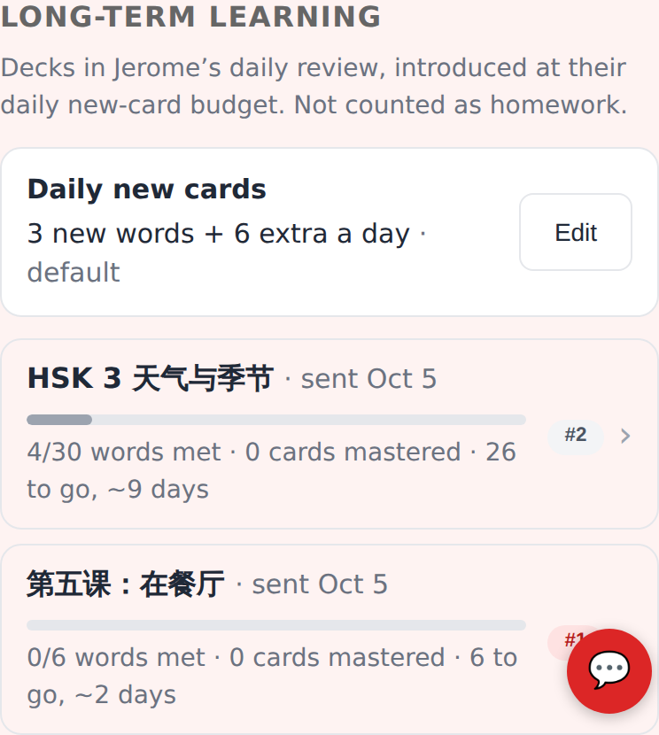 |
| | New quieter "Long-term learning" section: daily budget, words met, ~days, queue position |
| 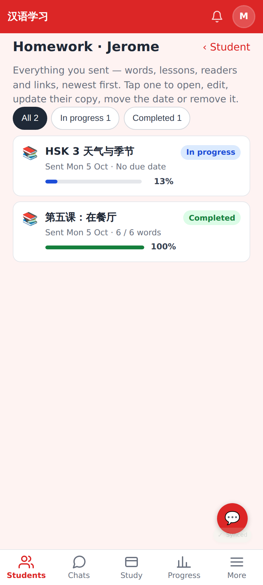 | 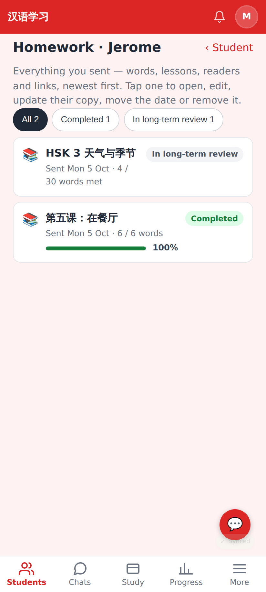 |
| Library: long-term deck "In progress 13%" | "In long-term review", no % bar |
| 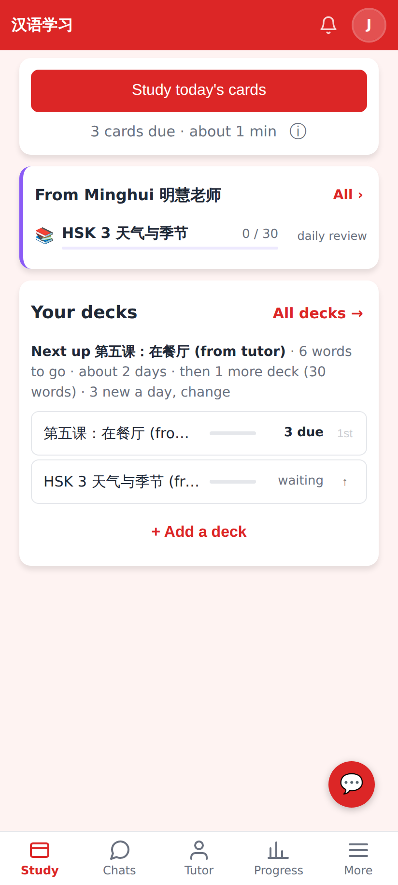 | 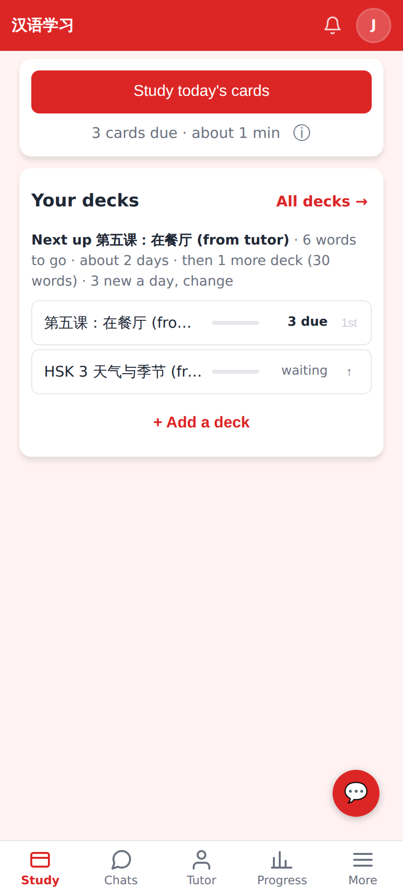 |
| Student Home: the long-term deck as a homework row | Only "Next up" / decks — no homework card when the one-off homework is done |

Student page top: [before](before-02-student-page-top.png) · [after](after-02-student-page-top.png).

## Lab app (Roborazzi)

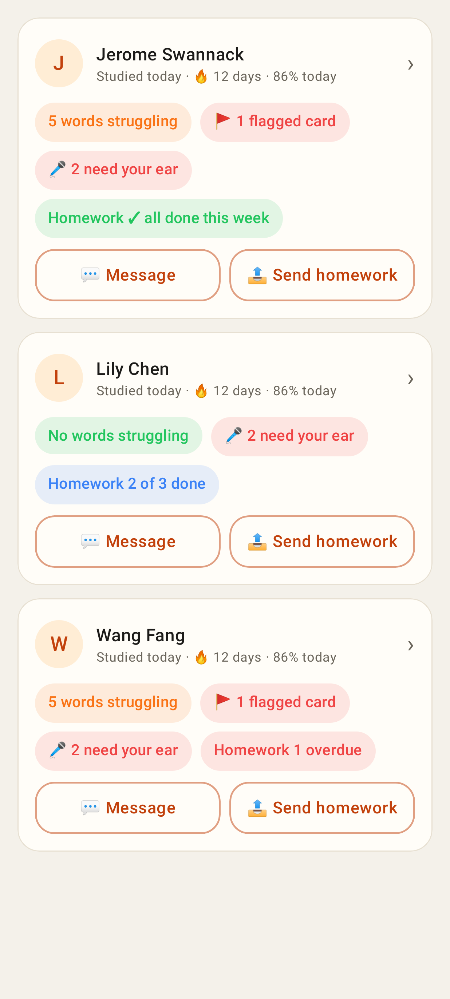 — the pill in its three tones (all done / open / overdue).

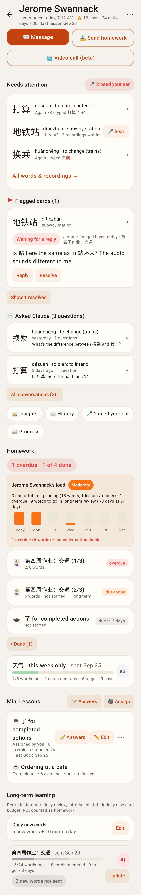 — Homework headline + one-off items, then "Long-term learning".

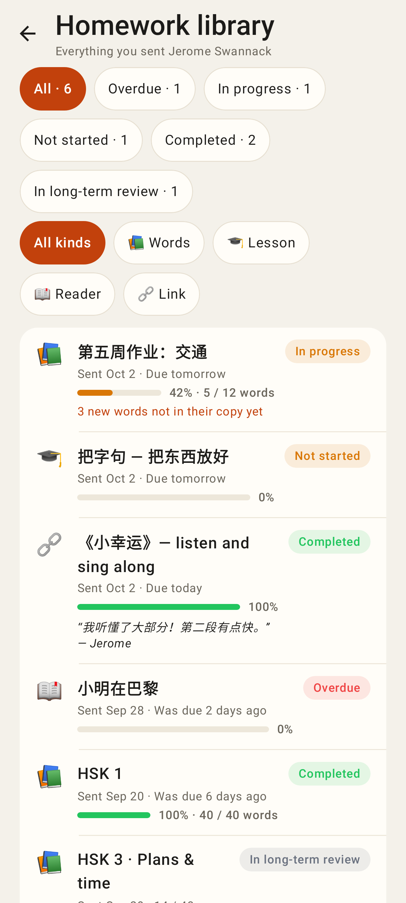 — a long-term deck "In long-term review", no %.
