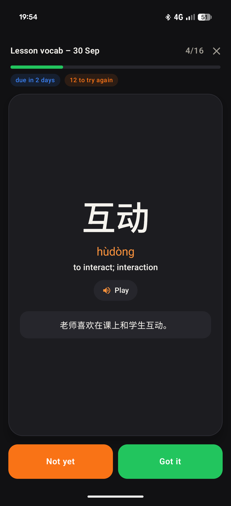
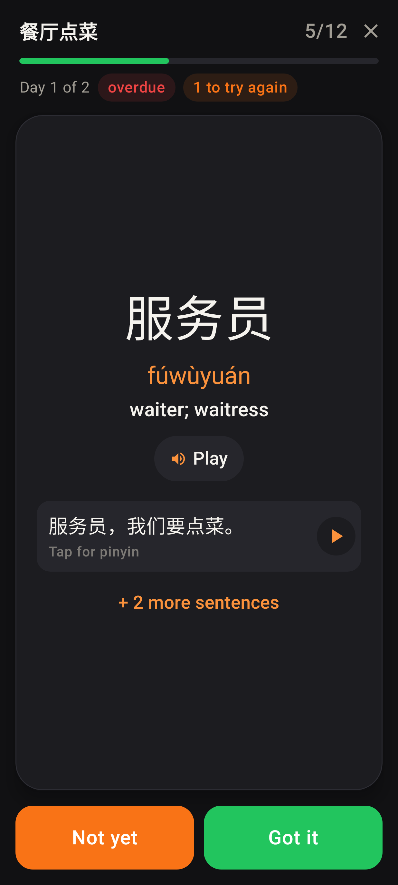
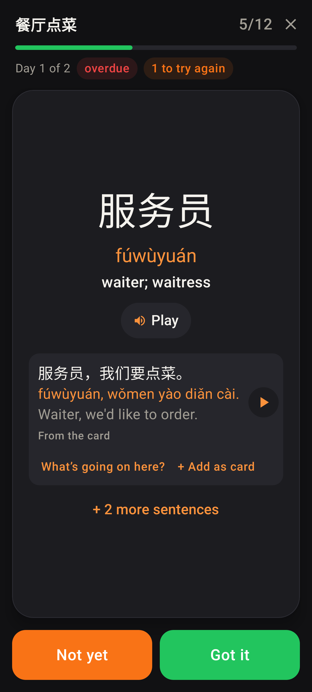
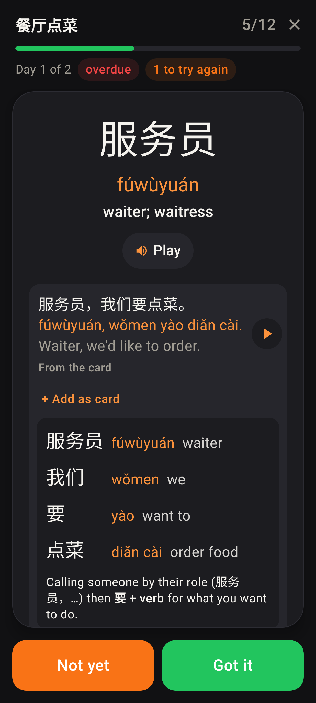
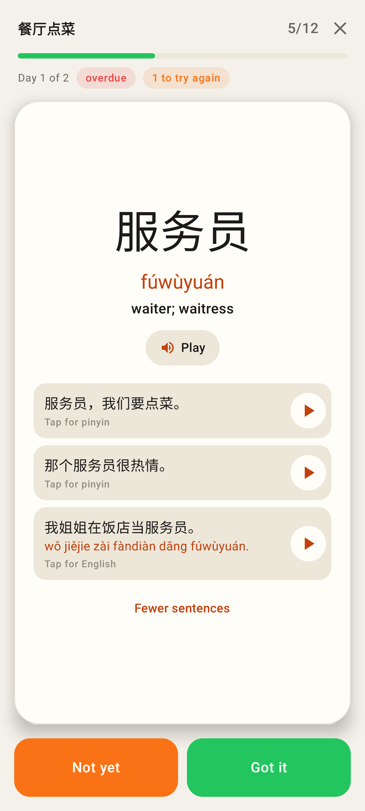
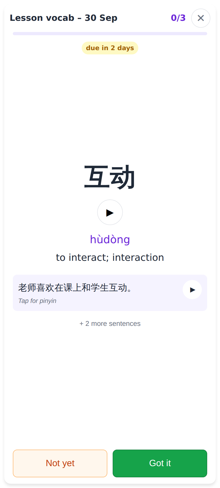
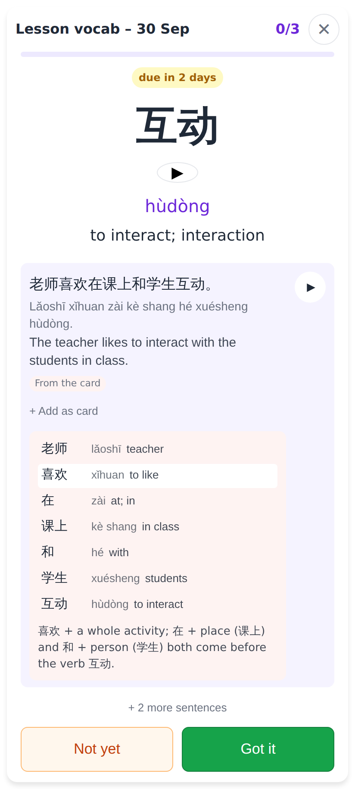
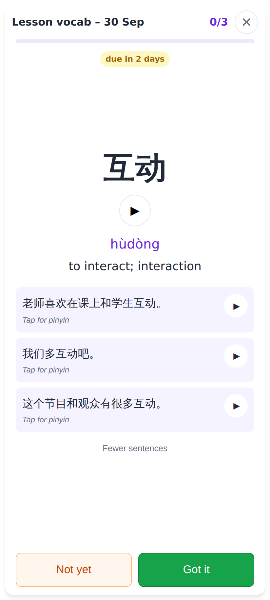
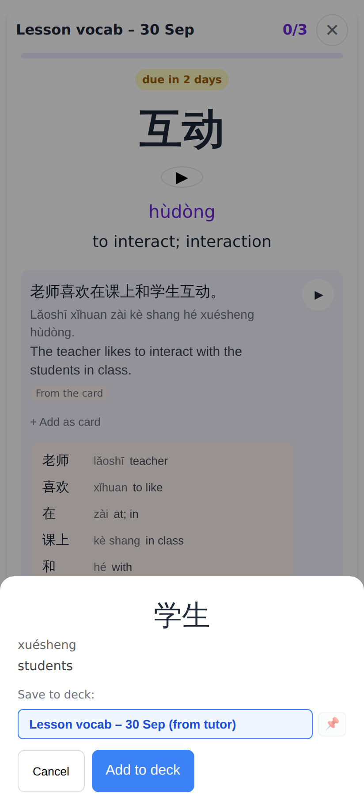

# Homework pass: the example sentence works like the study card's

Lab app (Pixel Fold folded, dark, font size 130 %) — Roborazzi:

Before: the sentence was plain text.

The card's sentence with the Chinese up, ▶ on the right, "Tap for pinyin"; the note's generated set behind "+ 2 more sentences".

Two taps: pinyin, then the English and the tools line — "What's going on here?" · + Add as card.

"What's going on here?": the same word-by-word breakdown as the study card (one word per row, each tappable to add as a card), then the construction.

"+ 2 more sentences" opened (light theme, normal font): each row reveals the same way.

Web (412 × 915, 2×) — Playwright:

The revealed word with its sentence row.

Opened, with the cached breakdown (shown offline too).

The generated set under the card's sentence.

A word in the breakdown → "add as a card" sheet.
