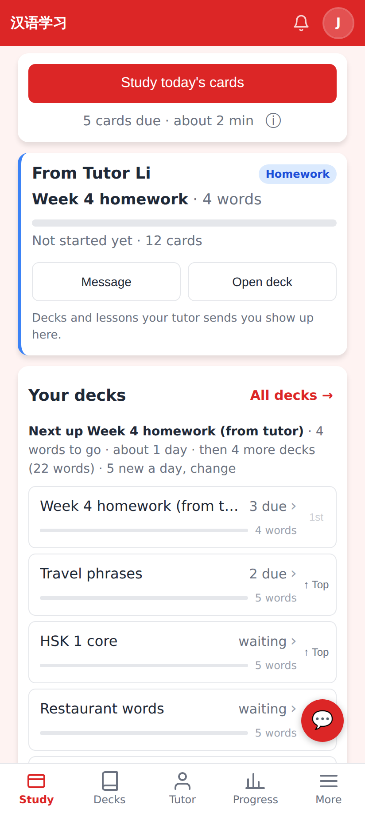
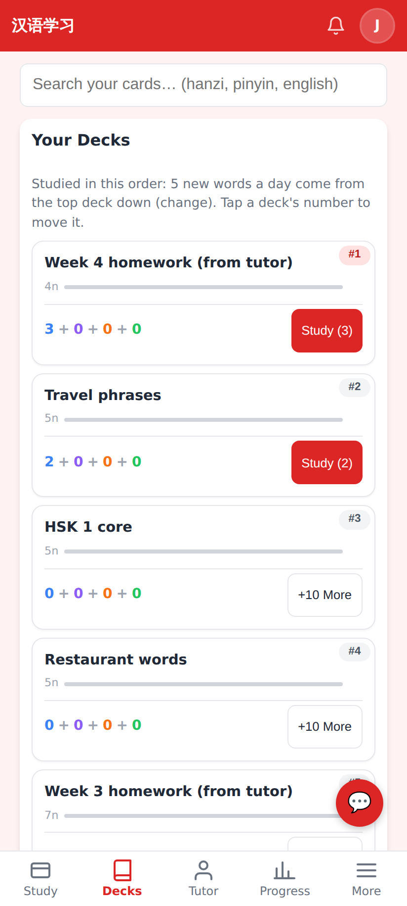
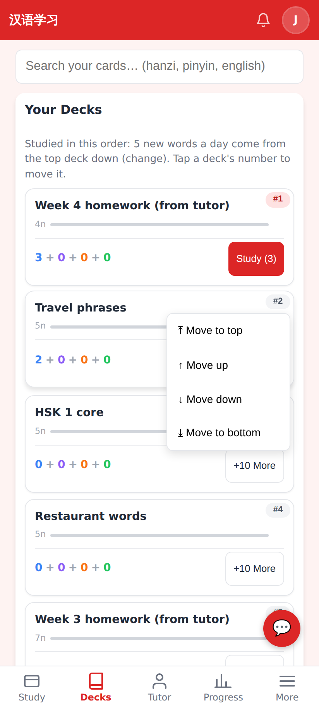
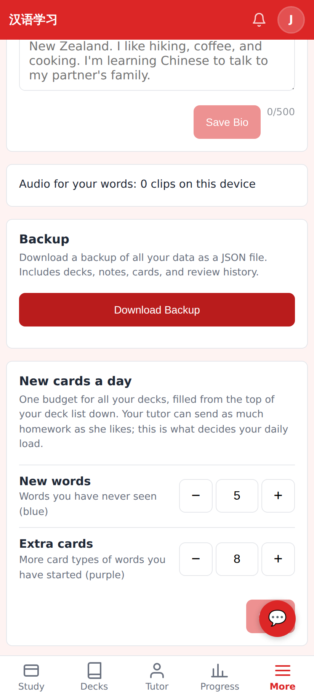
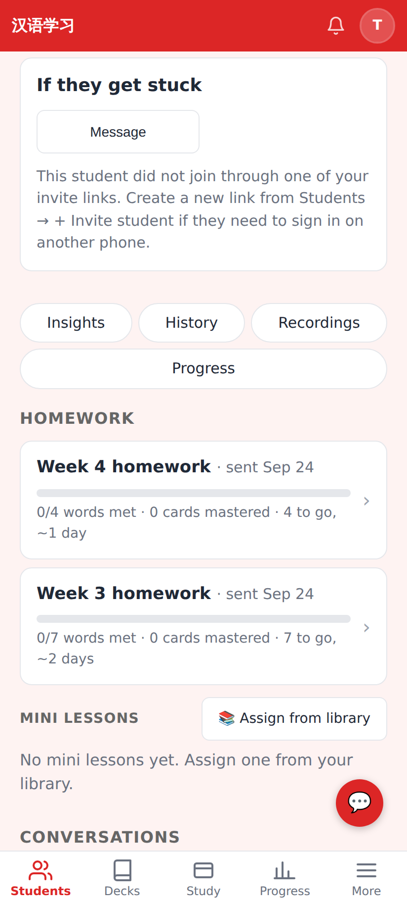
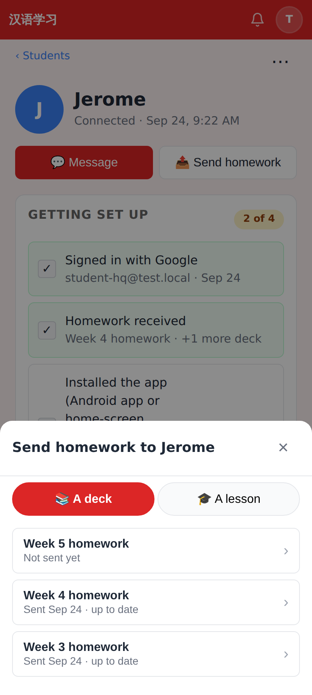
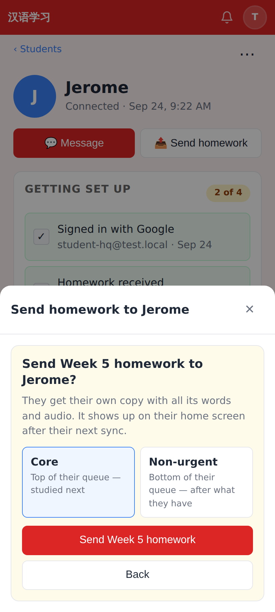
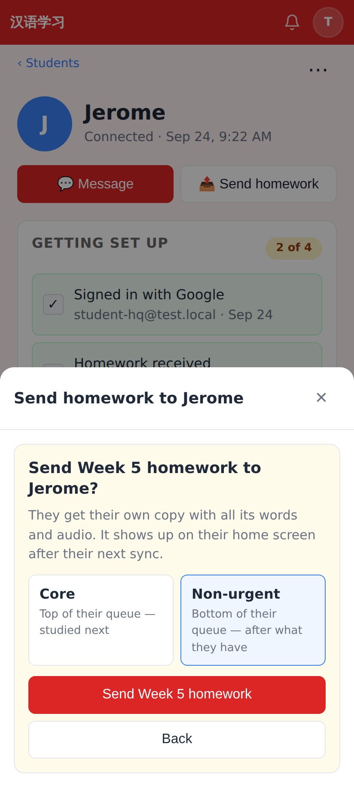

# Homework queue — PR screenshots

Captured at 412×915 @2× from this branch running locally in E2E test mode. Student **Jerome** (budget set to 5 new words + 8 extra cards a day, three own decks of 5 words) is connected to tutor **Tutor Li**, who sent *Week 3 homework* (7 words, non-urgent) and *Week 4 homework* (4 words, core).

**Home — Next up line + queue-ordered decks.** "Next up Week 4 homework (from tutor) · 4 words to go · about 1 day · then 4 more decks (22 words) · 5 new a day, change". The core packet took 3 of today's 5 new words (its own per-deck cap), Travel phrases gets the other 2, the rest wait. Pins are gone; "↑ Top" moves a deck to the front, "1st" marks the head of the queue.

**Decks tab — the queue.** "Studied in this order: 5 new words a day come from the top deck down (change). Tap a deck's number to move it." Each card carries its #N place; the non-urgent packet sits last.

**Reorder menu** on a deck's #2 badge: Move to top / up / down / bottom (44px rows).

**Settings — New cards a day.** One budget for all decks: *New words* (blue) and *Extra cards* (purple) steppers, Save.

**Tutor's student page — Homework rows** now read "0/4 words met · 0 cards mastered · 4 to go, ~1 day" / "0/7 words met · … 7 to go, ~2 days", computed from the student's own budget.

**Send homework sheet** (unchanged deck list; a deck not yet sent leads to the confirm step).

**Confirm step with the new priority choice** — *Core* (top of their queue — studied next) is preselected…

…and *Non-urgent* (bottom of their queue — after what they have).

