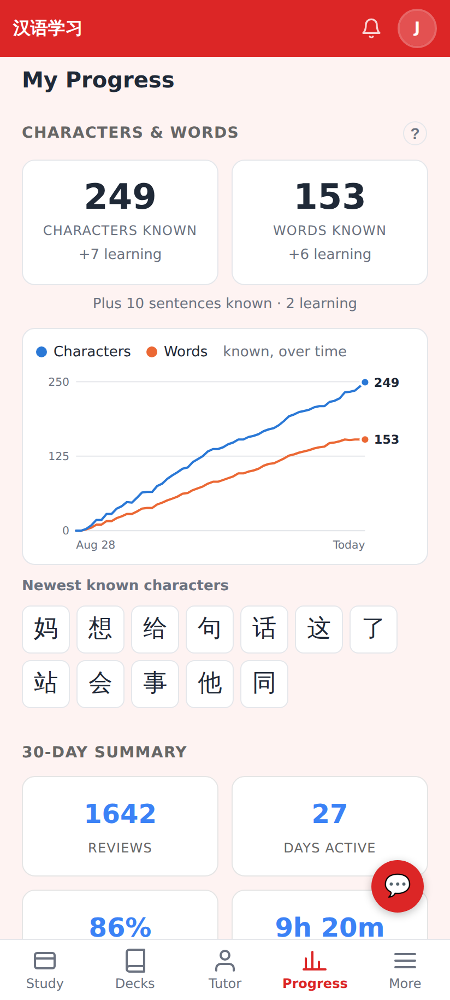
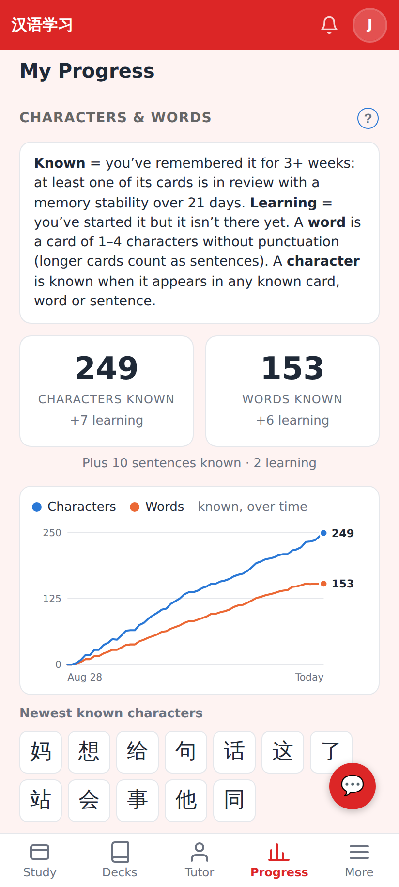
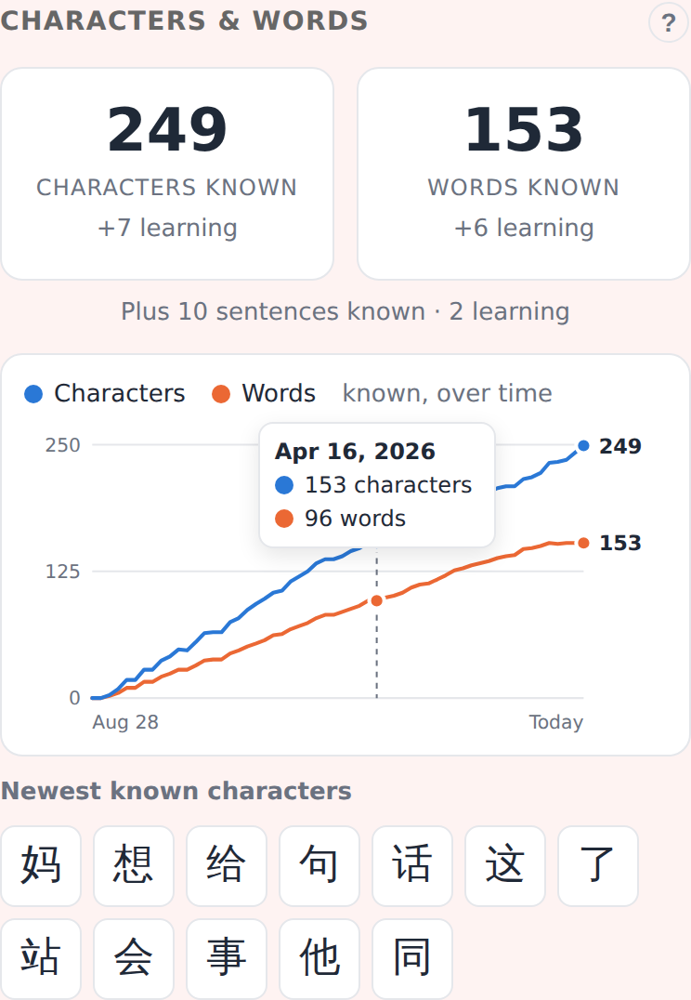
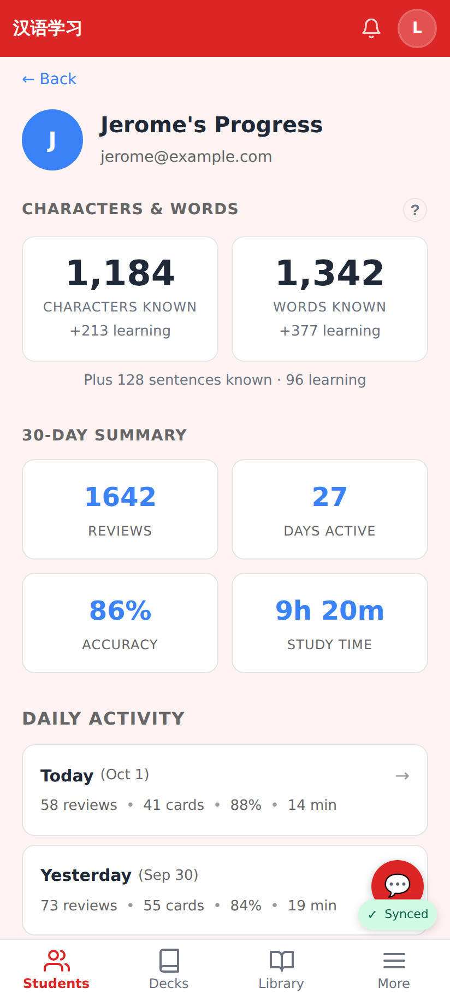
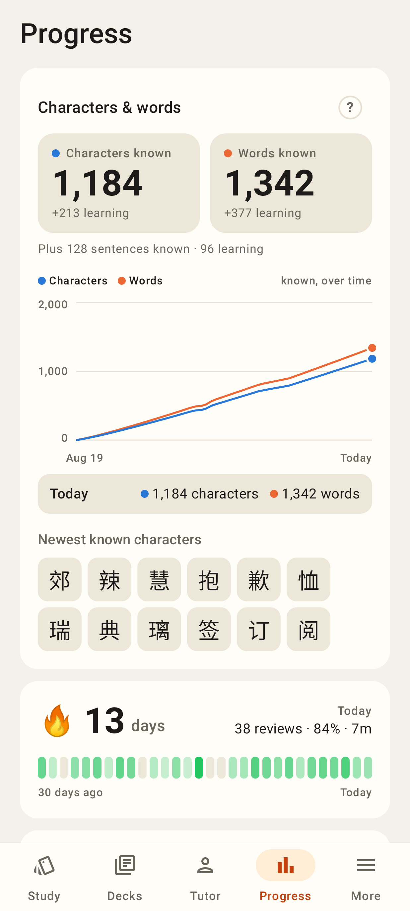
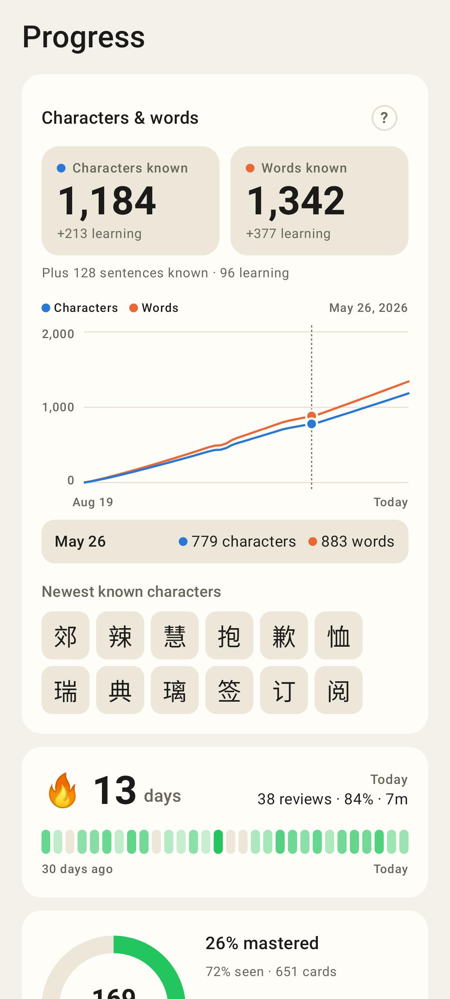
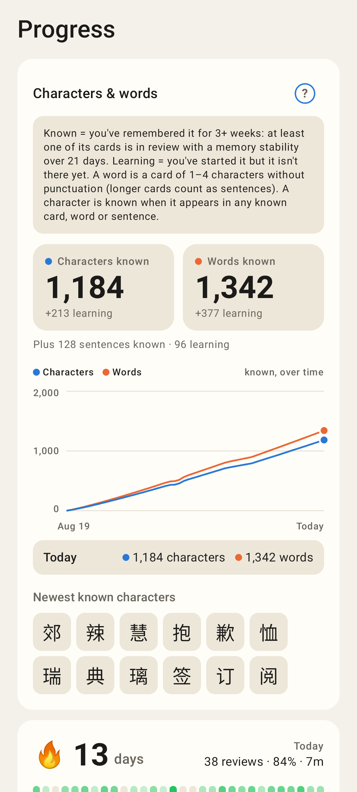
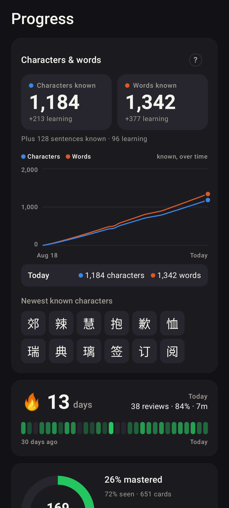

# Characters & words known — Progress page (web + Lab)

Phone viewport (412×915 @2×). Web data: ~170 real notes with 13 months of seeded review events
replayed on the device; tutor view and Lab samples use Jerome-sized numbers.

## Web

Progress page: Characters / Words known with "+N learning", sentences line, known-over-time chart, newest known characters — all computed on the device.

"?" opens the definitions (known = remembered for 3+ weeks).

Hover / tap the chart for a day's counts.

The tutor's view of a student: the same two numbers from the server.

## Lab app

Progress tab: the new card on top, lines draw in, numbers count up.

Touch and drag along the chart to scrub (a light tick per point).

"?" expands the definitions.

Dark mode (series colours stepped for the dark surface).

Tutor's student progress screen with the counts from `/student-progress/daily`.
