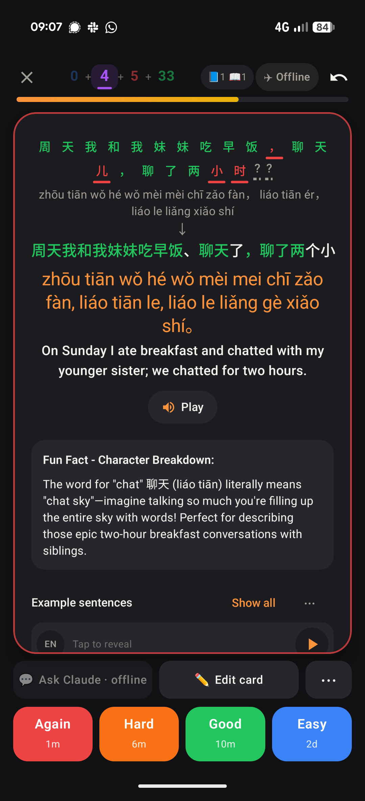
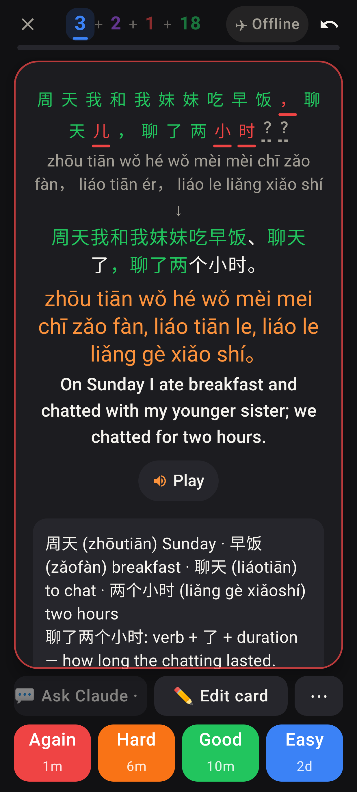
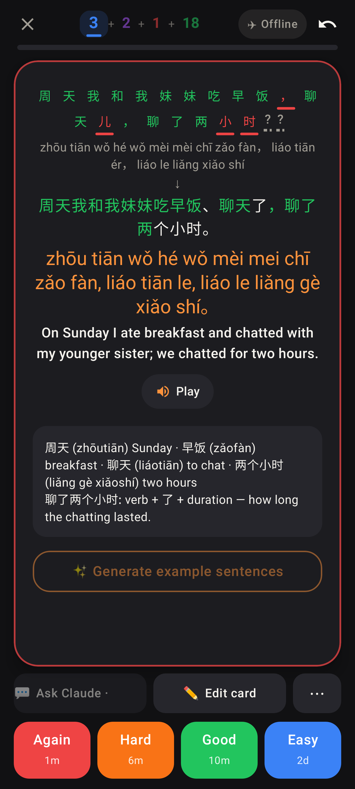
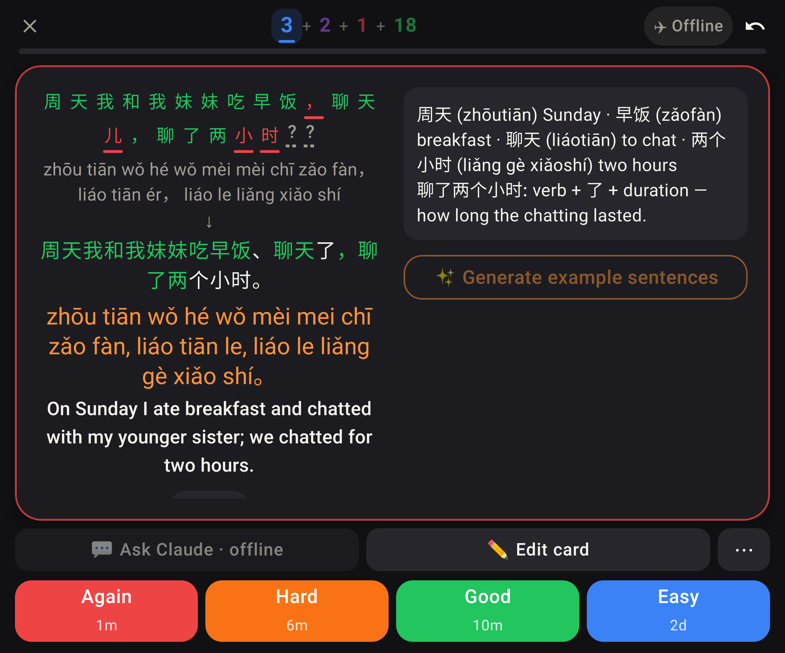

# Lab app: the correct answer under "↓" wraps instead of being cut off

A long typed sentence answered wrong: 周天我和我妹妹吃早饭、聊天了，聊了两个小时。

Before (Jerome's phone): the correct-answer line was one clipped row, ending "…聊了两个小".

After: Pixel Fold folded, dark, font scale 1.3. The whole answer wraps onto two lines, ending 小时。, and the "，" stays on the line of the character before it.

After: folded, font scale 1.0.

After: unfolded (inner screen), font scale 1.3.
