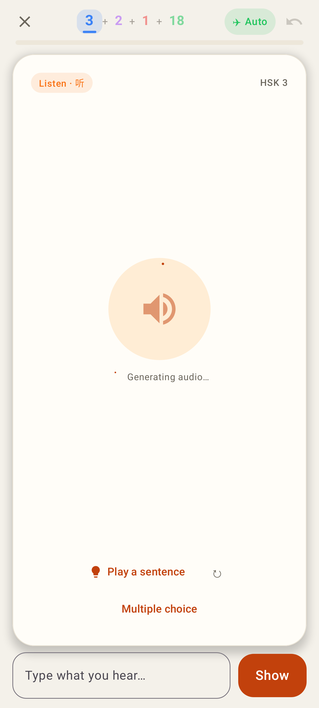
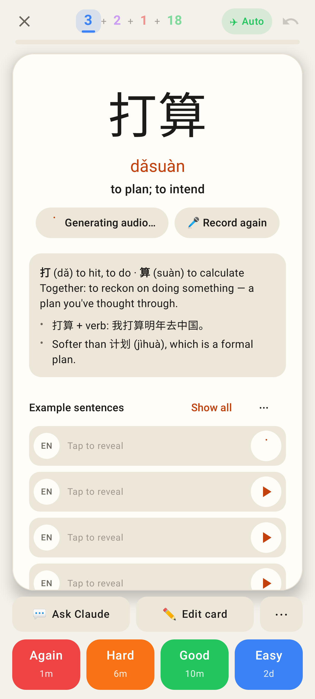
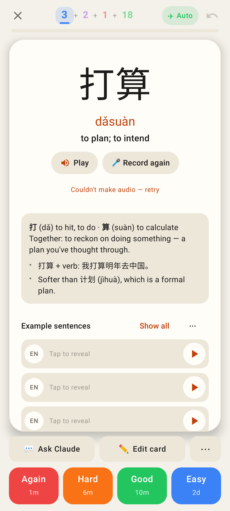

# Lab app: auto-audio on the study card

Pixel Fold folded (412×915 dp), rendered by Roborazzi (`CardAudioTest`). The spinners are
indeterminate; the frozen test clock catches them early in their sweep.

Listening card with no clip: the speaker gets a progress ring and "Generating audio…"; the auto-play waits and plays the clip when it lands.

Answer side: the Play pill reads "Generating audio…", and the card's own sentence (row 1) shows a spinner instead of ▶.

Offline: "Audio will be made when you're online". The note is queued and made on the next sync; Play uses the device voice meanwhile.

The server couldn't make it: "Couldn't make audio — retry". The tap retries at once; background attempts back off.
