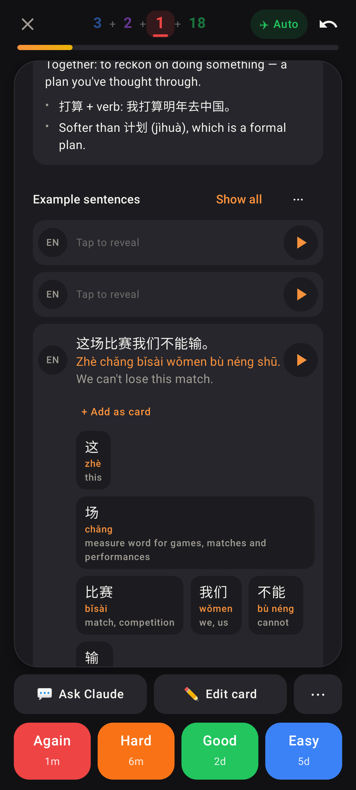
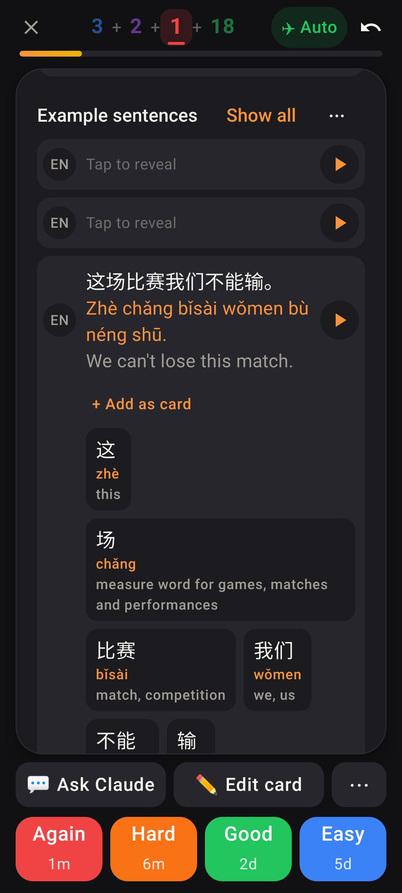
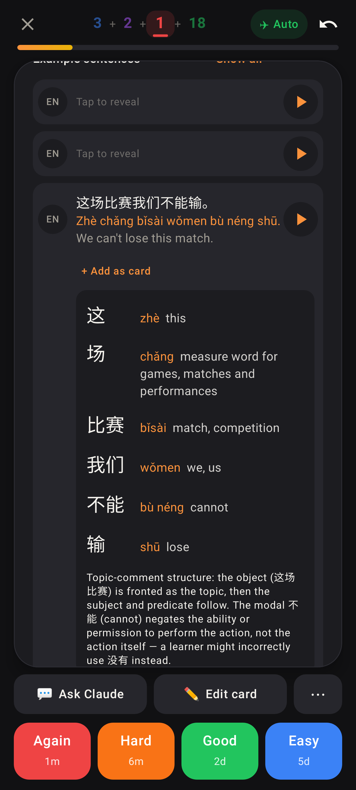
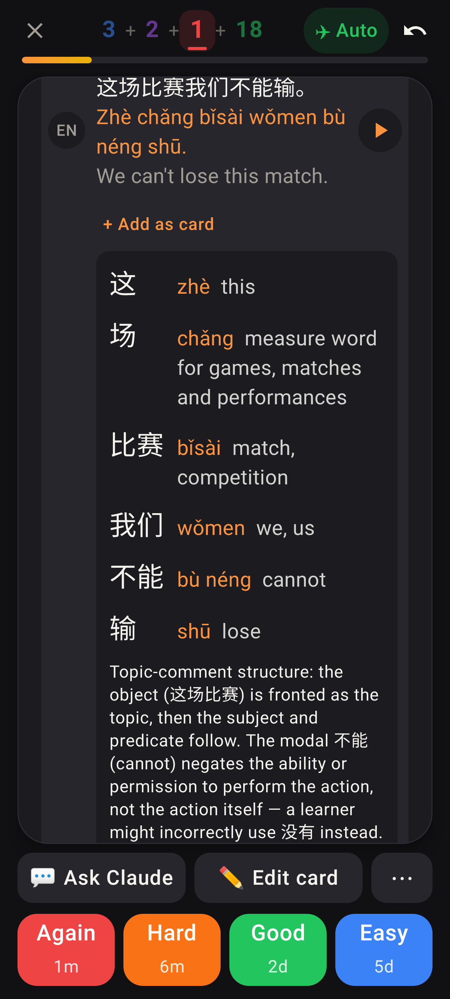

# Lab app: "What's going on here?" one word per row

Roborazzi shots (`SentenceBreakdownTest`), folded phone (412×915dp), dark theme, 这场比赛我们不能输。

Before (font 1.0): the words as wrapping chips side by side, read sideways block by block.

Before (font 1.3).

After (font 1.0): like the web, one word per full-width row — hanzi column, then pinyin + meaning — with the construction below.

After (font 1.3): long meanings wrap inside their column; the hanzi stay aligned.
