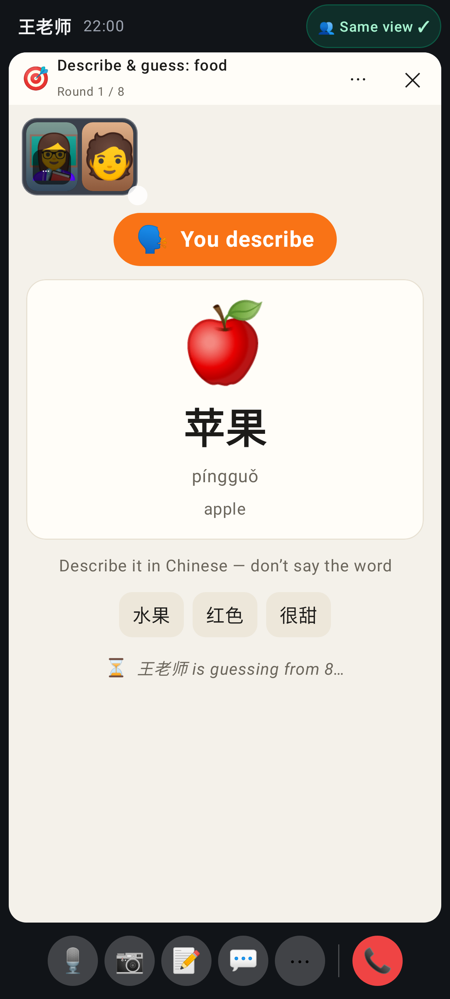
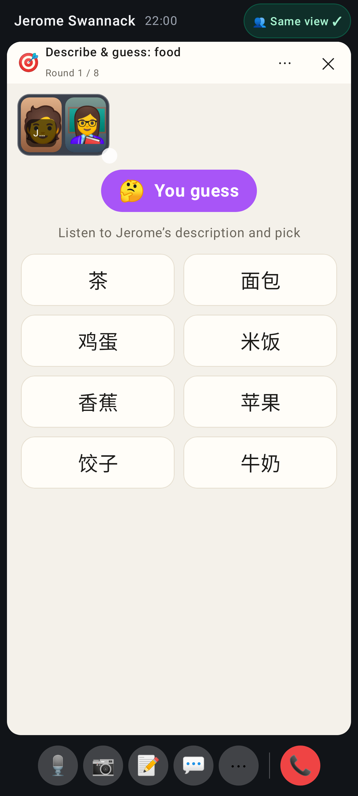
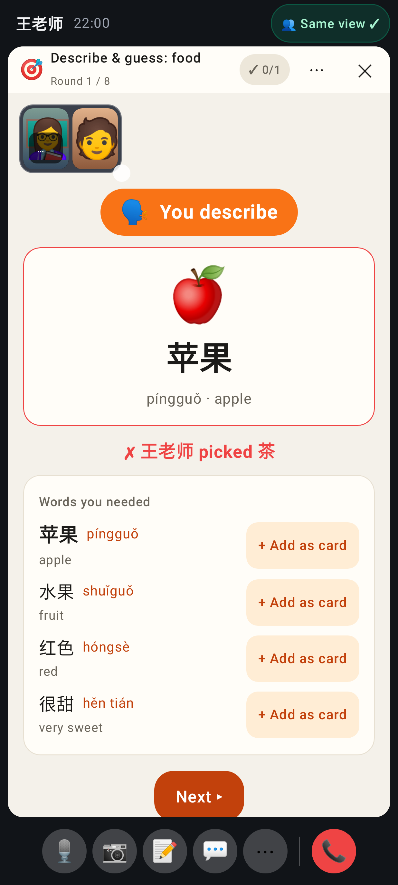
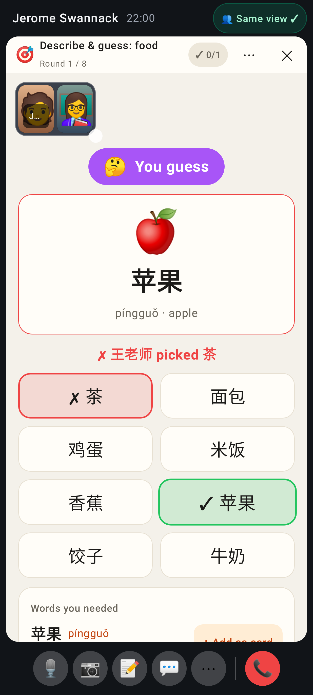
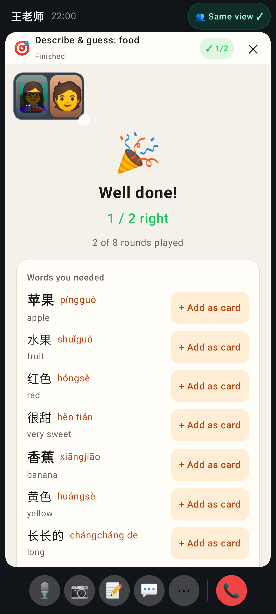
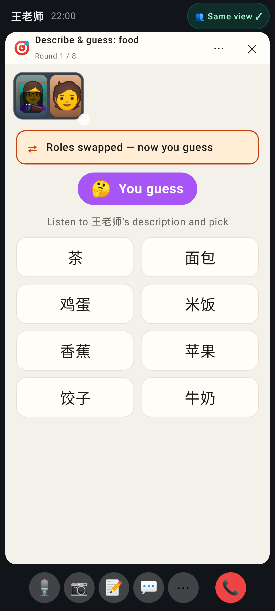
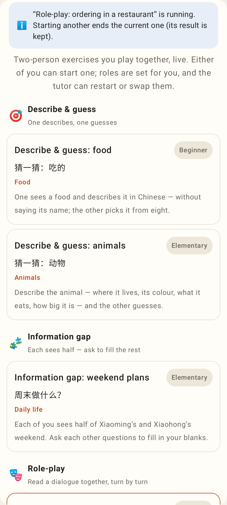

# Lab app: in-call activities — who may act, role badges, words you needed

The describer: big 🗣 "You describe" badge, the word and hint chips — no options.

The guesser: 🤔 "You guess", eight options in a 2-column grid.

The describer's reveal: verdict names who picked ("✗ 王老师 picked 茶"), Words you needed with + Add as card, and Next (the describer may move on).

The guesser's reveal: options marked right / wrong, then the words.

The done screen: every word the played rounds needed.

After the tutor swaps roles: "Roles swapped — now you guess" and the new badge.

The picker copy: either of you can start one.
