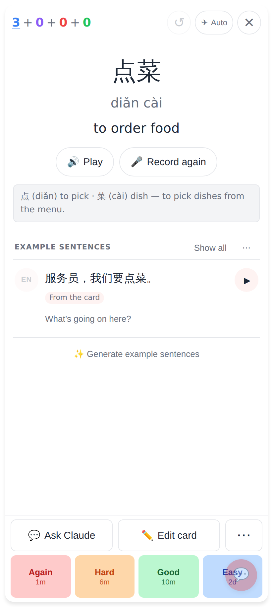
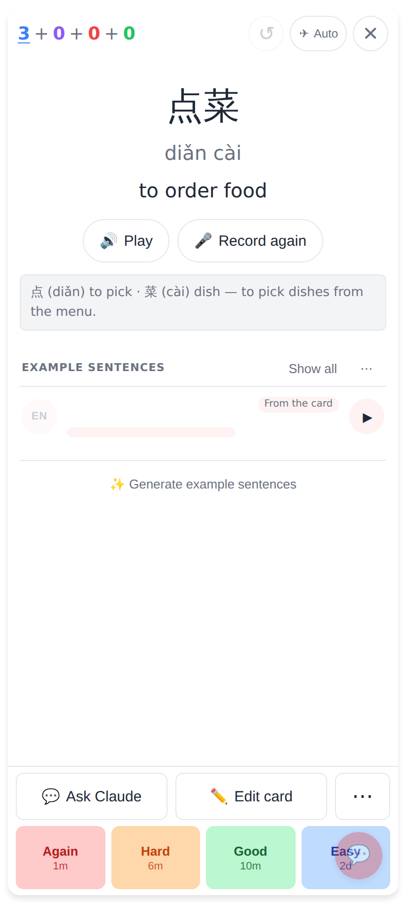
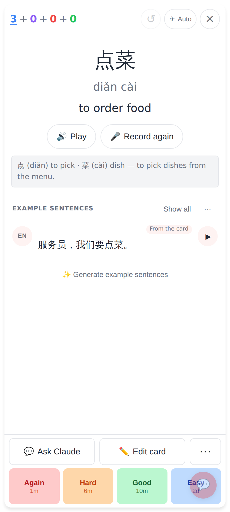
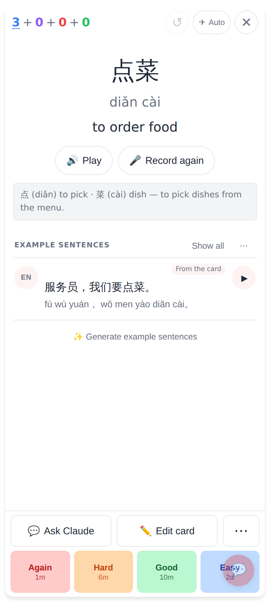
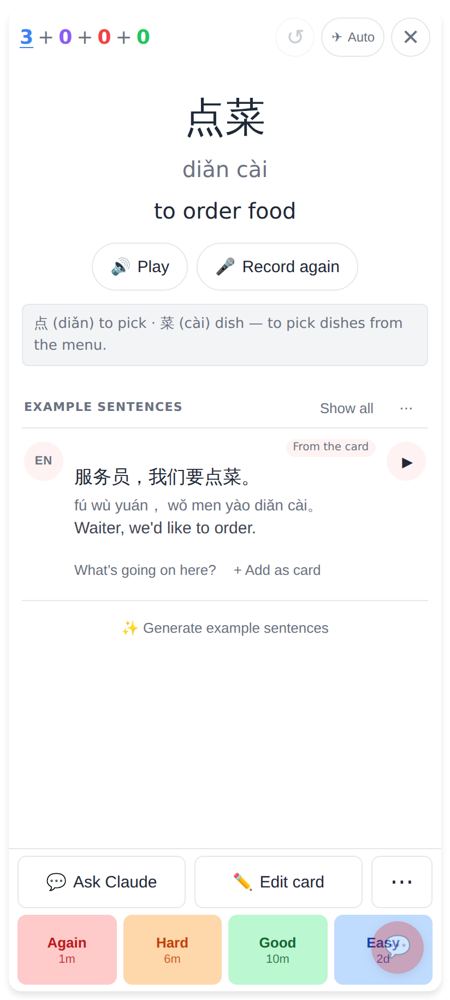
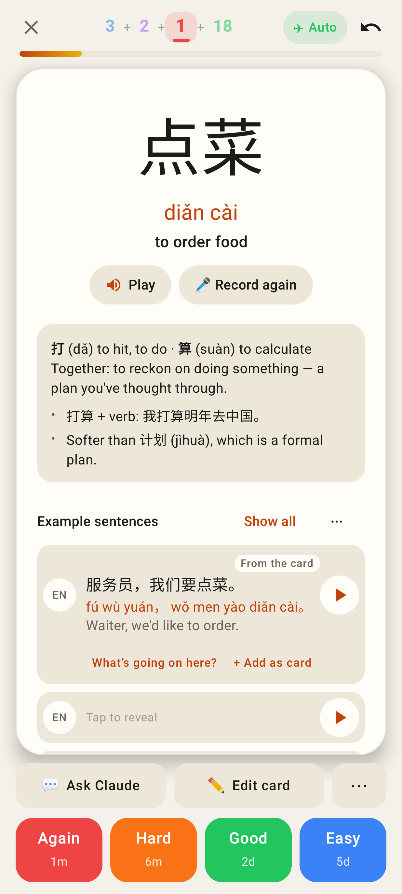
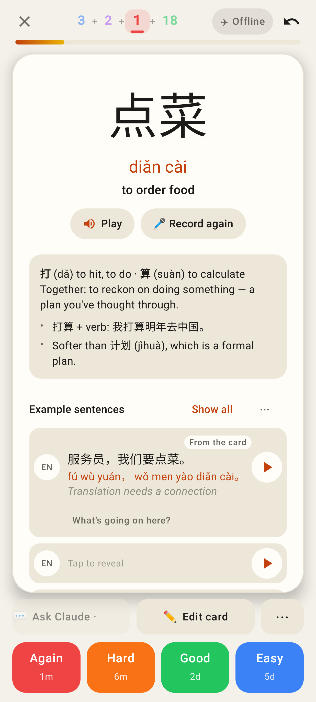
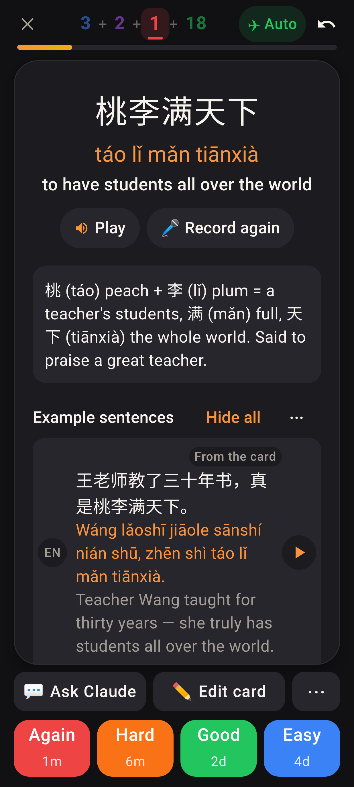

# The card's own sentence reveals its English (web + Lab)

A note whose card sentence has no pinyin / English (about a third of notes: MCP-added and older ones).

Before (web, Lab the same): one tap opened the row fully — no pinyin, no English — and "From the card" sat where the English belongs.

After: the row starts blank (listen first); "From the card" is a small badge on its own line at the top right.

First tap: the Chinese.

Second tap: the pinyin, made on the device.

Third tap: the English (fetched once from explain-text, kept on the device), then the tools line like every row.

Lab app: the same row, fully open.

Lab app, offline and never fetched: "Translation needs a connection".

Lab app, a note that has its own English (dark, font 1.3): the badge above, the English under the sentence.
