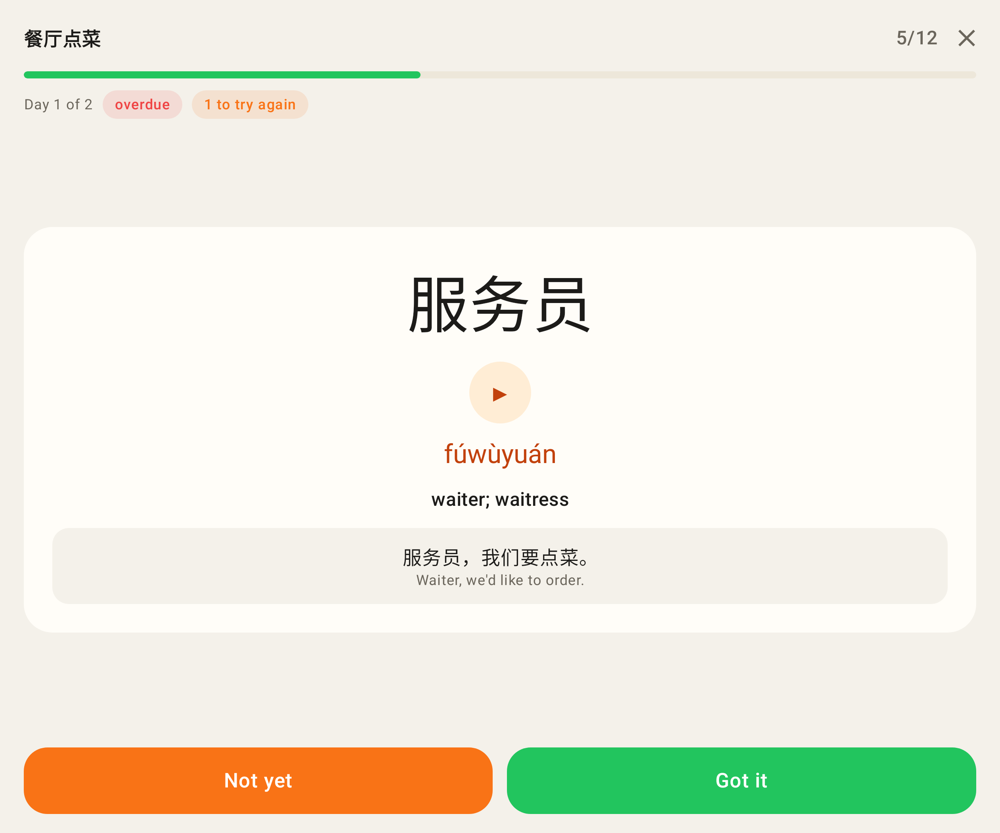
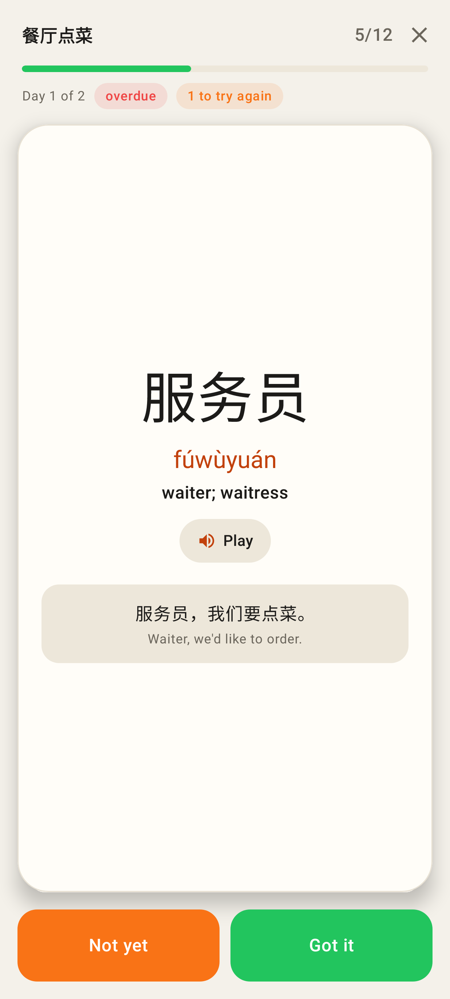
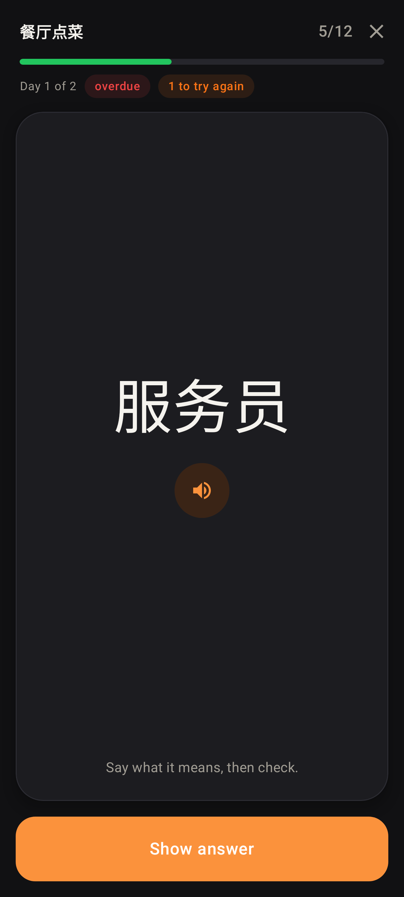
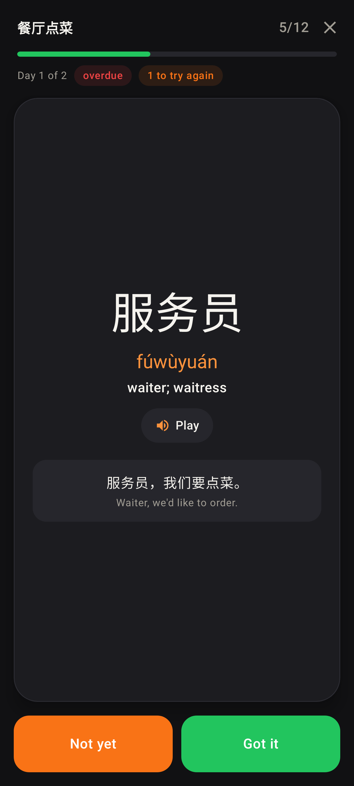
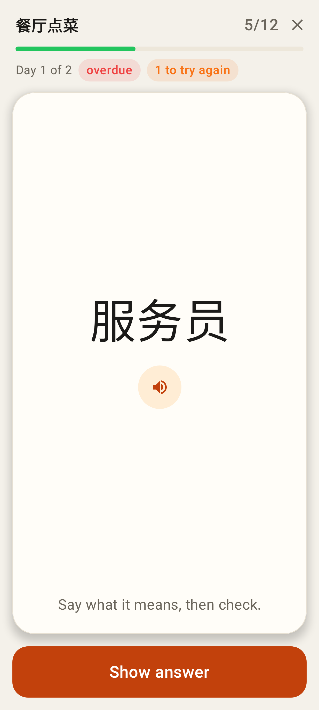
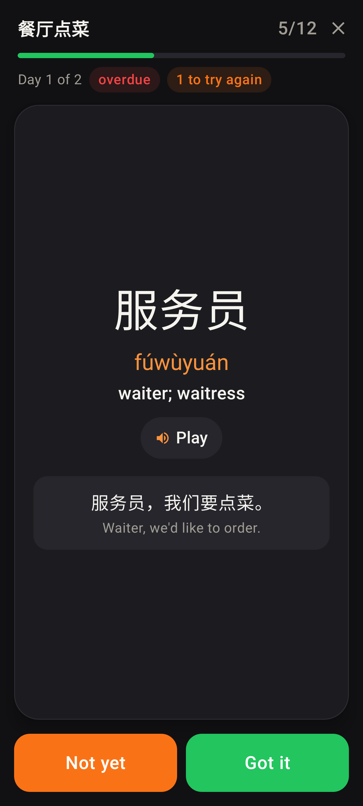
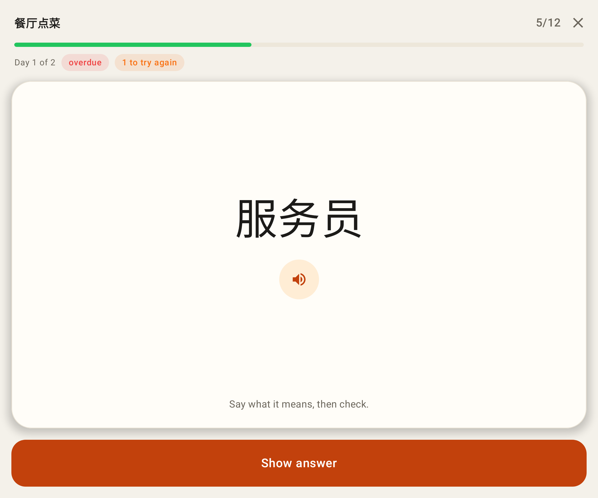
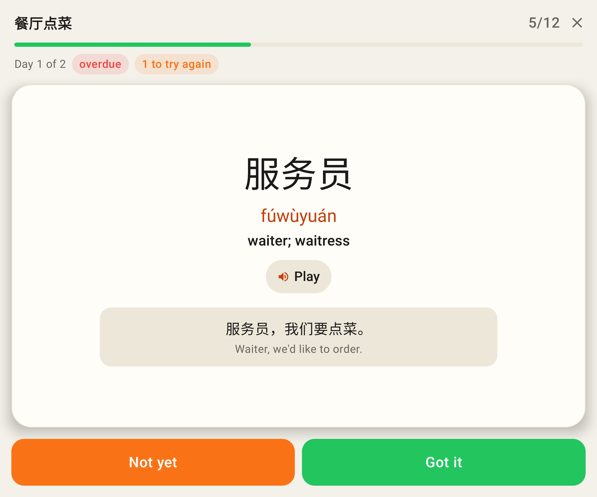

# Lab app: homework pass laid out like a study card

Roborazzi renders (Pixel Fold folded 412×915dp, unfolded 841×701dp). The renders have no system
navigation bar; on the phone the answer bar now sits 16dp above it (checked by `PassLayoutTest`
with a 48dp navigation-bar inset).

## Before

The card floats in the middle of an empty column; on the phone Show answer sat under the gesture bar.

Revealing grows the floating card in place.

Unfolded, revealed.

## After

The card fills the space between the header and the answer bar, like a study card; tap it or Show answer.

The card turns over (the study flip) to pinyin, meaning, ▶ Play and the sentence; Not yet / Got it take the same bottom slot as the study ratings.

Dark theme, front.

Dark theme, revealed.

Font size 130 %.

Font size 130 %, dark, revealed.

Unfolded, front.

Unfolded, revealed, font size 130 %.
