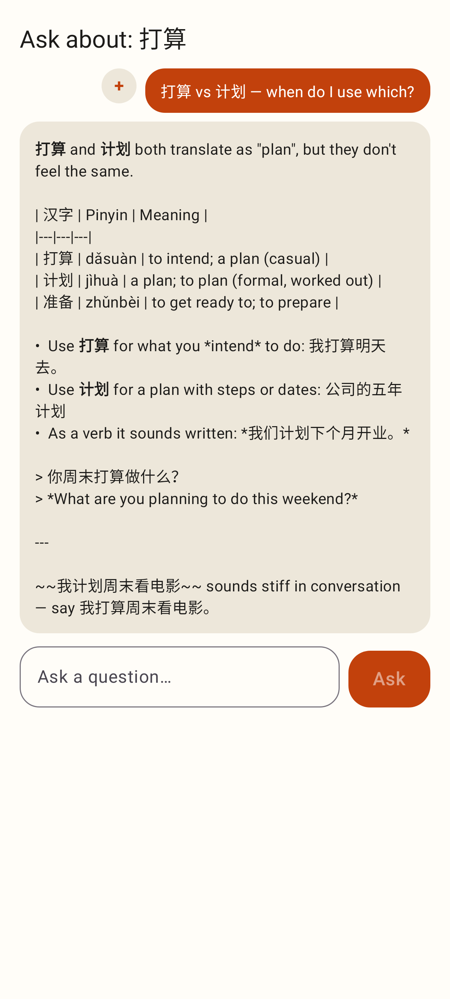
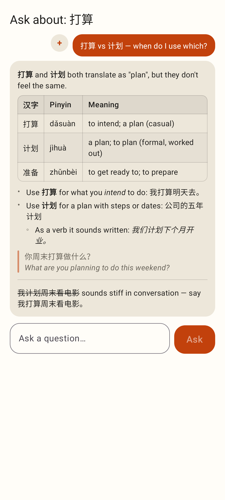
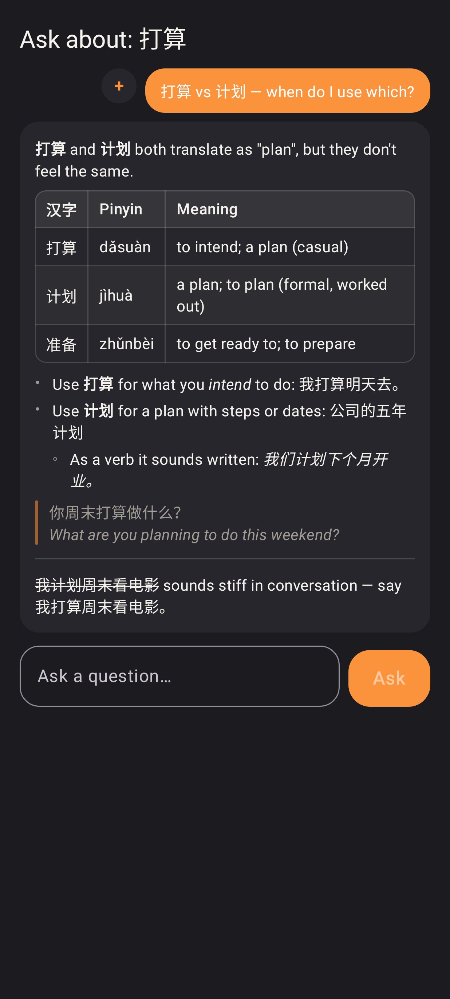
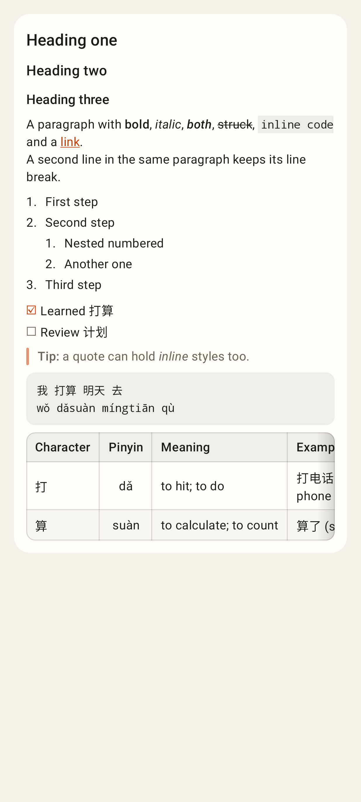
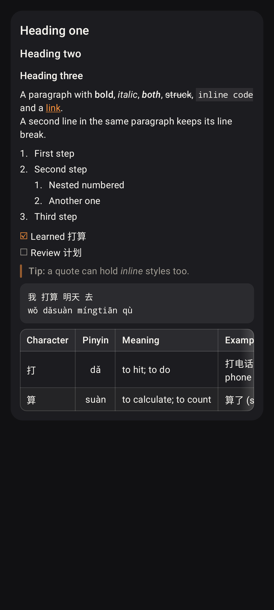
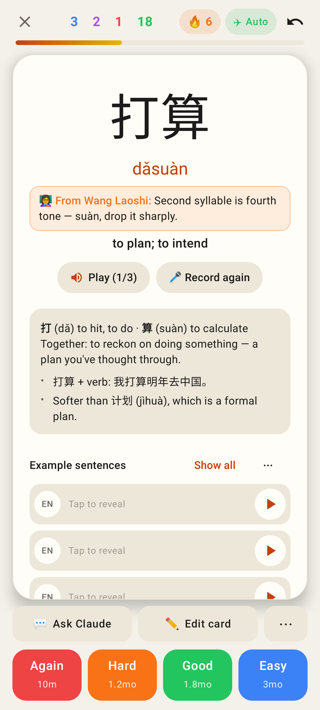

# Lab app: Markdown rendered properly everywhere

Phone viewport (Pixel Fold folded, 412dp), Roborazzi renders.

**Before**: the Ask Claude answer from Jerome's screenshot shown as raw text (pipes, `*`, `~~`, `>`, `---`).

**After**: the same answer through the new `MarkdownText`, with a real table (shaded header, CJK columns kept whole), italics, a nested list, a quote, a rule and strikethrough.

**After, dark theme**: every colour is a translucent `Lab.colors` token.

Everything the renderer supports: headings, inline styles, link, nested numbered list, task list, quote, fenced code, and a 4-column table too wide for the phone that scrolls sideways (edge fade on the right).

The same in dark.

fun_facts on the study card back now use the same renderer (bold and bullets as before, plus everything else).
