# Lab app — package A (study card extras), part 2

Phone = Pixel Fold folded (412dp), rendered by `StudyCardScreenshots` (Roborazzi).

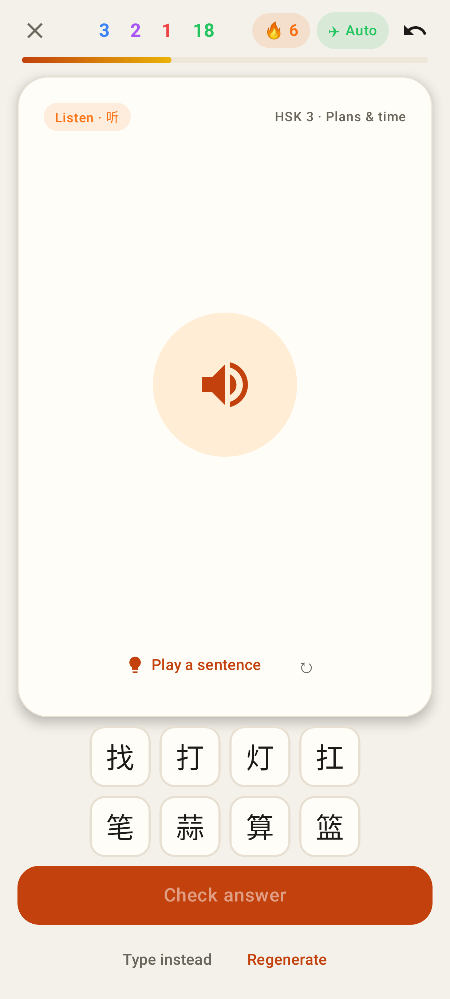
Listen card: multiple choice, one row of options per character.

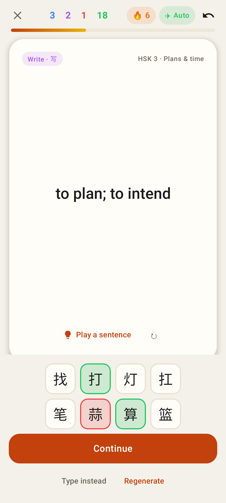
Checked: right option green, wrong pick red, then Continue.

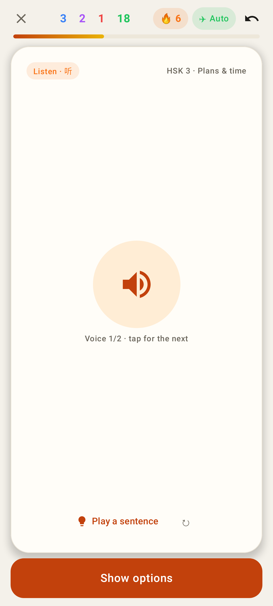
Listen card with options loaded but held back behind "Show options" (as the web).

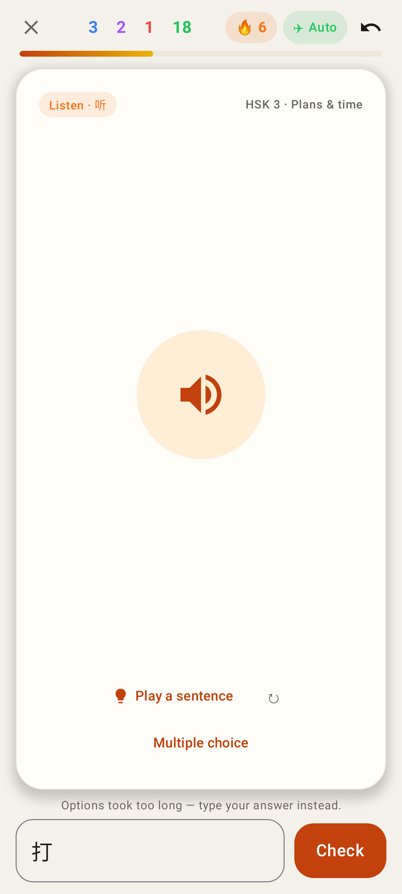
Options took longer than 8 s: typing, with the one-line reason.

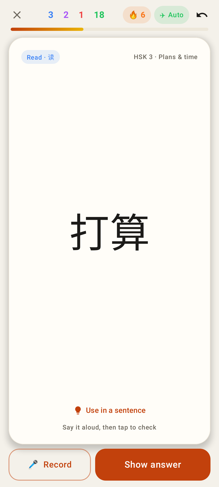
Read card front: 🎤 Record or Show answer.

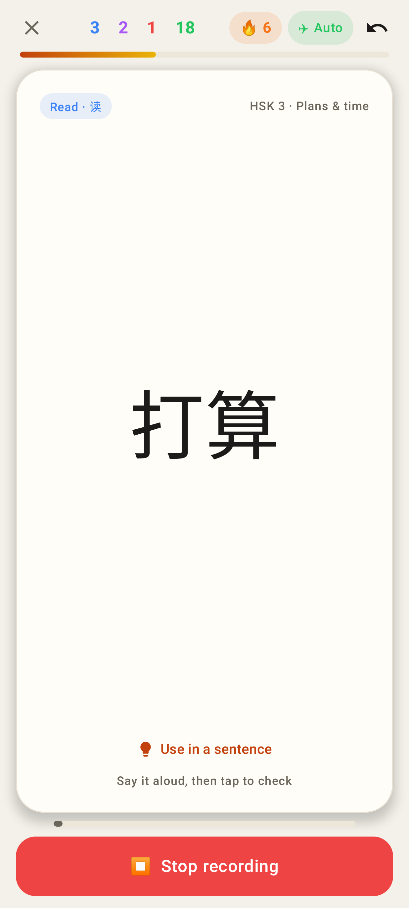
Recording: level meter + Stop.

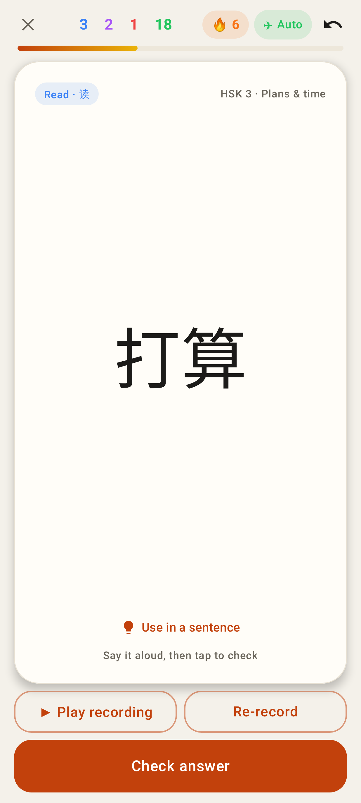
A take: play it back, re-record, check.

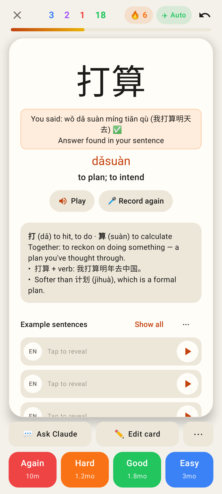
Back: "You said …" from the transcription (the word was inside the sentence), Record again.

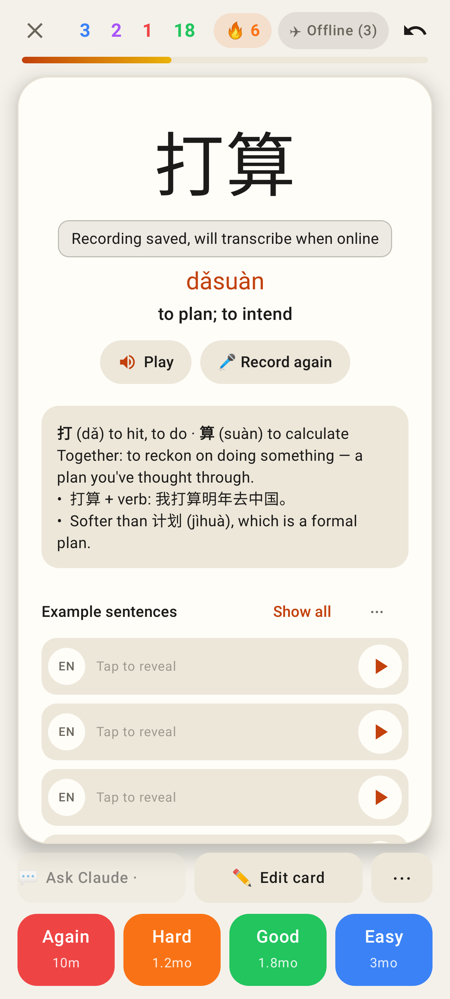
Offline: the recording is saved and uploads with the review later.

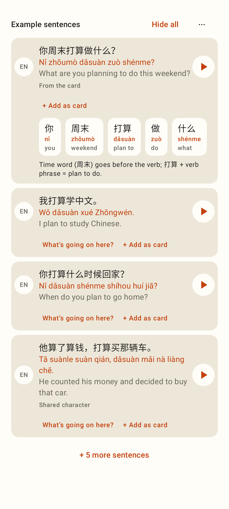
Sentences fully open: "What's going on here?" breakdown with tappable words, + Add as card, ⋯ for new set / add 5 / custom / clear.

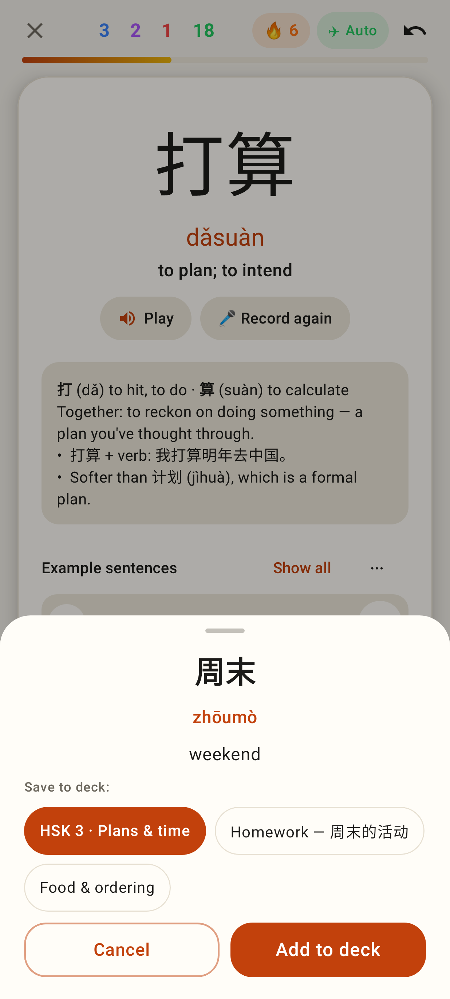
Add a word as a card: deck picker (this card's deck first), duplicate warning.

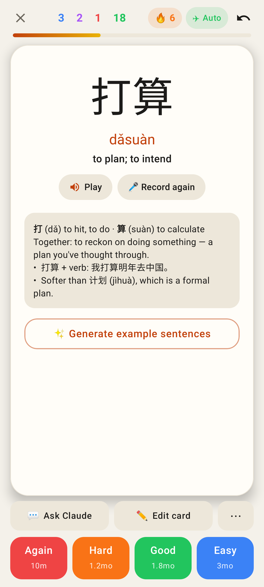
No sentences yet: ✨ Generate example sentences.
