# Lab app — package A (study card extras), part 1

Phone = Pixel Fold folded (412dp), rendered by `StudyCardScreenshots` (Roborazzi).

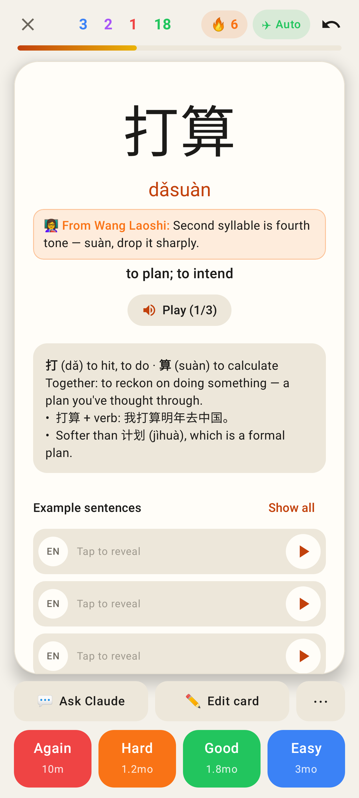
Card back: tutor's note under the pinyin (shown once), Play cycling the note's voices, the footer row Ask Claude · Edit card · ⋯.

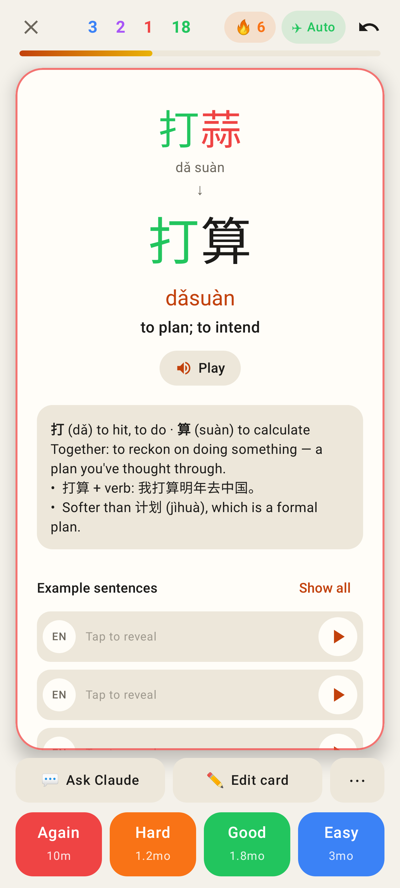
A wrong typed answer: character diff with the pinyin of what was typed.

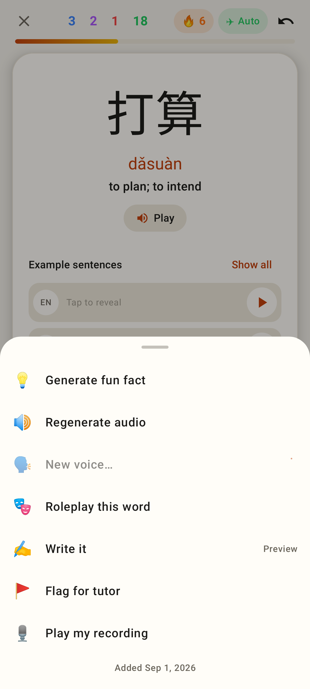
⋯ sheet: fun fact (only when missing), regenerate audio, new voice (busy), roleplay, Write it, flag for tutor, play my recording, "Added" date.

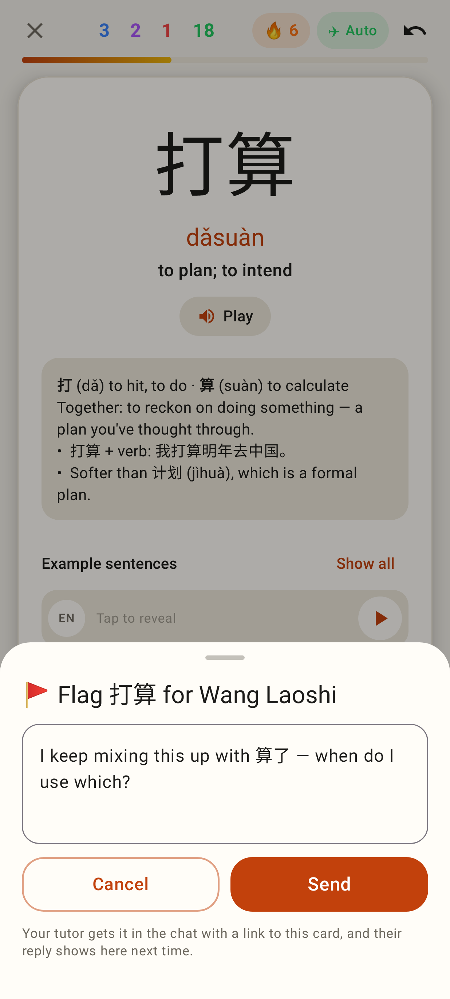
Flag for tutor.

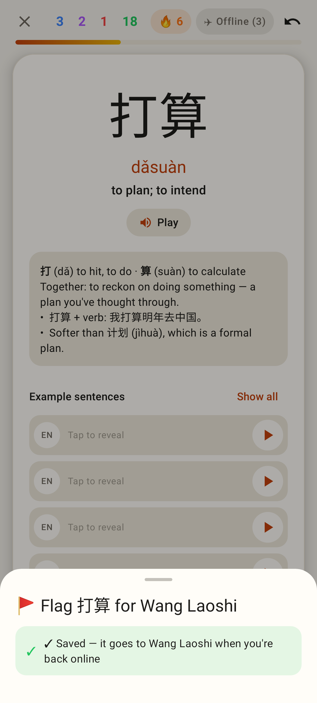
Offline, the flag is queued in the outbox.

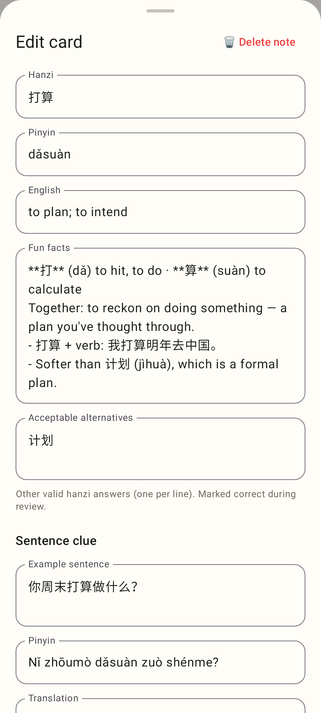
Edit card sheet.

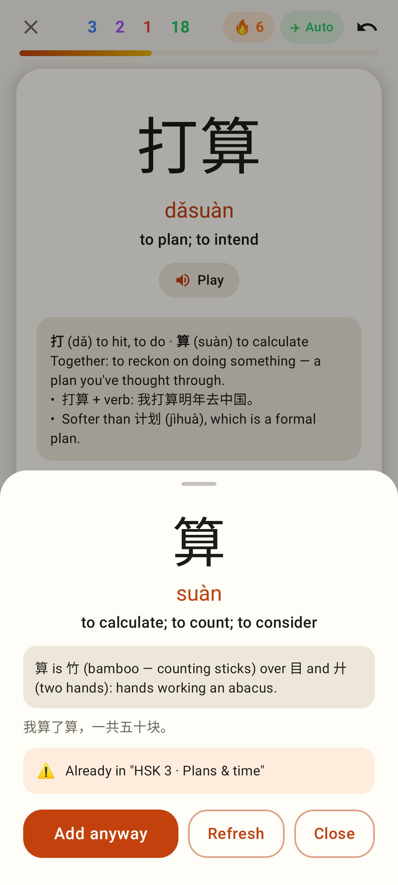
Tap a character on the back: its definition (cached for offline), "Already in" warning, Add / Refresh.

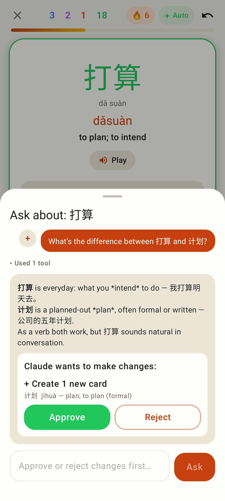
Ask Claude: answer, "Used 1 tool", Claude's change waiting for Approve / Reject.

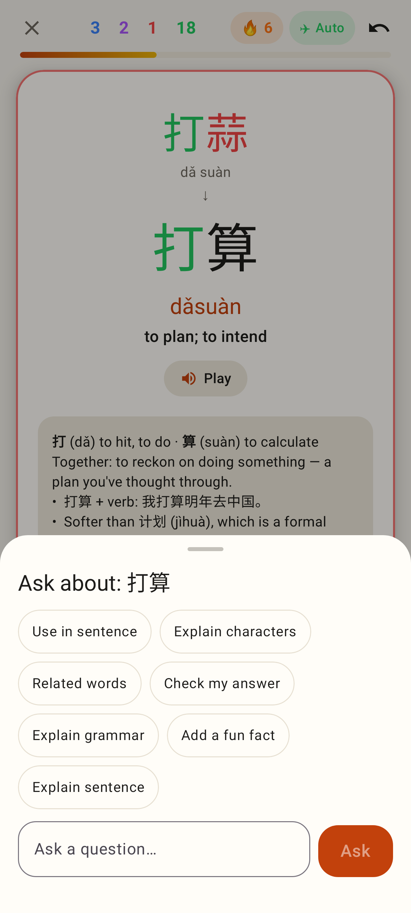
Ask Claude before the first question: quick-question chips (Check my answer on a typed card).

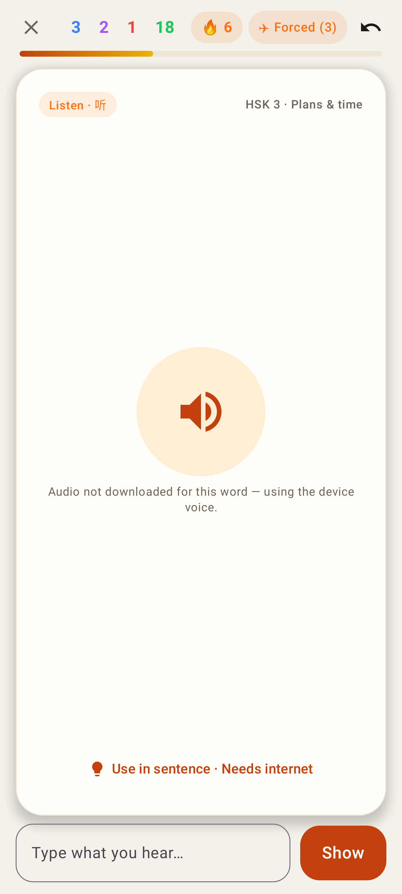
Forced offline (pill shows 3 reviews waiting): clip not downloaded note, "Use in sentence" needs internet.

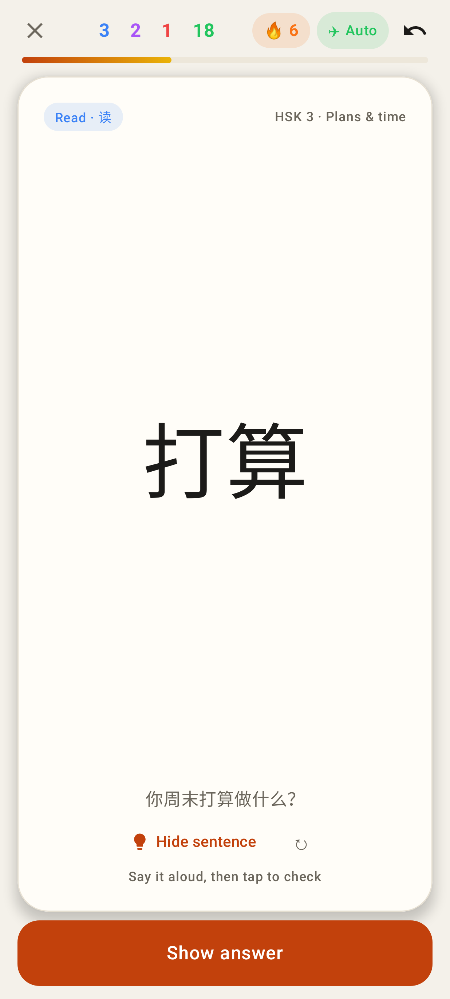
Read card with its example sentence shown, ↻ to regenerate.

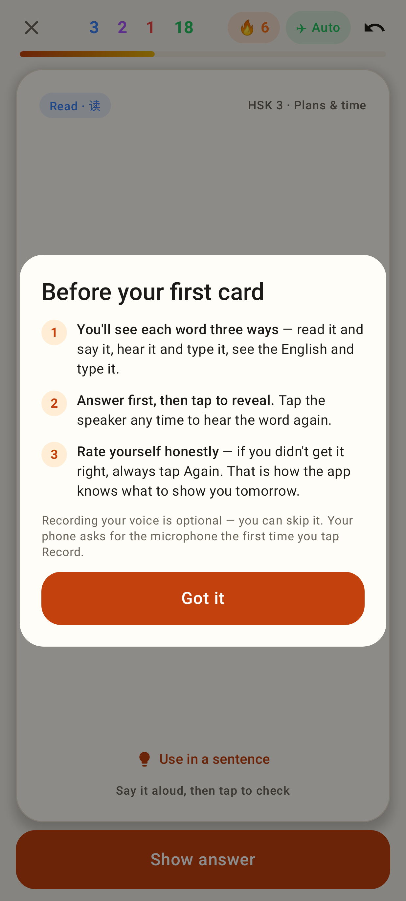
First-card explainer (no reviews yet).

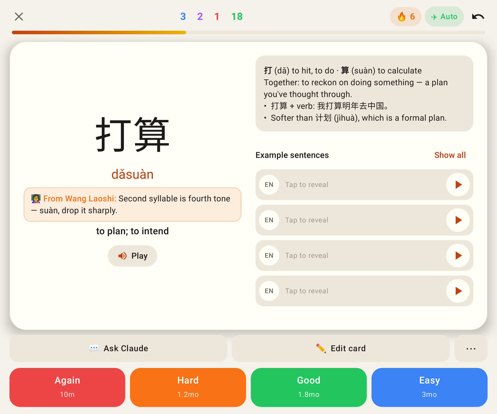
Unfolded back.

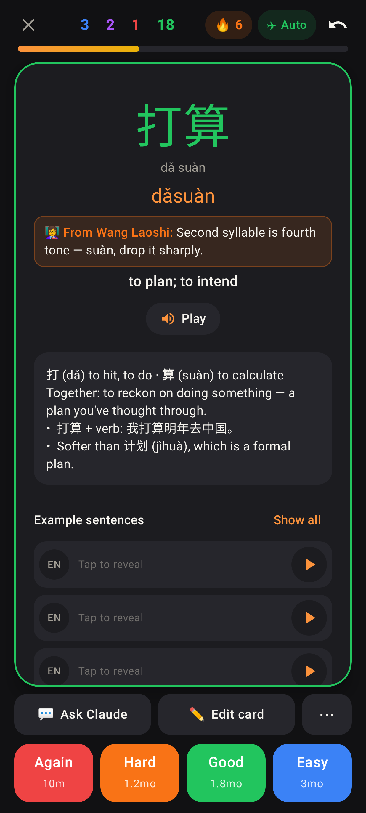
Dark theme.
