# Lab app — package B, part 2: graded readers

Roborazzi at the Pixel Fold's folded size (412×915dp) unless noted; the illustration is a test drawing.

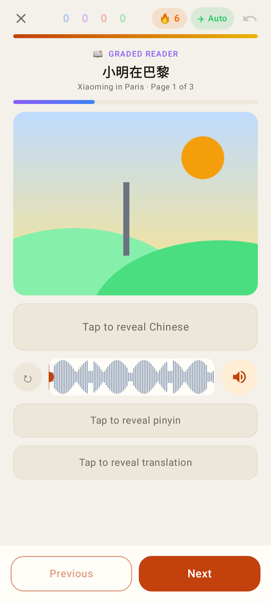
*Today's graded reader at the end of a study session — Chinese hidden, listen first; the narration as a scrubbable waveform (tap / drag the anchor, play from it, ↻ regenerates)*

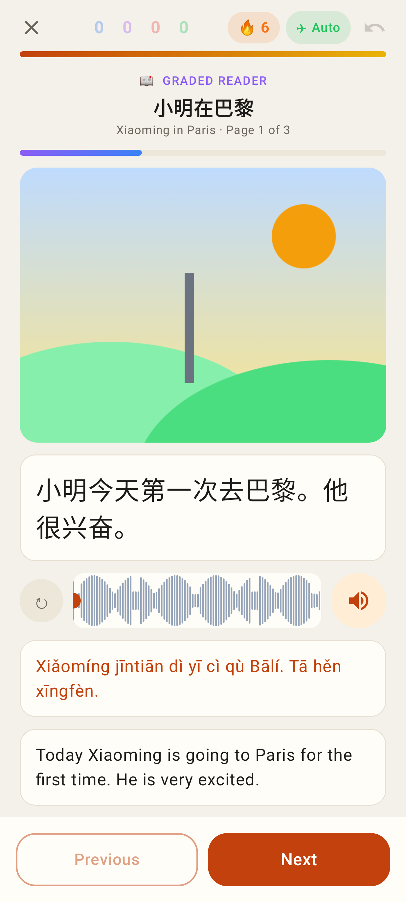
*Chinese, pinyin and translation revealed (each taps back to hidden)*

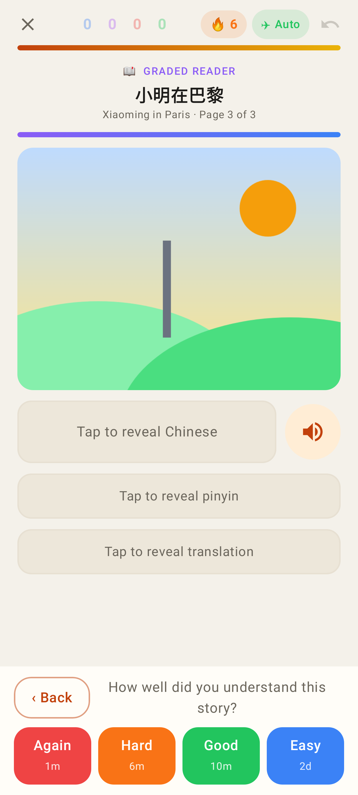
*Last page: Back + the FSRS rating bar*

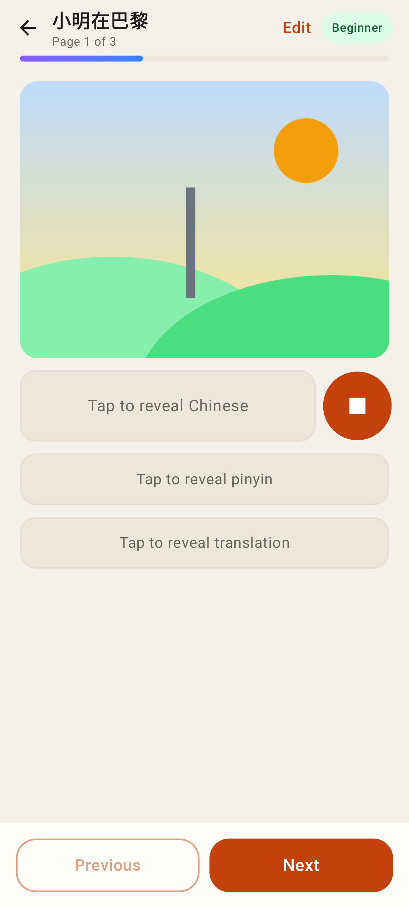
*The reading view (/readers/:id) with narration playing*

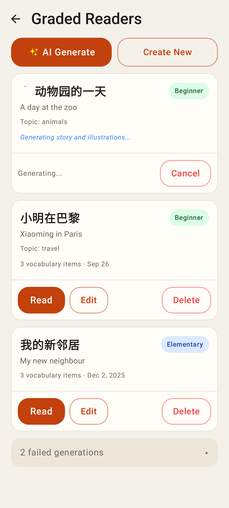
*Readers list: a story being written (polls), ready stories, the failed row folded*

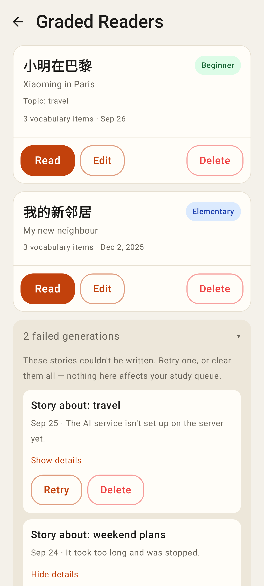
*Failed generations: friendly reason, Show details, Retry / Delete, Delete all*

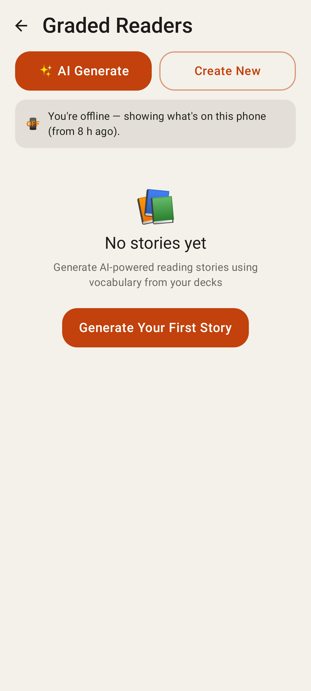
*Offline, nothing cached yet*

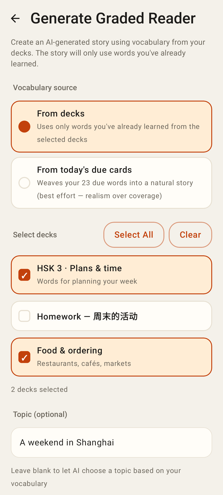
*Generate a story from decks, with a topic and difficulty*

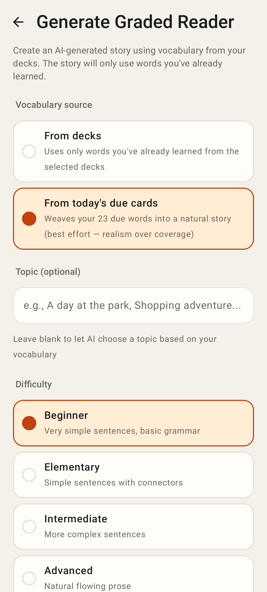
*…or from today's due cards*

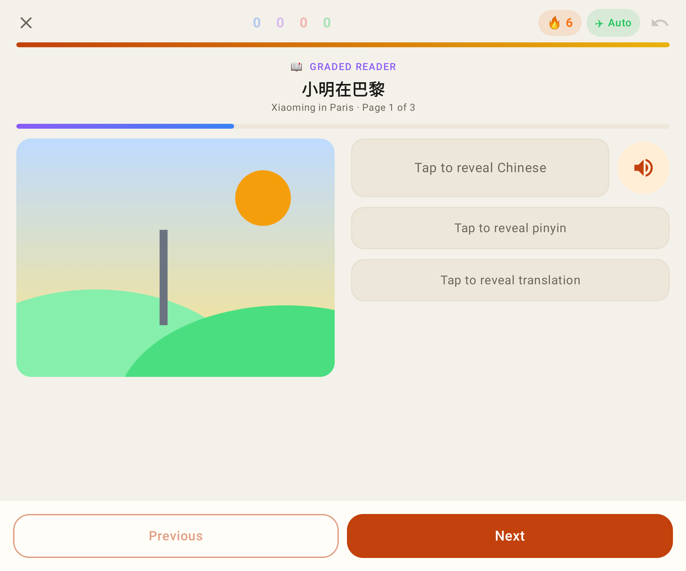
*Unfolded Fold: picture beside the text*

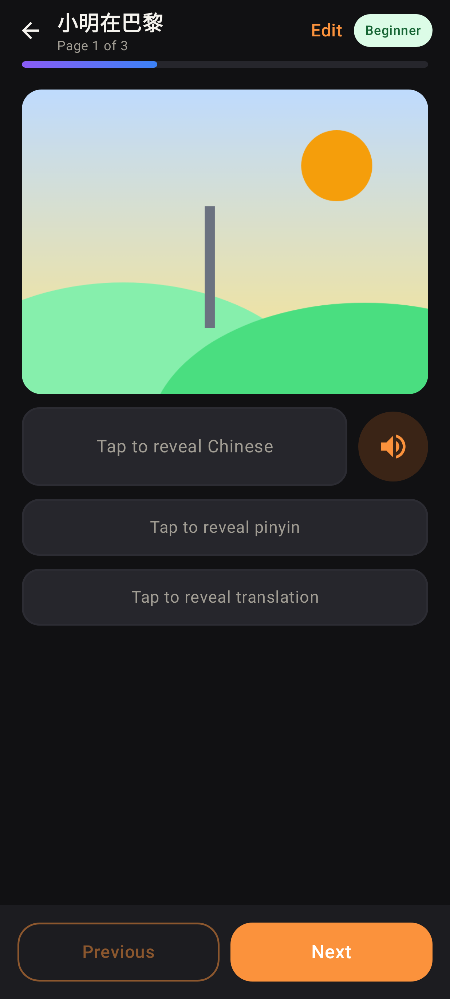
*Dark theme*

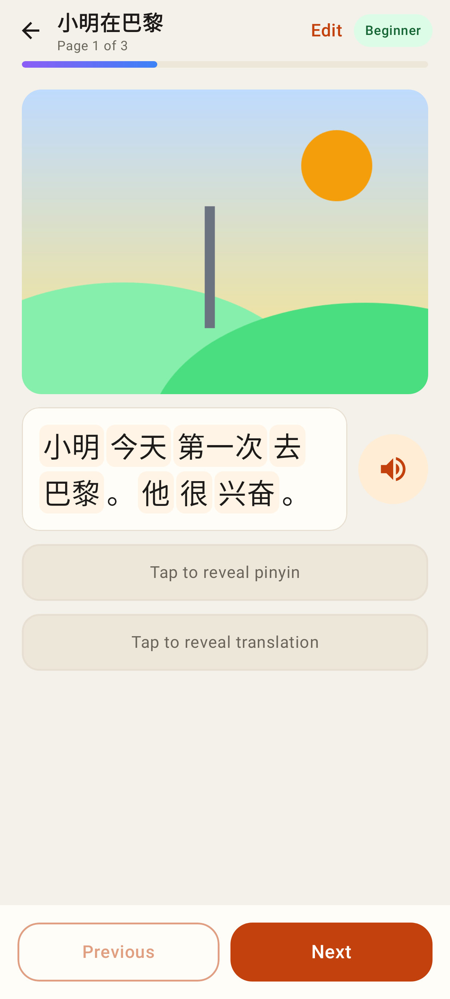
*Reading view: the revealed Chinese split into words (segmentation cached for offline) — tap one to add it*

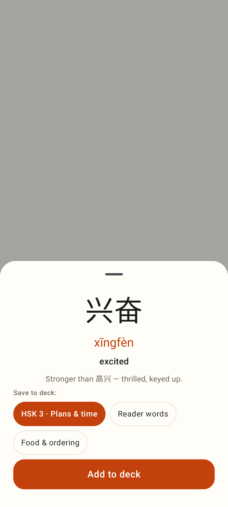
*Add a word to a deck (Add anyway when it's already there)*
