# Lab app — package C: Decks tab, deck page, card editor, card hub

Roborazzi renders at the Pixel Fold's folded size (412dp) unless noted.

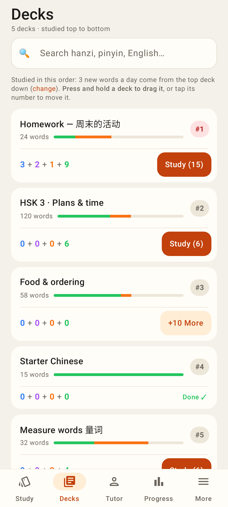
The deck queue in study order: #N badge (tap → move menu), due counts in the queue colours, Study / +10 More / Done ✓.

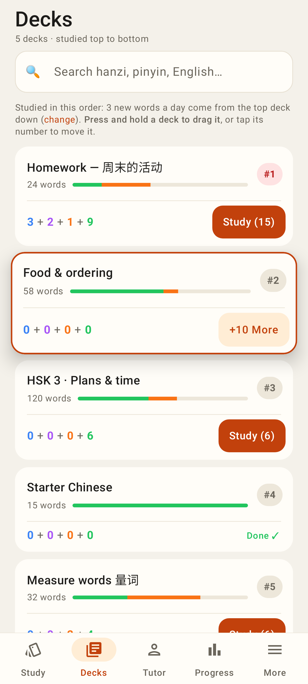
Press and hold lifts a deck; the list reflows under the finger (parity-tested hit-test).

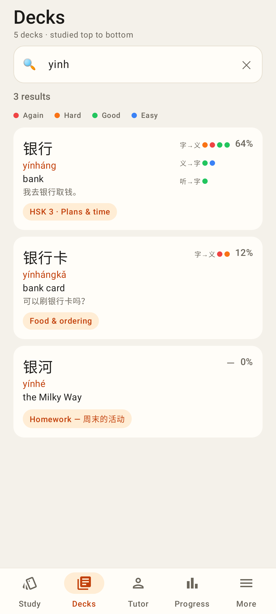
Local search (toneless pinyin works) with recent ratings per card type and mastery.

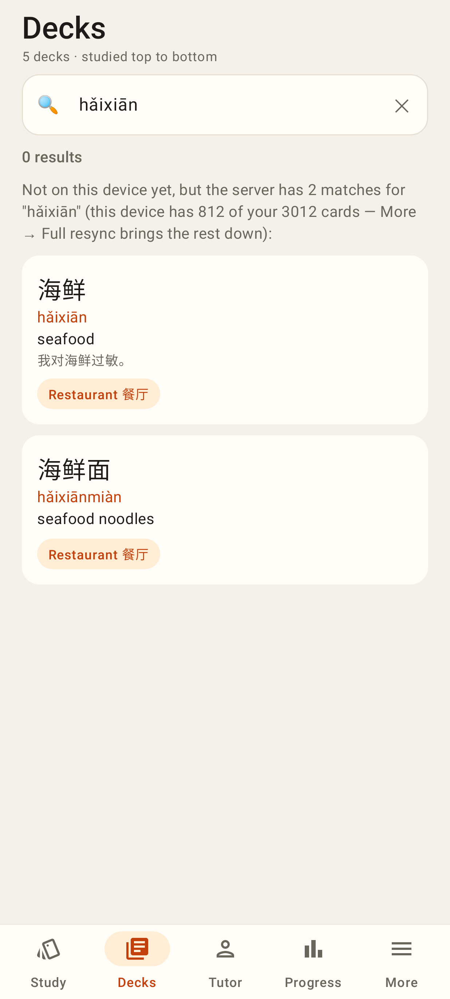
Nothing on the phone → the server's matches, saying how many cards the phone holds.

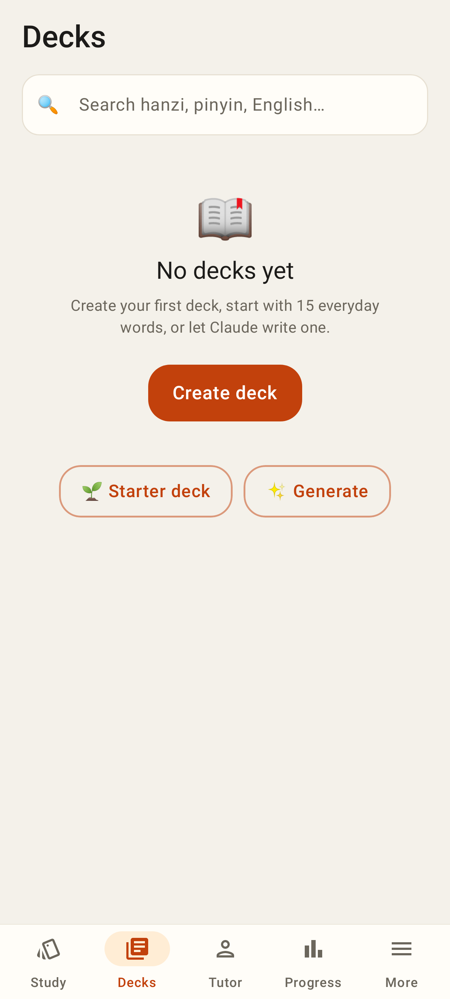
No decks yet: create, starter deck, or generate.

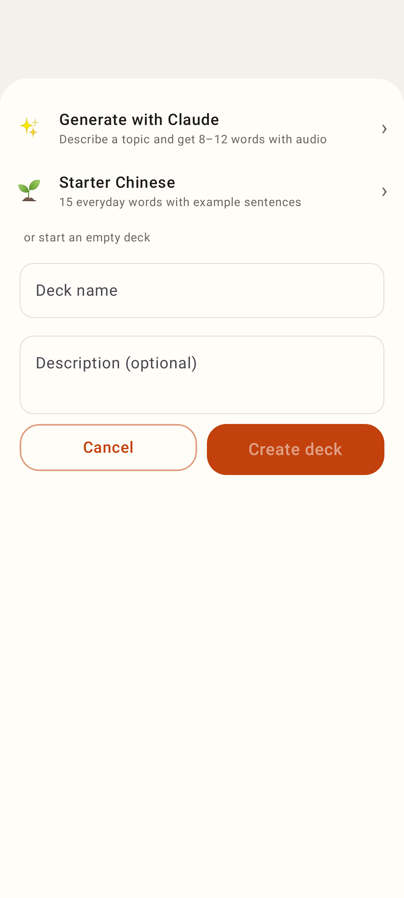
New deck sheet (Generate with Claude / Starter Chinese / empty deck).

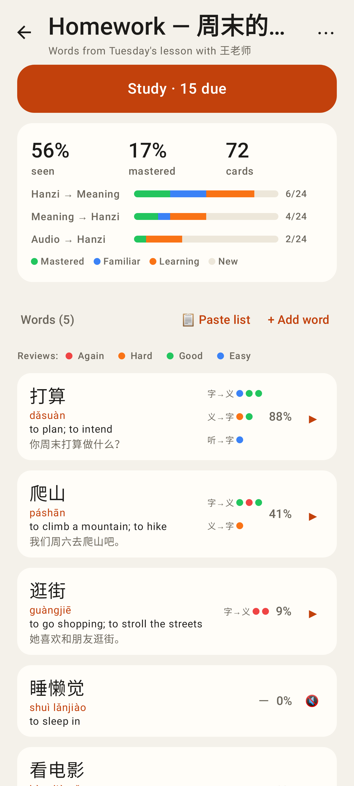
Deck page from Room: Study · N due, progress per card type, words by mastery with ratings and ▶.

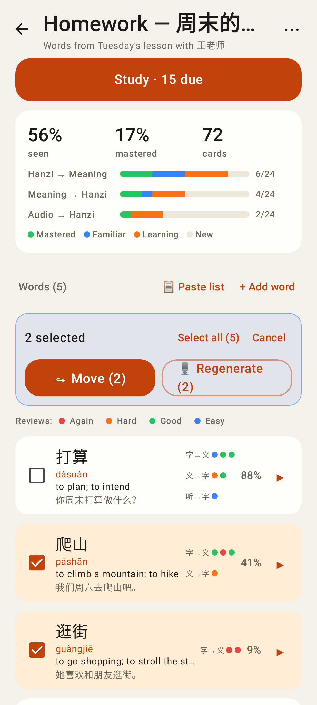
Long-press a word to select several: move to another deck or regenerate audio.

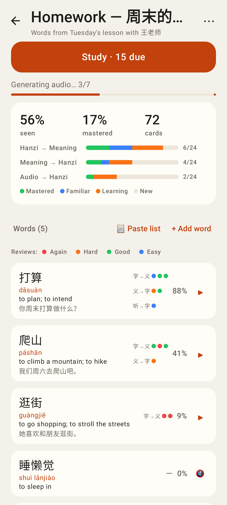
⋯ → Generate missing audio, one word at a time with progress.

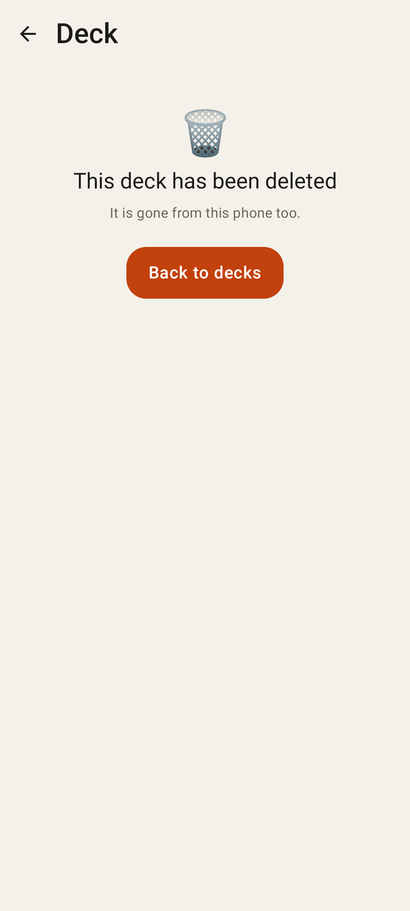
A deck deleted elsewhere says so.

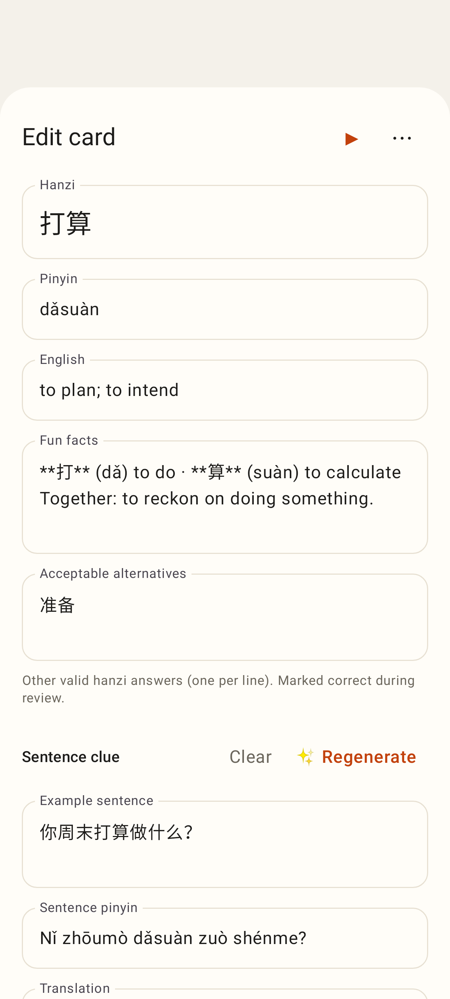
The card editor sheet (⋯ holds card page, move, generate audio, delete).

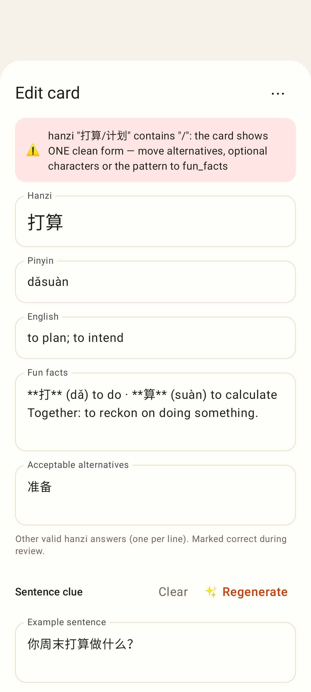
The card standard's hard rules are checked on the phone — same sentence as the server, offline too.

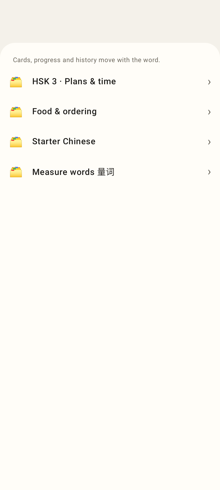
Move to another deck; cards and history move with the word.

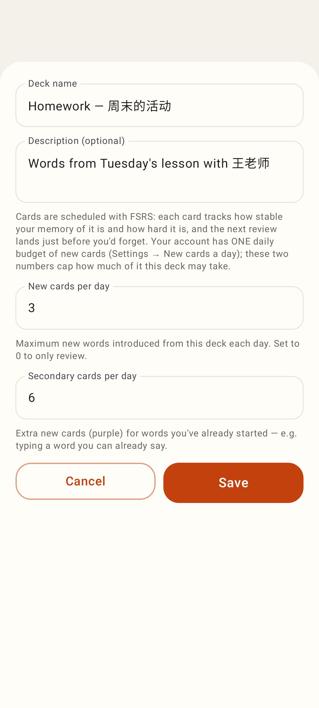
Name, description and the deck's caps on the daily budget (validated like pickDeckSettings).

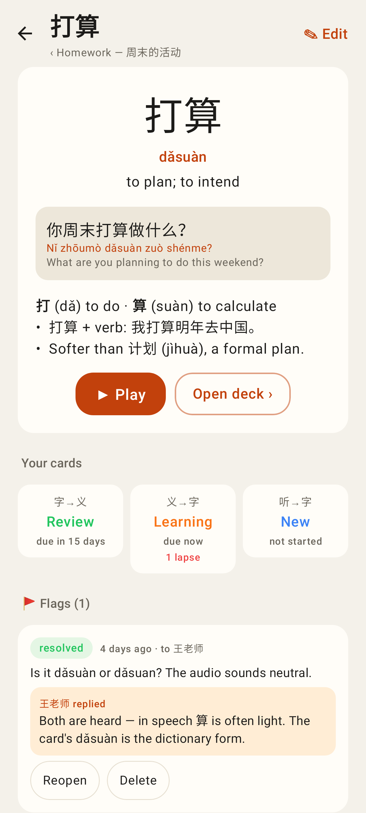
/cards/:noteId — the note, its three cards, flags with the tutor's reply, Claude threads, recent reviews.

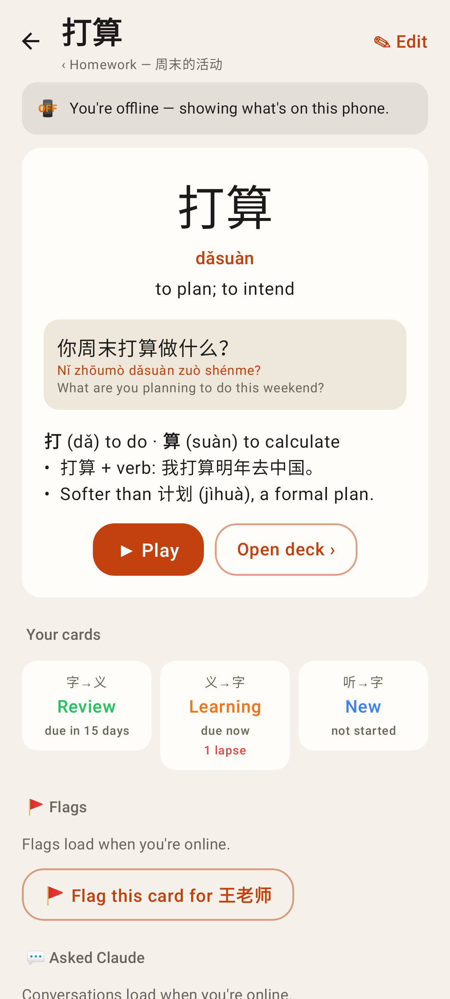
Offline before the hub was ever loaded: the phone answers the note, cards and reviews.

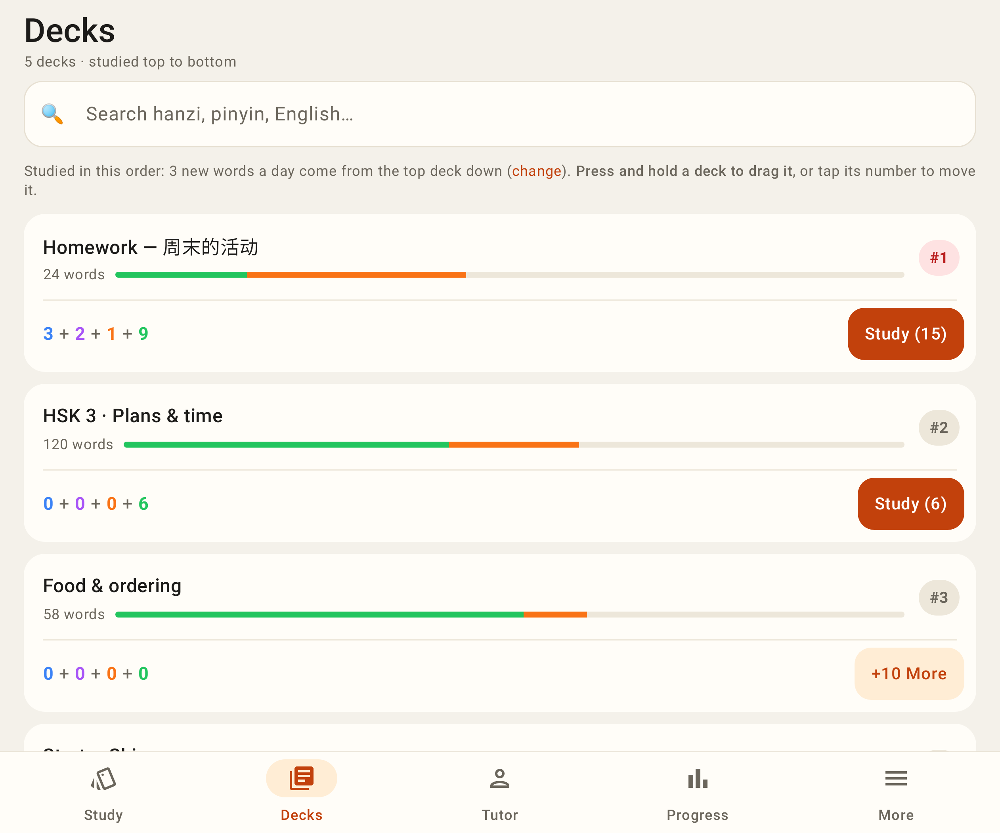
Unfolded (841dp): the column caps at 720dp.

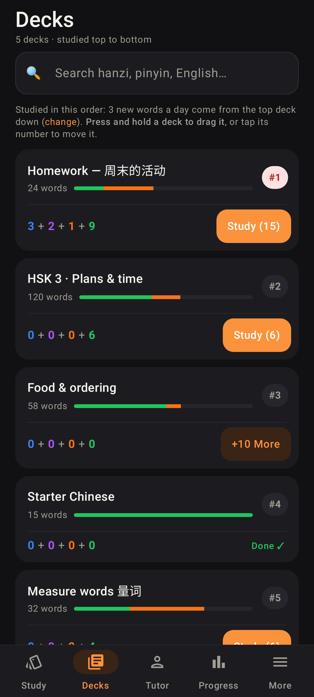
Dark theme.
