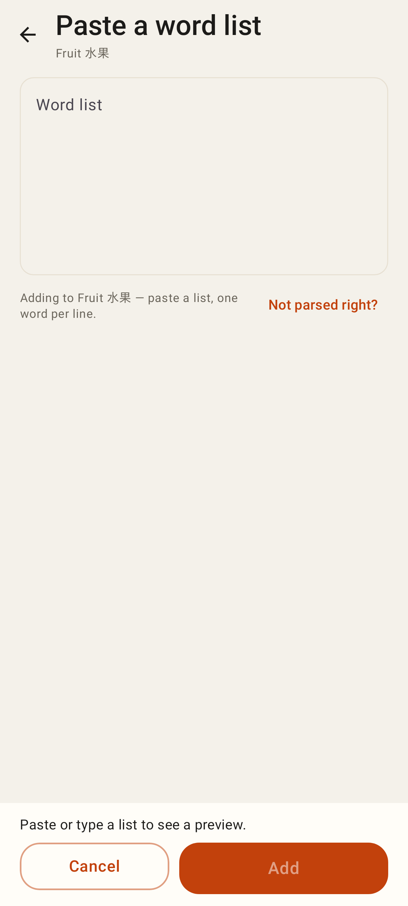
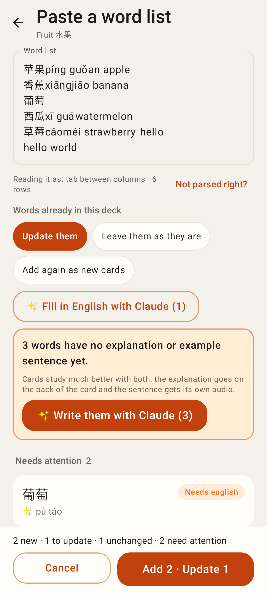
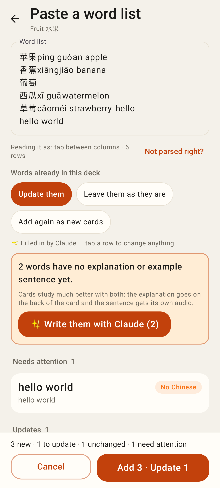
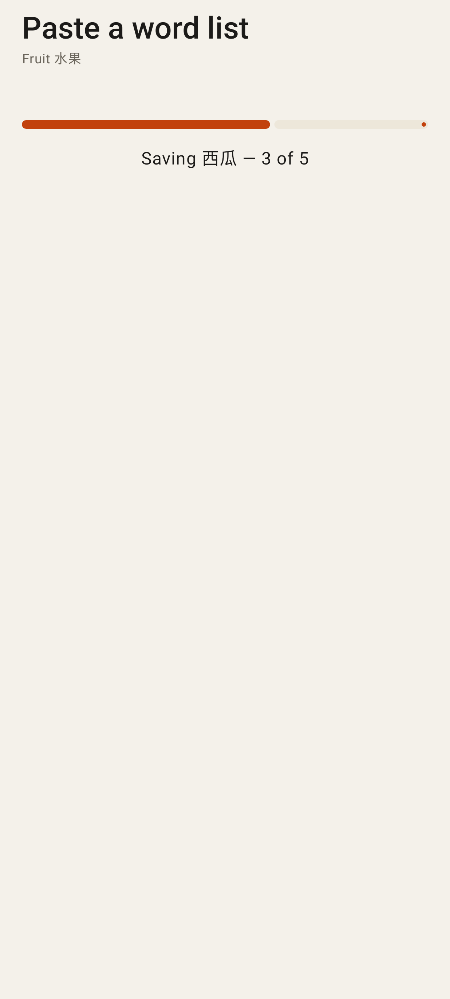
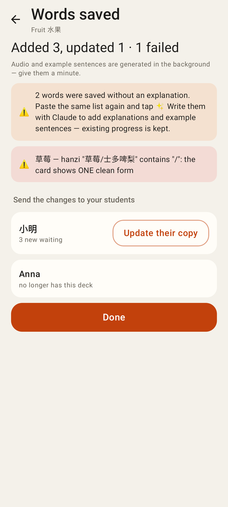
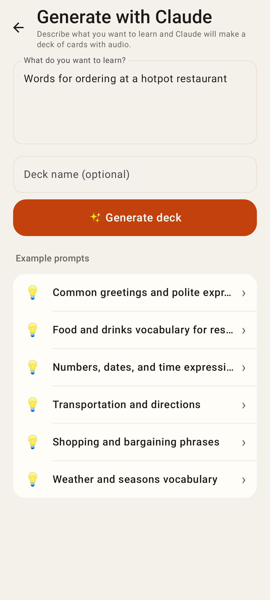
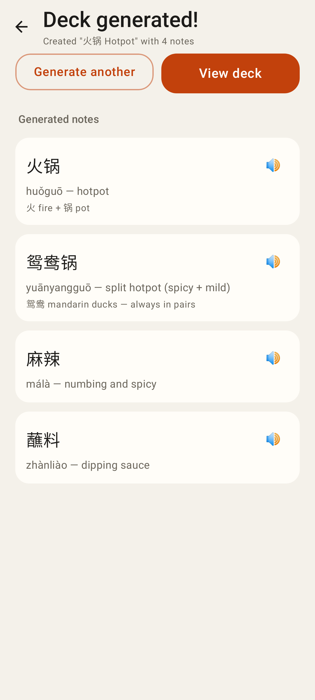

# Lab app — package C, part 2: Paste a list and Generate with Claude

Roborazzi renders at the Pixel Fold's folded size (412dp).

Deck page → 📋 Paste list: one box, separators detected automatically.

The preview: what was detected, "Not parsed right?" for overrides, policy for words already in the deck, ✨ fill in English, the explanation nudge, grouped rows, sticky Save.

After ✨: filled values are marked until edited; a row expands into its editor (skip, fix any field).

Saving one request per row, three at a time.

Done: counts, per-row failures with the server's reason, the "saved without an explanation" reminder, and Update their copy per student (tutors).

/generate — Generate with Claude, with the web's example prompts.

The generated deck's words with ▶, Generate another / View deck.
