# Lab app — package D: Progress tab + Settings

Robolectric/Roborazzi renders (Pixel Fold folded 412dp; unfolded 841dp), realistic data.

## Progress

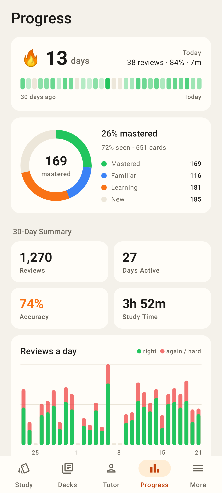
Progress tab: 🔥 streak + 30-day heatmap, cards mastered ring, 30-day summary, reviews-a-day chart (right vs again/hard).

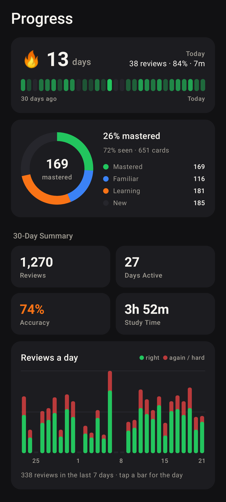
Same in dark mode.

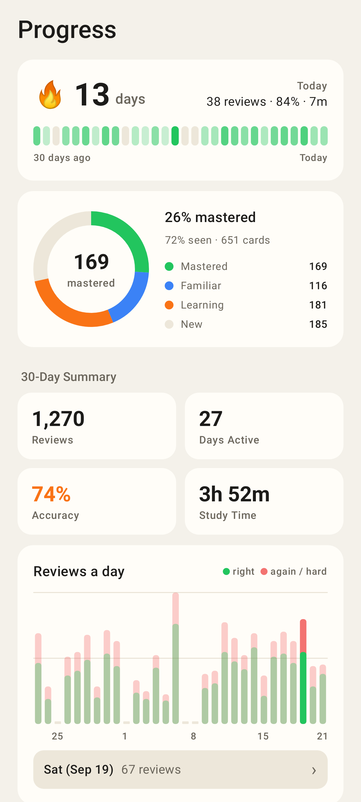
A tapped bar: the day, its reviews, › opens the day.

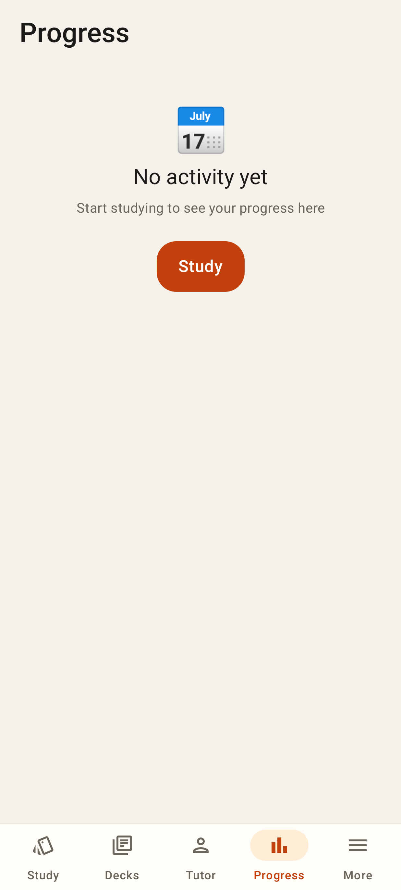
No reviews yet.

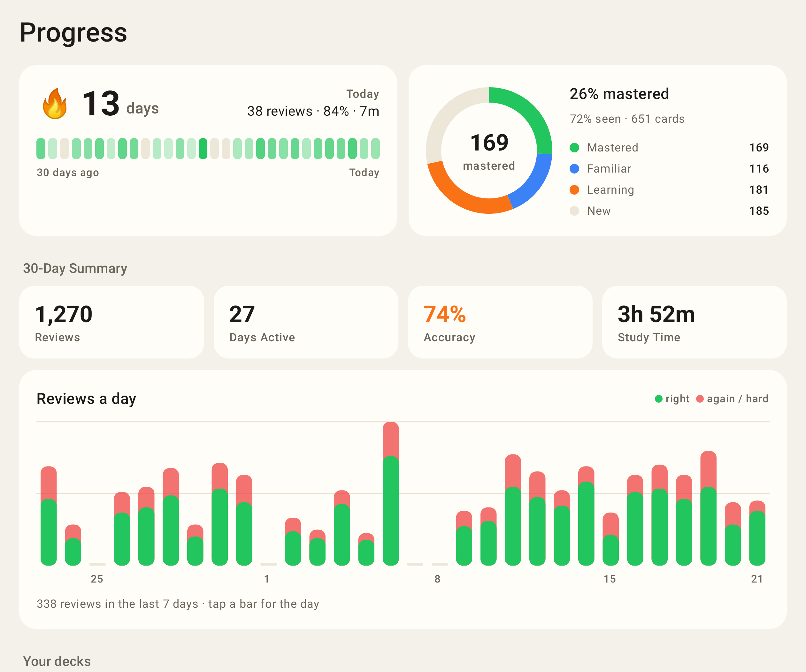
Unfolded: streak and mastery side by side, four summary tiles in a row.

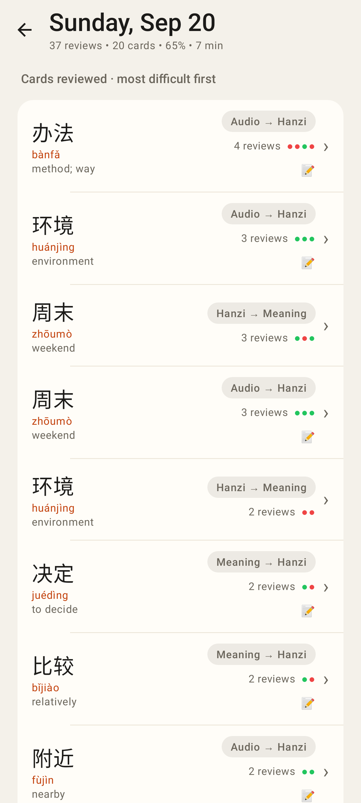
A day: cards reviewed, most difficult first, last five ratings.

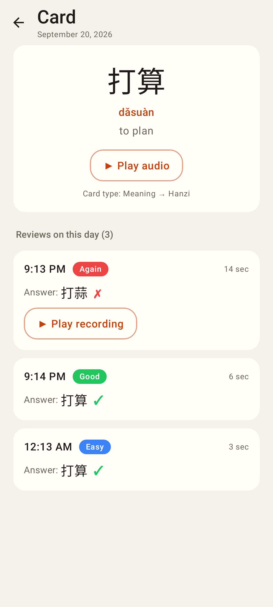
One card on that day: each review with time, rating, duration, typed answer ✓/✗, recording.

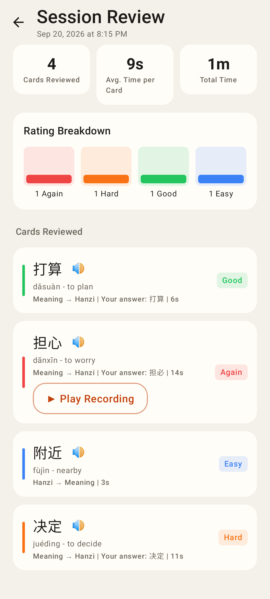
Session review (`/study/review/:id`).

## Settings

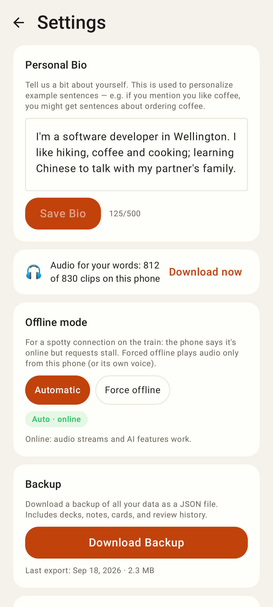
Settings: bio, offline audio, offline mode, backup…

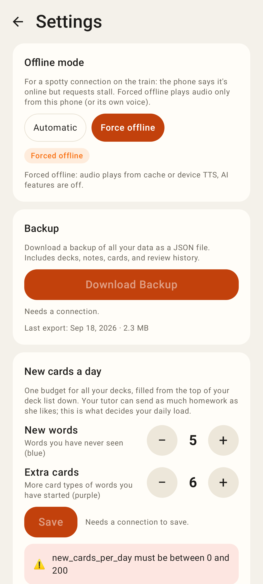
Forced offline, backup needs a connection, the study budget steppers with a server validation error.

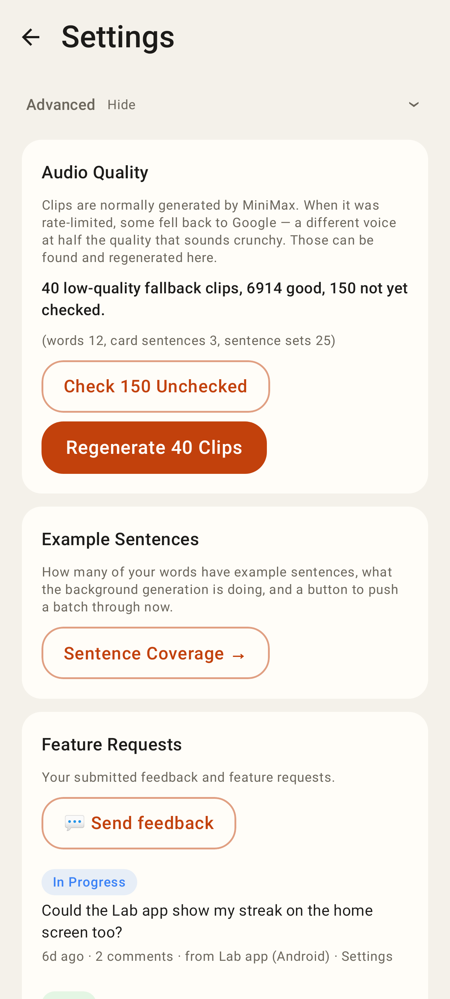
Advanced: audio quality, sentence coverage link, feature requests.

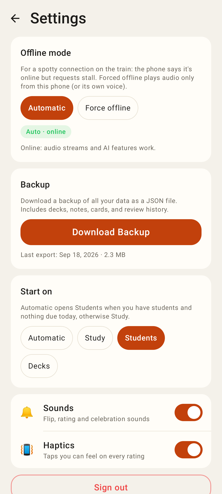
A tutor-only account: no bio / budget / offline audio; Start on includes Students.

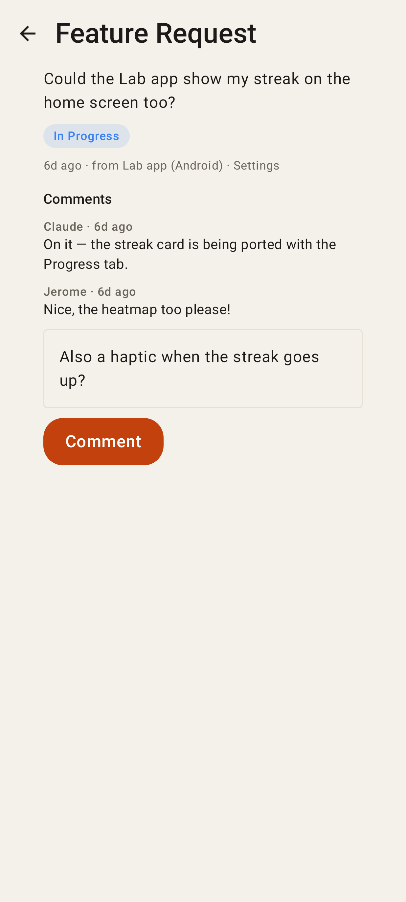
A feature request with comments and the comment box (shown in a bottom sheet).

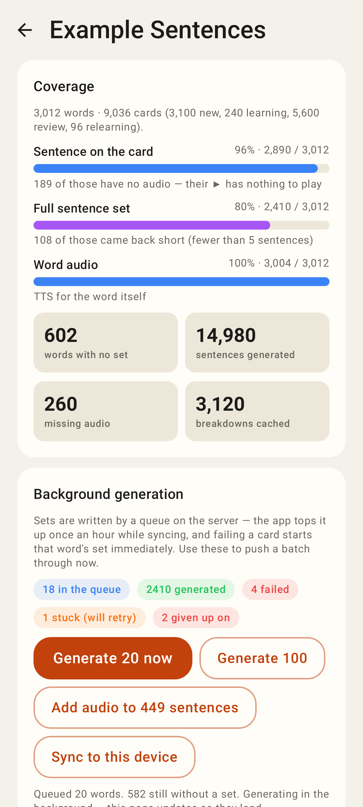
Sentence coverage: bars, facts, job chips, actions.

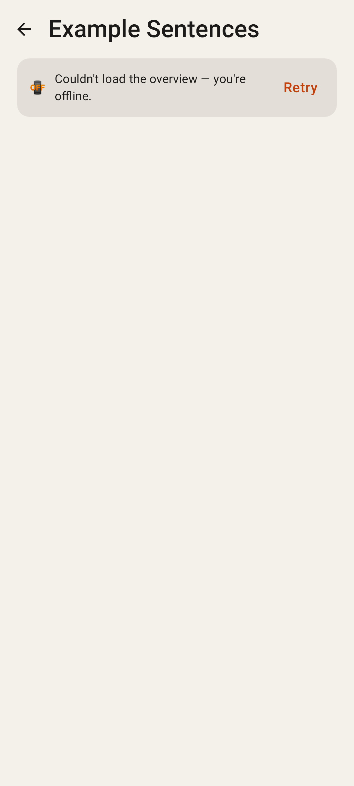
Sentence coverage offline with nothing cached.

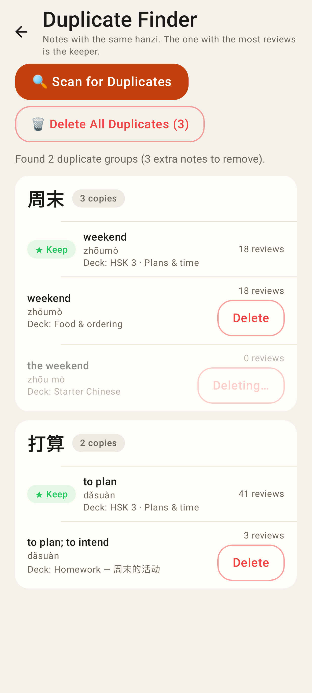
Duplicate finder: ★ Keep = most reviewed; one delete in flight.

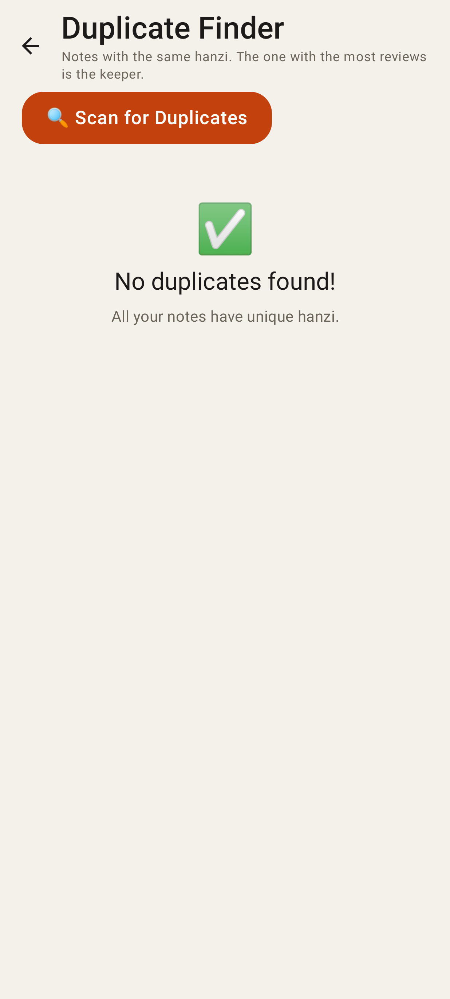
No duplicates.

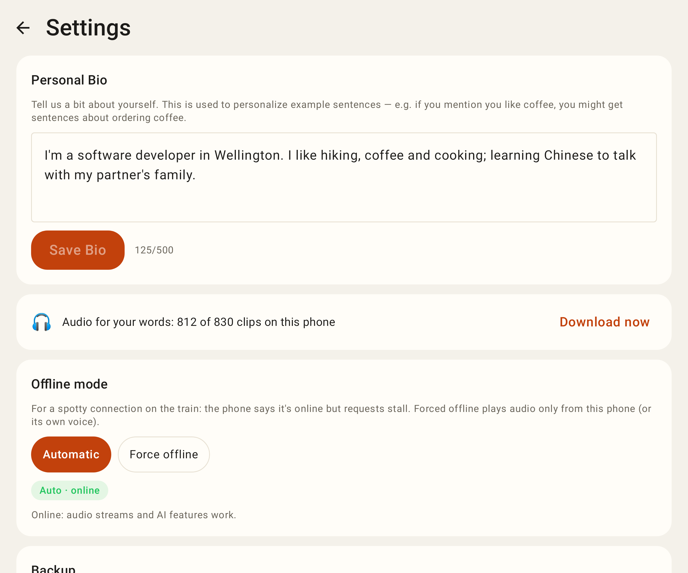
Settings unfolded.
