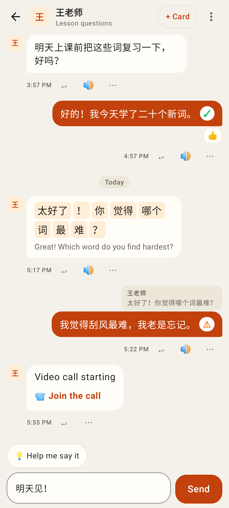
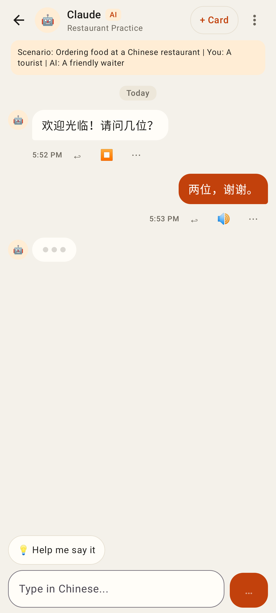
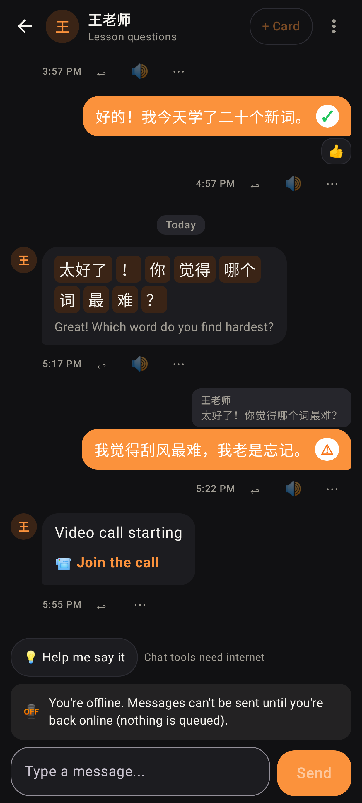
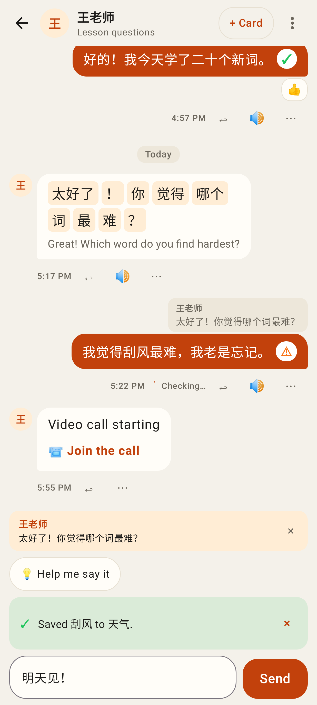
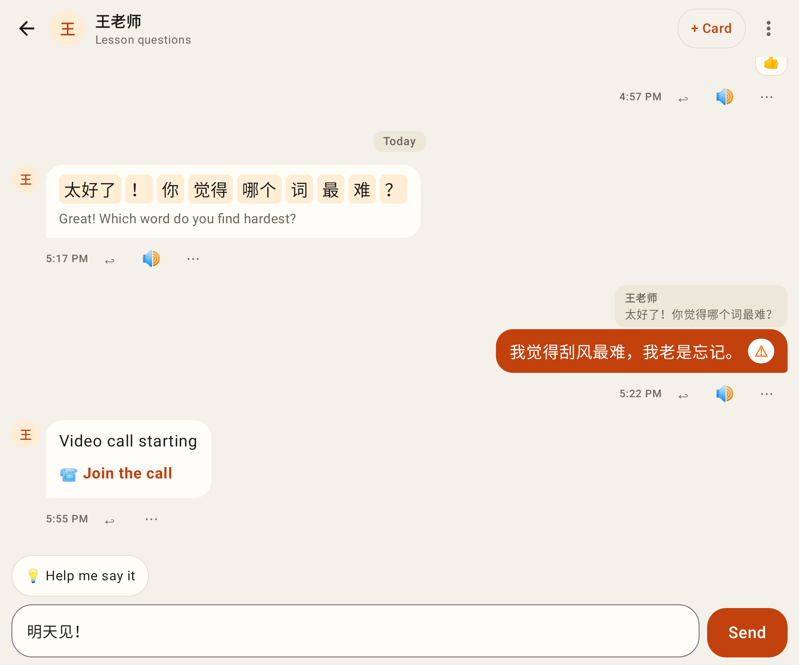
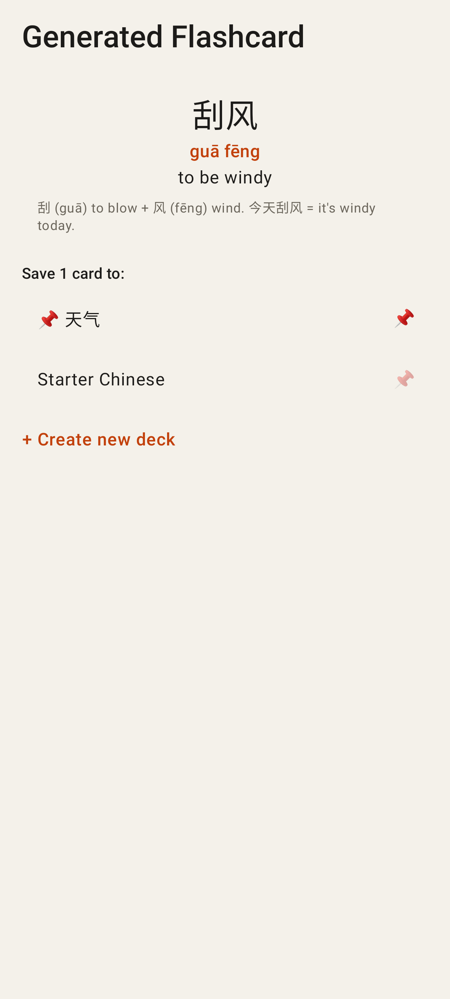

# Lab app — package E, part 2: the chat

Tutor chat: day dividers, reply previews, reactions, check marks on my messages (✓ / ⚠ opens the corrections), a word-by-word message with tappable words, a call invite as "Join the call"; Reply · Play · ⋯ under each message, + Card and ⋯ in the header, 💡 Help me say it.

Claude practice chat: scenario banner, AI badge, the reply playing (⏹), Claude typing.

Offline (dark): the history from this phone, tools and Send disabled with the reason.

Replying to a message, "Checking…" on a message, a saved-card notice.

The unfolded Fold (841 dp).

Saving a suggested card: pinned decks first, + Create new deck.
