# Lab app — package E: homework, Tutor tab, first open

Roborazzi renders at the folded Pixel Fold (412×915 dp) unless noted.

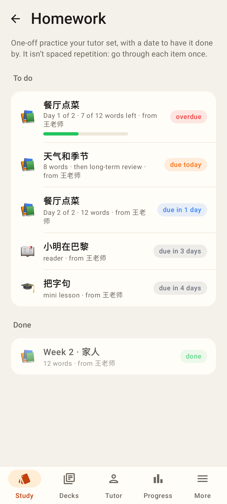
`/homework` — to do (overdue first, due chips, split "Day 1 of 2", progress bar) and done.

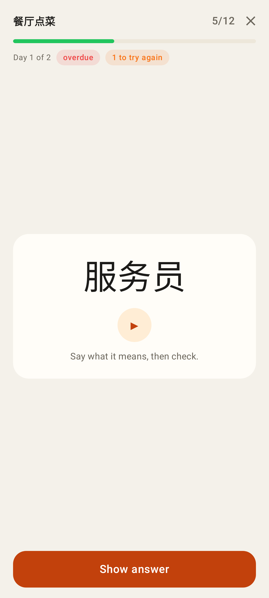
`/homework/:id` — one word at a time, ▶ plays the clip, progress + "to try again".

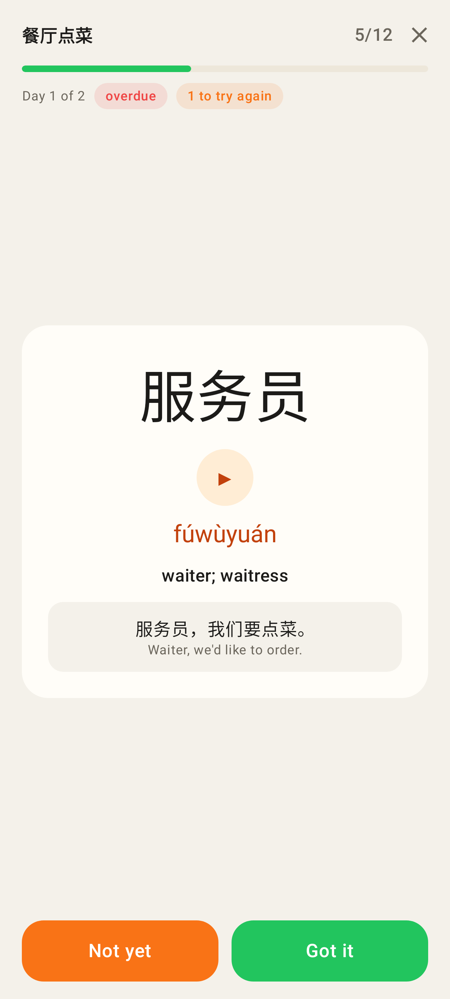
Show answer → pinyin, meaning, the card's sentence; Not yet / Got it.

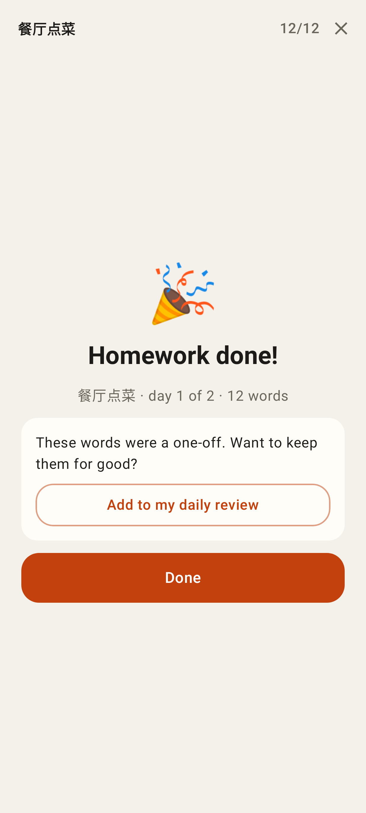
Done (confetti + fanfare) with "Add to my daily review" for a one-off-only deck.

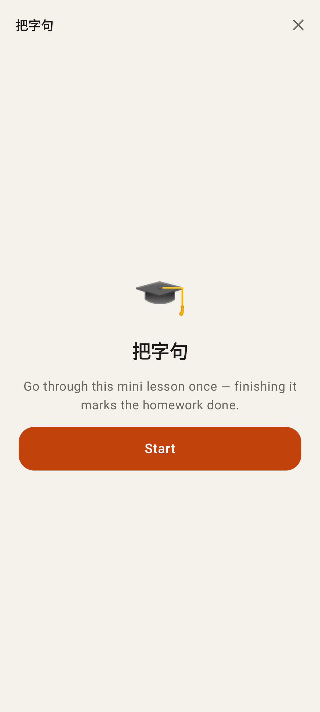
A lesson / reader item — plays in the main app until package B's player is native.

Home under Study: the Homework card and the "From <tutor>" card (progress in words, unread message, Reply / Open deck).

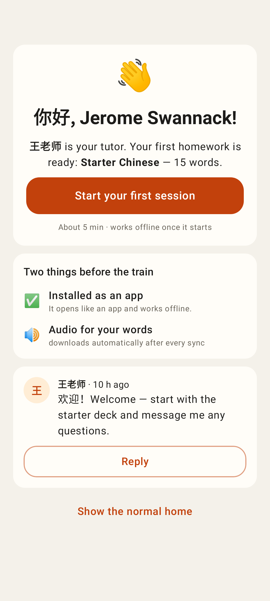
An invited student's first open, from `/api/me/onboarding` (cached, works before the first sync).

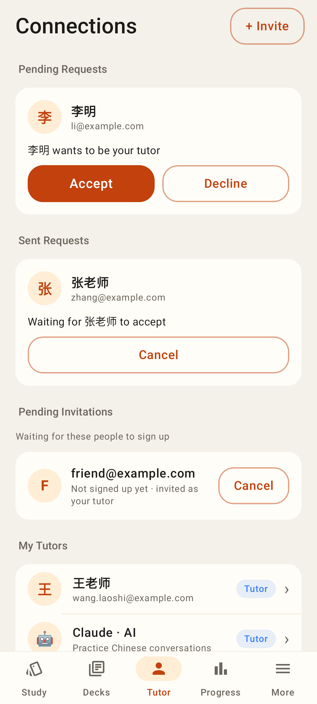
Tutor tab: pending / sent requests, email invitations, My Tutors, + Invite.

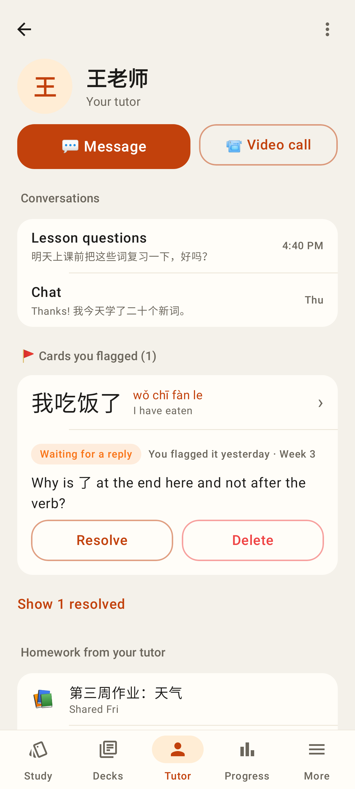
The student's tutor page: Message, video call, conversations, cards you flagged, homework decks.

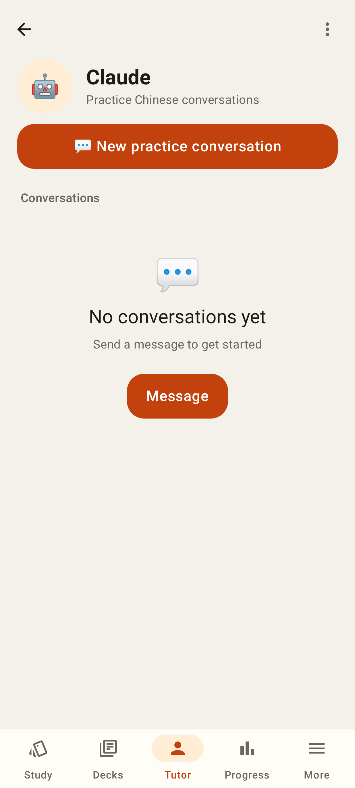
The Claude practice partner: New practice conversation.

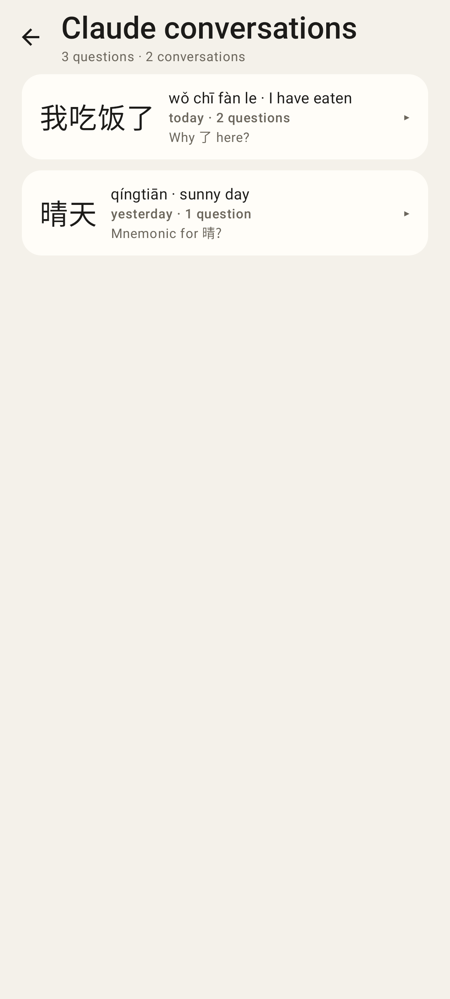
`/claude-chats` — Ask-Claude questions grouped per card.

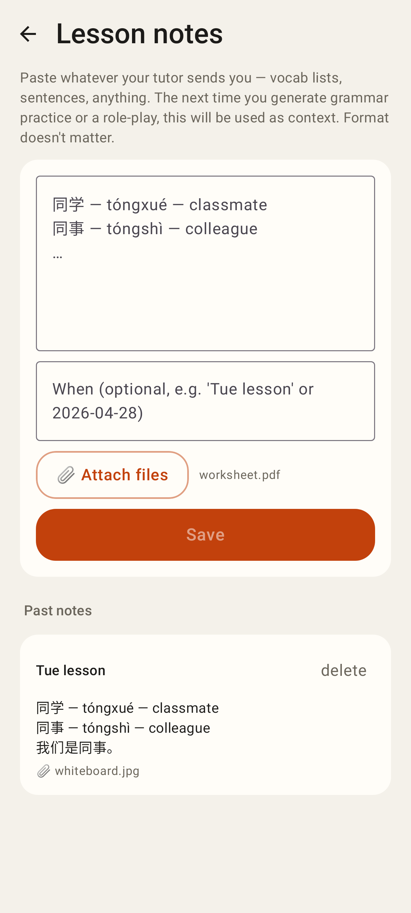
`/lesson-notes` — paste notes, attach files, past notes.

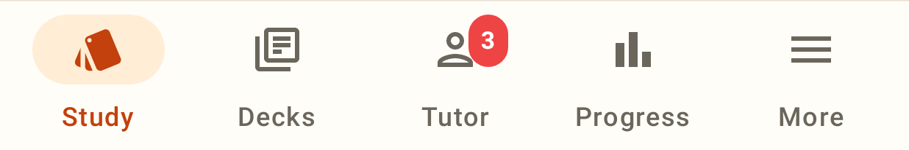
Unread chat messages on the Tutor tab.

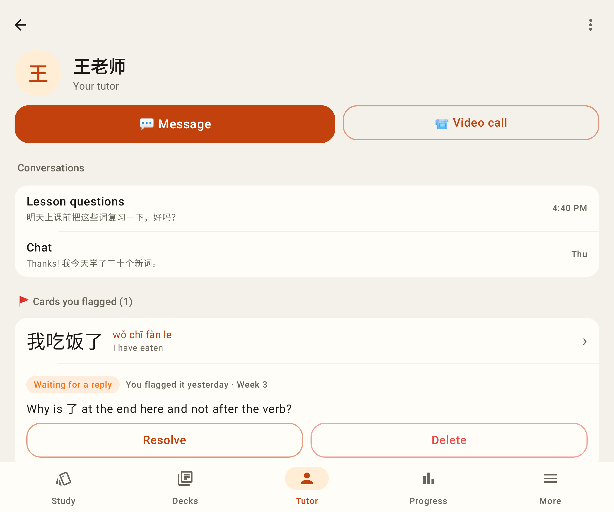
Tutor page on the unfolded Fold (841 dp).
