# Lab app — package F (teaching), part 3

Roborazzi renders (`android-lab/app/src/test/…/ui/teaching/TeachingScreenshots.kt`), Pixel Fold folded (412dp) unless noted.

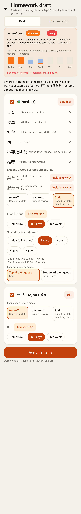
Homework draft from lesson notes: load now → after (Moderate → Heavy), the words with the two they already have skipped (Include anyway), Both + split over 2 days + queue, the mini lesson, Assign 2 items.

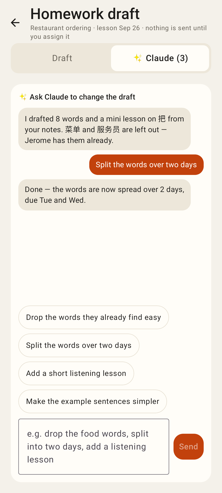
The Claude tab: the conversation, suggestion chips, message box.

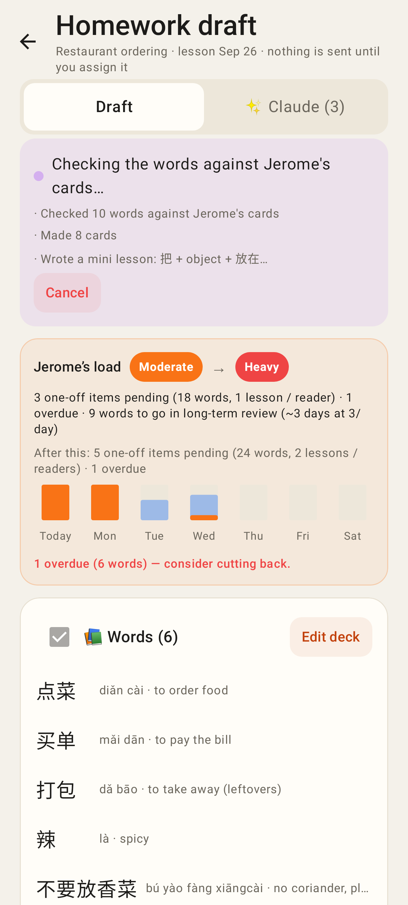
While the assistant works: progress, last steps, Cancel (polls every 3 s).

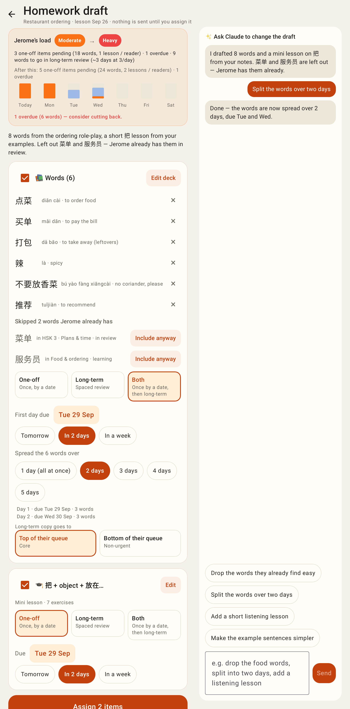
Unfolded: draft and chat side by side.

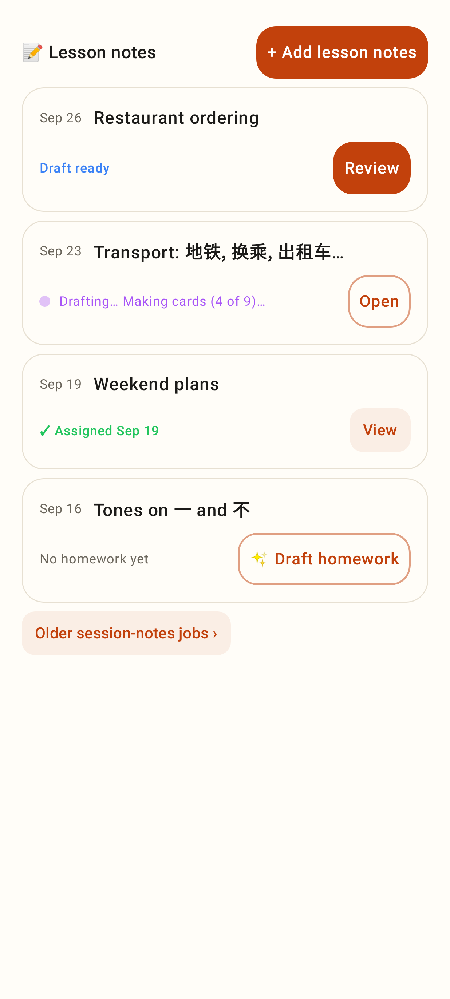
Lesson notes on the student page: Draft ready → Review, Drafting…, Assigned, No homework yet → ✨ Draft homework.

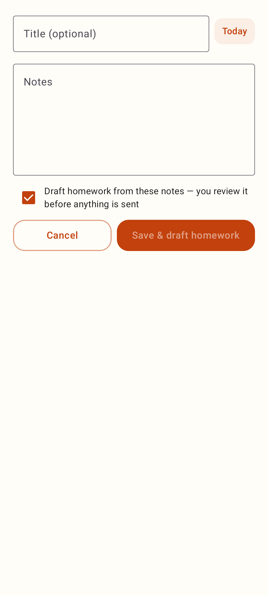
Add lesson notes.

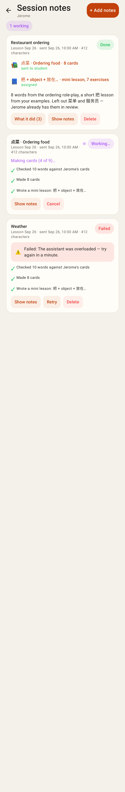
Session-notes jobs: done (what it made, sent / not sent), running, failed with Retry.

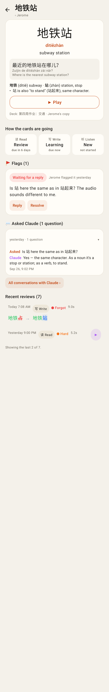
The tutor's view of a student's card: note, how each card is going, flag with Reply / Resolve, Asked Claude, recent reviews with the typed-answer diff.

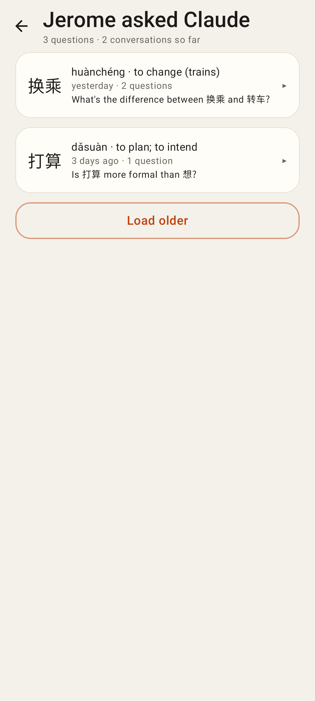
All the student's Ask-Claude conversations.

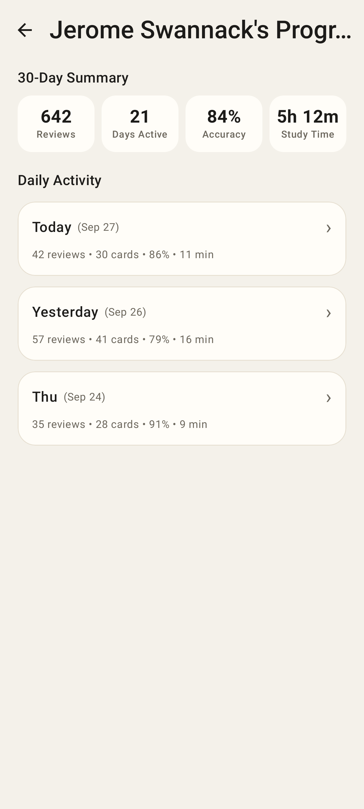
30-day summary and active days.

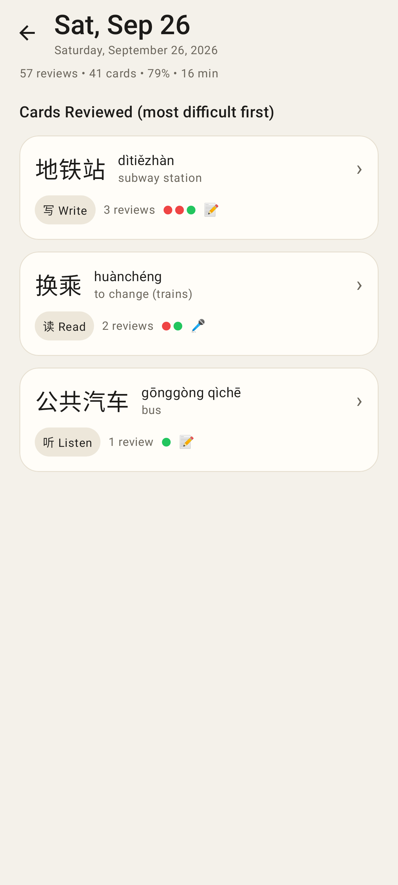
One day, hardest cards first.

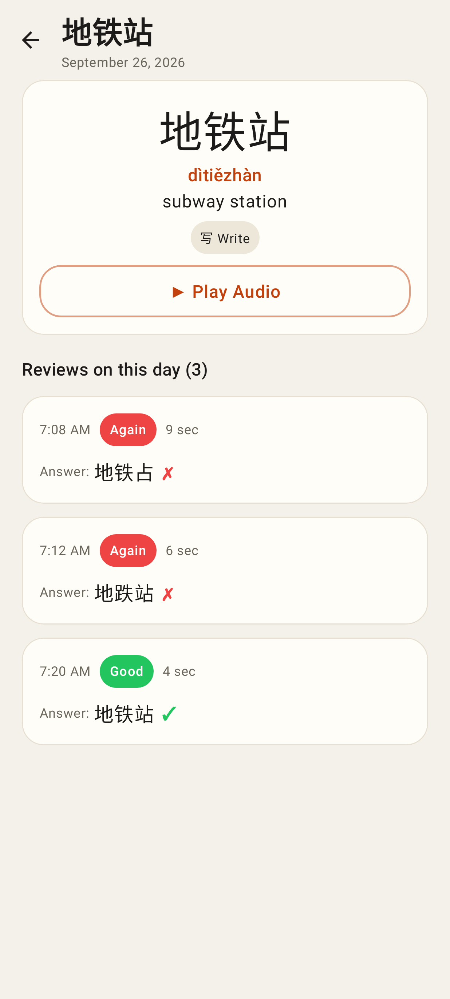
Every review of one card that day.

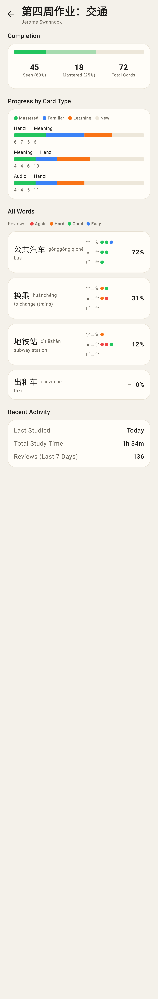
A homework deck in the student's account: completion, by card type, every word's recent ratings, activity.
