# Lab app — package F (teaching), part 1

Roborazzi renders of the native tutor screens (`android-lab/app/src/test/…/ui/teaching/TeachingScreenshots.kt`), Pixel Fold folded (412dp) unless noted.

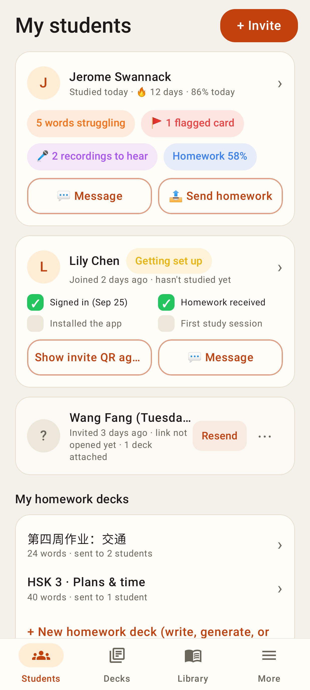
Students tab: student cards with status line and pills, a new student's setup checklist, a pending invite (Resend / ⋯), homework decks.

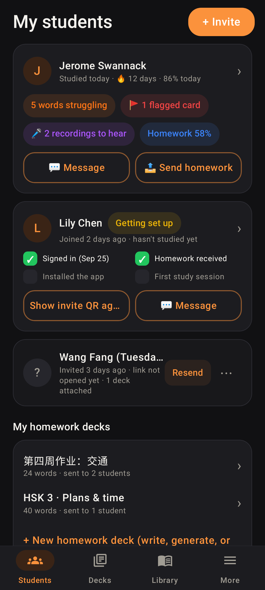
Same, dark theme.

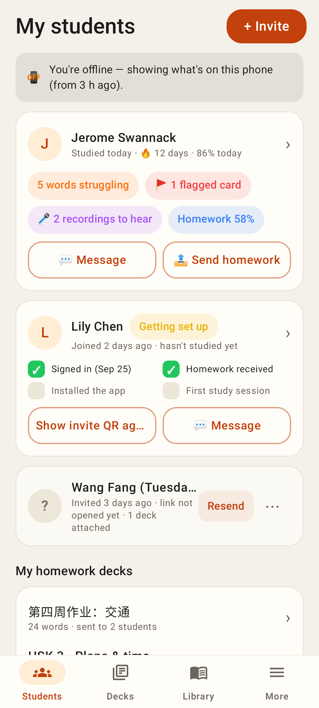
Offline: the cached dashboard with a stale notice.

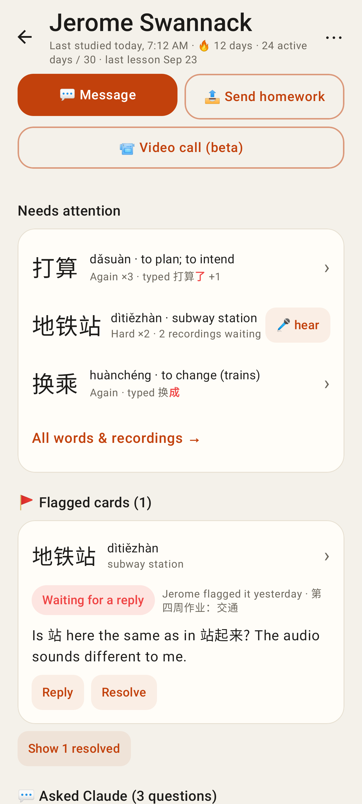
Student page, top: status, Message / Send homework / Video call, Needs attention (wrong characters red, 🎤 hear), flagged card.

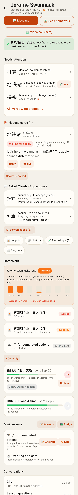
The whole page: flags, Asked Claude threads, links, load gauge + one-off homework with due chips, homework decks with #N queue badge and Update, mini lessons, conversations, activity.

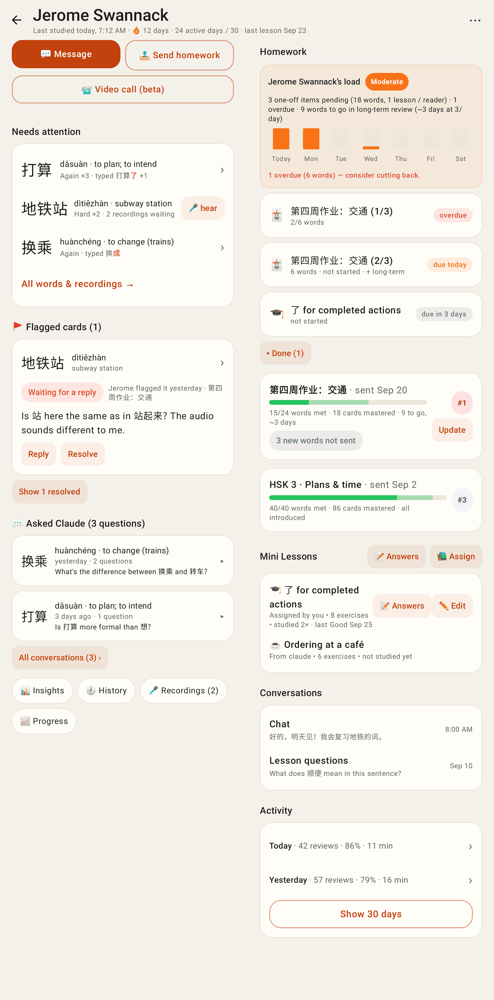
Unfolded (841dp): the student on the left, the work on the right.

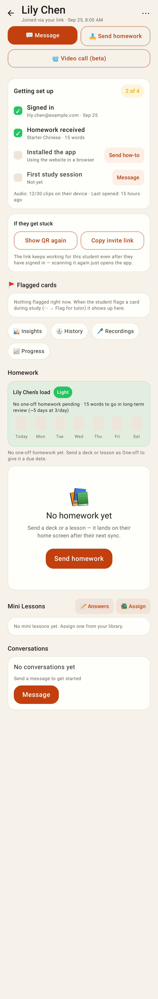
A brand-new student: "Getting set up" checklist (Send how-to) and "If they get stuck".

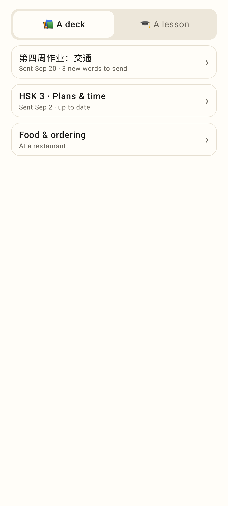
Send homework: the tutor's decks (sent / up to date / new words to send).

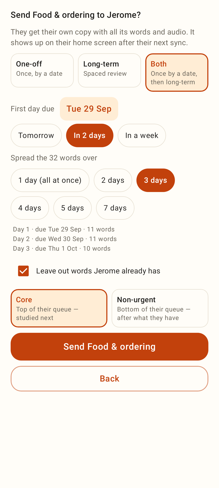
Both (one-off + long-term), due date chips, "spread over 3 days" with the per-day preview, leave out known words, Core / Non-urgent.

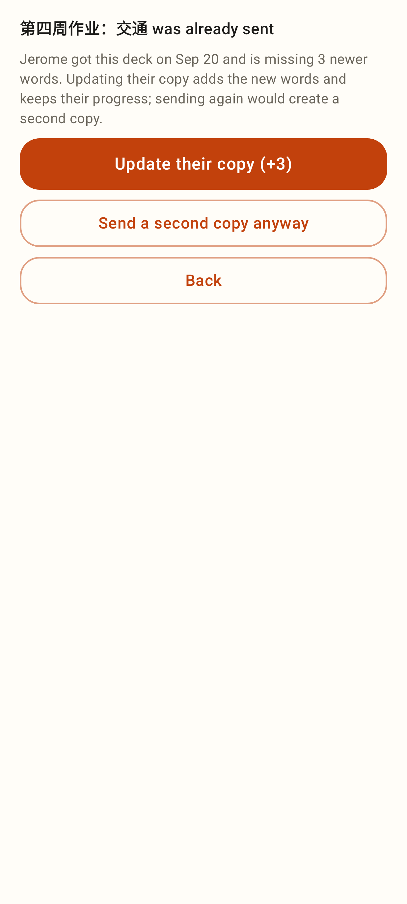
A deck already sent: Update their copy (+3) or send a second copy.

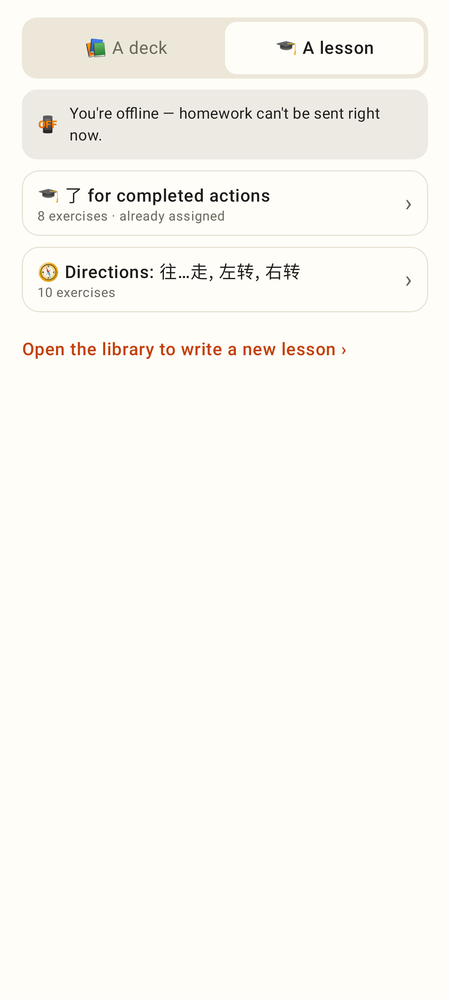
Lessons tab (offline: sending disabled with a notice).

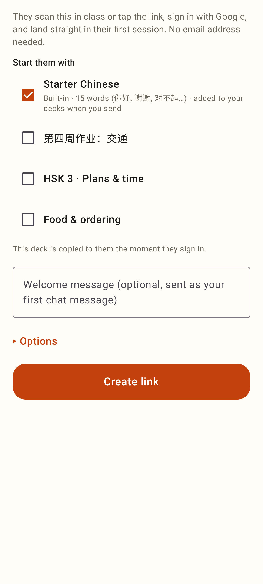
Invite a student: Starter Chinese ticked, own decks, welcome message, Options.

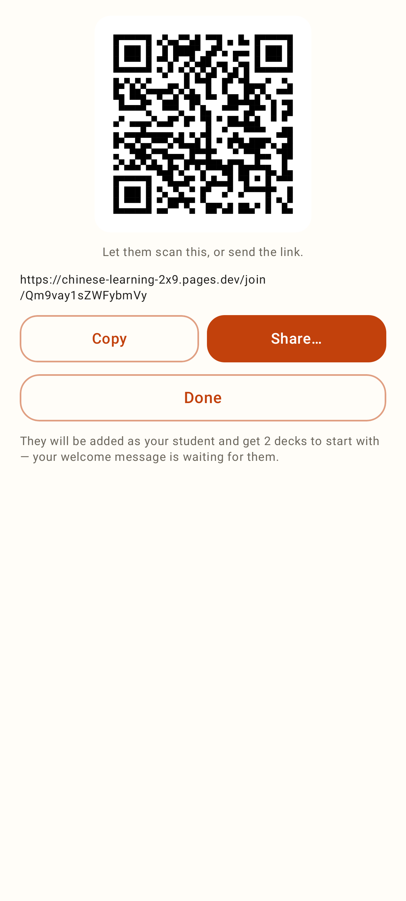
The created link: QR (zxing), Copy / Share, summary.
